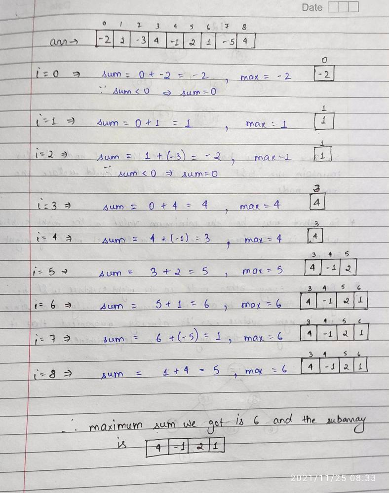
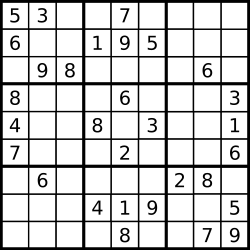
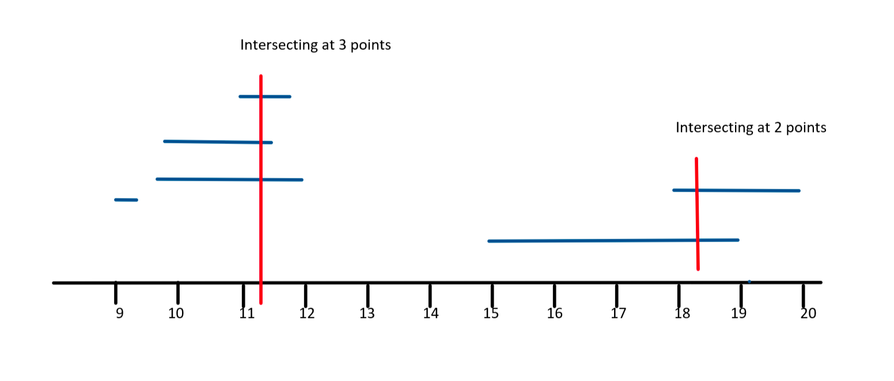

# Array
{: .no_toc }

<details open markdown="block">
  <summary>
    Table of contents
  </summary>
  {: .text-delta }
1. TOC
{:toc}
</details>

---
 

## Maximum Subarray

Given an integer array nums, find the contiguous subarray (containing at least one number) which has the largest sum and return its sum.

A subarray is a contiguous part of an array.

**Example 1:**
Input: nums = [-2,1,-3,4,-1,2,1,-5,4]
Output: 6
Explanation: [4,-1,2,1] has the largest sum = 6.

**Example 2:**
Input: nums = [1]
Output: 1

**Example 3:**
Input: nums = [5,4,-1,7,8]
Output: 23

###  Kadane's Algorithm
Start traversing your array keep each element in the sum and every time keep the max of currSum and prevSum.

But the catch here is that if at any point sum becomes negative then no point keeping it because 0 is obviously greater than negative, so just make your sum 0.



####  Implementation

```java
class Solution {
    public int maxSubArray(int[] nums) {
        int n = nums.length;
        int max = Integer.MIN_VALUE, sum = 0;

        for(int i=0;i<n;i++){
            sum += nums[i];
            max = Math.max(sum,max);

            if(sum<0) sum = 0;
        }
        return max;
    }
} 
```

####  Runtime
1 ms

####  Memory
73.2 MB

####  Complexity Analysis

**Time Complexity**:
O(n)

**Space Complexity**:
O(1)


---

## Valid Sudoku

Determine if a 9 x 9 Sudoku board is valid. Only the filled cells need to be validated according to the following rules:

1. Each row must contain the digits 1-9 without repetition.
2. Each column must contain the digits 1-9 without repetition.
3. Each of the nine 3 x 3 sub-boxes of the grid must contain the digits 1-9 without repetition.

Note:
- A Sudoku board (partially filled) could be valid but is not necessarily solvable.
- Only the filled cells need to be validated according to the mentioned rules.



**Example 1:**
```log
Input: board =
[["5","3",".",".","7",".",".",".","."]
,["6",".",".","1","9","5",".",".","."]
,[".","9","8",".",".",".",".","6","."]
,["8",".",".",".","6",".",".",".","3"]
,["4",".",".","8",".","3",".",".","1"]
,["7",".",".",".","2",".",".",".","6"]
,[".","6",".",".",".",".","2","8","."]
,[".",".",".","4","1","9",".",".","5"]
,[".",".",".",".","8",".",".","7","9"]]
```

Output: true

**Example 2:**
```log
Input: board =
[["8","3",".",".","7",".",".",".","."]
,["6",".",".","1","9","5",".",".","."]
,[".","9","8",".",".",".",".","6","."]
,["8",".",".",".","6",".",".",".","3"]
,["4",".",".","8",".","3",".",".","1"]
,["7",".",".",".","2",".",".",".","6"]
,[".","6",".",".",".",".","2","8","."]
,[".",".",".","4","1","9",".",".","5"]
,[".",".",".",".","8",".",".","7","9"]]
```

Output: false

Explanation: Same as Example 1, except with the 5 in the top left corner being modified to 8. Since there are two 8's in the top left 3x3 sub-box, it is invalid.

**Constraints:**

board.length == 9
board[i].length == 9
board[i][j] is a digit 1-9 or '.'.


###  Solution 1

Collect the set of things we see, encoded as strings. `For example`:

- '4' in row 7 is encoded as "(4)7".
- '4' in column 7 is encoded as "7(4)".
- '4' in the top-right block is encoded as "0(4)2".

Scream `false` if we ever fail to add something because it was already added (i.e., seen before).


####  Implementation

```java
 class Solution {
    public boolean isValidSudoku(char[][] board) {
        Set seen = new HashSet();
        for (int i=0; i<9; ++i) {
            for (int j=0; j<9; ++j) {
                if (board[i][j] != '.') {
                    String b = "(" + board[i][j] + ")";
                    if (!seen.add(b + i) || !seen.add(j + b) || !seen.add(i/3 + b + j/3))
                        return false;
                }
            }
        }
        return true;
    }
}
```

**Edit:** We can also make it really clear and self-explaining.


```java
 class Solution {
    public boolean isValidSudoku(char[][] board) {
        Set seen = new HashSet();
        for (int i=0; i<9; ++i) {
            for (int j=0; j<9; ++j) {
                char number = board[i][j];
                if (number != '.')
                    if (!seen.add(number + " in row " + i) ||
                            !seen.add(number + " in column " + j) ||
                            !seen.add(number + " in block " + i/3 + "-" + j/3))
                        return false;
            }
        }
        return true;
    }
}
```

####  Runtime
37 ms

####  Memory
49.4 MB

####  Complexity Analysis

**Time Complexity**:

**Space Complexity**:

###  Solution 2


####  Implementation

```java
 class Solution {
    public boolean isValidSudoku(char[][] board) {
        for(int i = 0; i<9; i++){
            HashSet<Character> rows = new HashSet<Character>();
            HashSet<Character> columns = new HashSet<Character>();
            HashSet<Character> cube = new HashSet<Character>();
            for (int j = 0; j < 9;j++){
                if(board[i][j]!='.' && !rows.add(board[i][j]))
                    return false;
                if(board[j][i]!='.' && !columns.add(board[j][i]))
                    return false;
                int RowIndex = 3*(i/3);
                int ColIndex = 3*(i%3);
                if(board[RowIndex + j/3][ColIndex + j%3]!='.' && !cube.add(board[RowIndex + j/3][ColIndex + j%3]))
                    return false;
            }
        }
        return true;
    }

}
```


####  Runtime
2 ms

####  Memory
42.4 MB


---

## Minimum Number of Platforms Required for a Railway/Bus Station

Given the arrival and departure times of all trains that reach a railway station, the task is to find the minimum number of platforms required for the railway station so that no train waits.
We are given two arrays that represent the arrival and departure times of trains that stop.

Examples:

- Input: arr[] = {9:00, 9:40, 9:50, 11:00, 15:00, 18:00}
- dep[] = {9:10, 12:00, 11:20, 11:30, 19:00, 20:00}
- Output: 3
- Explanation: There are at-most three trains at a time (time between 9:40 to 12:00)

All events sorted by time.
Total platforms at any time can be obtained by subtracting total
departures from total arrivals by that time.
Time     Event Type     Total Platforms Needed at this Time                               
9:00       Arrival                  1
9:10       Departure                0
9:40       Arrival                  1
9:50       Arrival                  2
11:00      Arrival                  3
11:20      Departure                2
11:30      Departure                1
12:00      Departure                0
15:00      Arrival                  1
18:00      Arrival                  2
19:00      Departure                1
20:00      Departure                0

Minimum Platforms needed on railway station = Maximum platforms
needed at any time
= 3  

- Input: arr[] = {9:00, 9:40}
- dep[] = {9:10, 12:00}
- Output: 1
- Explanation: Only one platform is needed.


- Input: N=6,
- arr[] = {9:00, 9:45, 9:55, 11:00, 15:00, 18:00}
- dep[] = {9:20, 12:00, 11:30, 11:50, 19:00, 20:00}
- Output:3
- Explanation: There are at-most three trains at a time. The train at 11:00 arrived but the trains which had arrived at 9:45 and 9:55 have still not departed. So, we need at least three platforms here.



###  Efficient Approach by Sorting

**Intuition:** At first we need to sort both the arrays. When the events will be sorted, it will be easy to track the count of trains that have arrived but not departed yet. 
Total platforms needed at one time can be found by taking the difference of arrivals and departures at that time and the maximum value of all times will be the final answer.

**Approach:**  At first we need to sort both the arrays. When the events will be sorted, it will be easy to track the count of trains that have arrived but not departed yet. 
Total platforms needed at one time can be found by taking the difference of arrivals and departures at that time and the maximum value of all times will be the final answer. 
`If(arr[i]<=dep[j])` means if arrival time is less than or equal to the departure time then- we need one more platform. So increment count as well as increment i. 
`If(arr[i]>dep[j])` means arrival time is more than the departure time then- we have one extra platform which we can reduce. So decrement count but increment j. Update the ans with `max(ans, count)` after each iteration of the while loop.


####  Implementation

```java
import java.util.*;
class TUF {
    static int findPlatform(int arr[], int dep[], int n) {
        Arrays.sort(arr);
        Arrays.sort(dep);
        int plat_needed = 1, result = 1;
        int i = 1, j = 0;

        while (i < n && j < n) {
            if (arr[i] <= dep[j]) {
                plat_needed++;
                i++;
            }else if (arr[i] > dep[j]) {
                plat_needed--;
                j++;
            }
            if (plat_needed > result)
                result = plat_needed;
        }
        return result;
    }
    
    public static void main (String[] args) {
        int[] arr ={900,945,955,1100,1500,1800};
        int[] dep={920,1200,1130,1150,1900,2000};
        int n=arr.length;
        int totalCount=findPlatform(arr,dep,n);
        System.out.println("Minimum number of Platforms required "+totalCount);
    }
} 
```

**Output:**

Minimum number of Platforms required 3

####  Complexity Analysis

**Time Complexity**:
O(nlogn)   (Sorting takes O(nlogn) and traversal of arrays takes O(n) so overall time complexity is O(nlogn)).

**Space Complexity**:
O(1)   (No extra space used).


### Naive Approach

**Intuition:** Take each interval of arrival and departure one by one and count the number of overlapping time intervals. This can easily be done using nested for-loops. Maintain the maximum value of the count during the process and return the maximum value at the end.

**Approach**: We need to run two nested for-loops. Inside the inner loop count the number of intervals which intersect with the interval represented by the outer loop. As soon as the inner loop ends just update the maximum value of count and proceed with the next iteration of the outer loop. After the process ends we will get the maximum value of the count.


####  Implementation

```java
 import java.util.*;
class TUF {
    static int countPlatforms(int n,int arr[],int dep[]){
        int ans=1; //final value
        for(int i=0;i<=n-1;i++) {
            int count=1; // count of overlapping interval of only this   iteration
            for(int j=i+1;j<=n-1;j++){
                if((arr[i]>=arr[j] && arr[i]<=dep[j]) ||
                        (arr[j]>=arr[i] && arr[j]<=dep[i])){
                    count++;
                }
            }
            ans=Math.max(ans,count); //updating the value
        }
        return ans;
    }
    public static void main (String[] args) {
        int[] arr ={900,945,955,1100,1500,1800};
        int[] dep={920,1200,1130,1150,1900,2000};
        int n=arr.length;
        int totalCount=countPlatforms(n,arr,dep);
        System.out.println("Minimum number of Platforms required "+totalCount);
    }
}
```

Output:

Minimum number of Platforms required 3

####  Complexity Analysis

**Time Complexity**:
O(n^2)  (due to two nested loops).

**Space Complexity**:
O(1)  (no extra space used).


## Custom ArrayList 

ArrayList is very similar to Array but provides the feature of dynamic space allocation when the number of objects in the list grows.

### Custom ArrayList using Array

In Array, we have to provide the size at the time of initialization but that is not required for ArrayList.

Actually, when you initialize ArrayList, it automatically assigns its initial capacity to 10.

####  Implementation

```java

import java.util.Arrays;

//Implement ArrayList using Array
public class CustomArrayList<E> {
    private static final int DEFAULT_INITIAL_CAPACITY = 5;
    private static final Object[] EMPTY_ELEMENT_DATA = {};
    private int size;

    /**
     * The array elements to be stored inside
     * customArrayListElementData.
     */
    private transient Object[] customArrayListElementData;

    /**
     * Constructs a custom arrayList with an initial capacity.
     *
     * @param initialCapacity
     */
    public CustomArrayList(int initialCapacity) {
        super();
        if (initialCapacity < 0)
            throw new IllegalArgumentException("Illegal Capacity: " +
                    initialCapacity);
        this.customArrayListElementData = new Object[initialCapacity];
    }

    /**
     * Constructs an empty list.
     */
    public CustomArrayList() {
        super();
        this.customArrayListElementData = EMPTY_ELEMENT_DATA;
    }

    /**
     * @return the size of the CustomArrayList
     */
    public int size() {
        return size;
    }

    /**
     * @return true/false if size is greater then 0 return true else false.
     */
    public boolean isEmpty() {
        return size == 0;
    }

    /**
     * return true
     *
     * @param e
     */
    public boolean add(E e) {
        ensureCapacity(size + 1);
        customArrayListElementData[size++] = e;
        return true;
    }

    public void clear() {
        for (int i = 0; i < size; i++)
            customArrayListElementData[i] = null;

        size = 0;

    }

    /**
     * Returns the element at the specified position in this list.
     *
     * @param index
     * @return
     */
    @SuppressWarnings("unchecked")
    public E get(int index) {
        if (index >= size) {
            throw new ArrayIndexOutOfBoundsException("array index out of bound exception with index at" + index);
        }
        return (E) customArrayListElementData[index];
    }

    /**
     * add element at specific index position and shift the
     * customArrayListElementData.
     *
     * @param index
     * @param element
     */
    public void add(int index, E element) {
        ensureCapacity(size + 1);
        System.arraycopy(customArrayListElementData, index, customArrayListElementData, index + 1, size - index);
        customArrayListElementData[index] = element;
        size++;

    }

    /**
     * Remove the element from the customArrayListElementData
     * and shift the elements position.
     *
     * @param index
     * @return
     */
    @SuppressWarnings("unchecked")
    public E remove(int index) {
        E oldValue = (E) customArrayListElementData[index];

        int removeNumber = size - index - 1;
        if (removeNumber > 0) {
            System.arraycopy(customArrayListElementData, index + 1, customArrayListElementData, index, removeNumber);
        }
        customArrayListElementData[--size] = null;
        return oldValue;
    }

    /**
     * Increases the capacity to ensure that it can hold at least the
     * number of elements specified by the minimum capacity argument.
     *
     * @param minCapacity the desired minimum capacity
     */
    private void growCustomArrayList(int minCapacity) {
        int oldCapacity = customArrayListElementData.length;
        int newCapacity = oldCapacity + (oldCapacity / 2);
        if (newCapacity - minCapacity < 0)
            newCapacity = minCapacity;
        customArrayListElementData = Arrays.copyOf(customArrayListElementData, newCapacity);
    }

    /**
     * ensure the capacity and grow the customArrayList vi
     * growCustomArrayList(minCapacity);
     *
     * @param minCapacity
     */
    private void ensureCapacity(int minCapacity) {
        if (customArrayListElementData == EMPTY_ELEMENT_DATA) {
            minCapacity = Math.max(DEFAULT_INITIAL_CAPACITY, minCapacity);
        }

        if (minCapacity - customArrayListElementData.length > 0)
            growCustomArrayList(minCapacity);
    }

    /**
     * main method to test the custome array list
     */
    public static void main(String[] args) {
        CustomArrayList<String> strList = new CustomArrayList<>();
        strList.add("str1");
        strList.add("str2");
        System.out.println("after adding elements size =" + strList.size());
        strList.remove(1);
        System.out.println("after removing element size =" + strList.size());
    }
}

/*
Output:
after adding elements size =2
after removing element size =1
 */ 
```


--- 

## More Details 
1. [JAVA Kadane's Algorithm](https://leetcode.com/problems/maximum-subarray/discuss/1595097/JAVA-or-Kadane's-Algorithm-or-Explanation-Using-Image)
2. [36. Valid Sudoku](https://leetcode.com/problems/valid-sudoku/discuss/15472/Short%2BSimple-Java-using-Strings)
3. [Minimum number of platforms required for a railway](https://takeuforward.org/data-structure/minimum-number-of-platforms-required-for-a-railway/)
4. [Write a program to create custom (your own) ArrayList in java](http://www.javamakeuse.com/2014/09/write-program-to-create-custom-your-own.html)