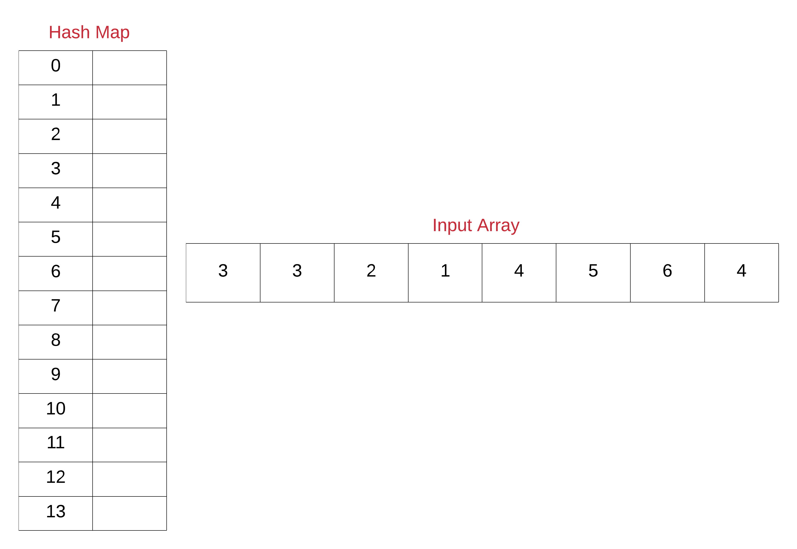
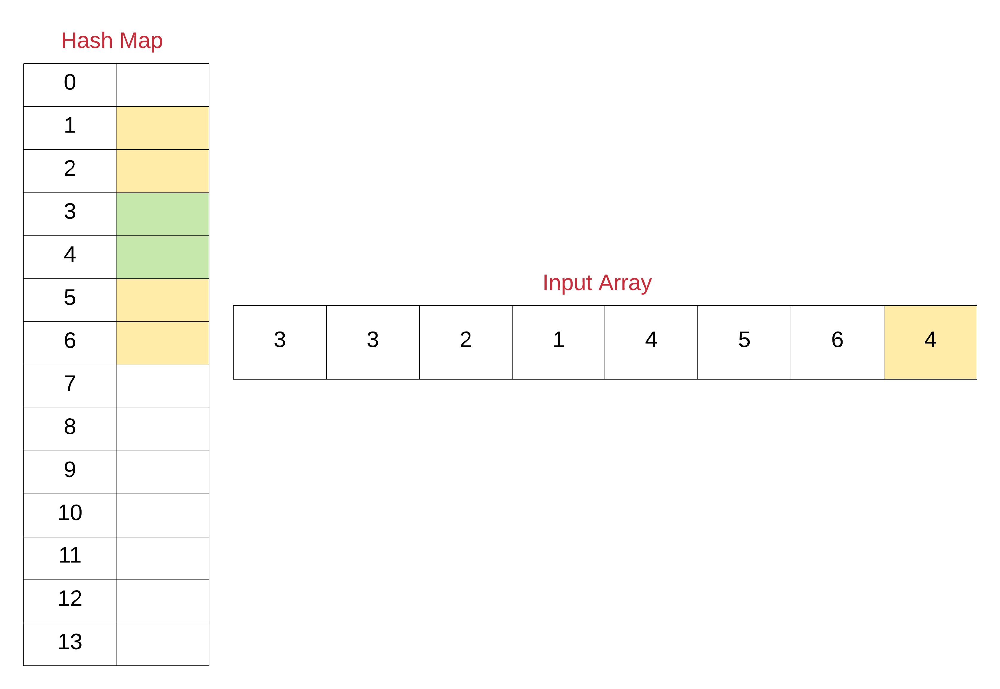
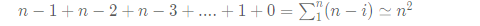

# Array
{: .no_toc }

<details open markdown="block">
  <summary>
    Table of contents
  </summary>
  {: .text-delta }
1. TOC
{:toc}
</details>

---
 

## Maximum Subarray

Given an integer array nums, find the contiguous subarray (containing at least one number) which has the largest sum and return its sum.

A subarray is a contiguous part of an array.

**Example 1:**
Input: nums = [-2,1,-3,4,-1,2,1,-5,4]
Output: 6
Explanation: [4,-1,2,1] has the largest sum = 6.

**Example 2:**
Input: nums = [1]
Output: 1

**Example 3:**
Input: nums = [5,4,-1,7,8]
Output: 23

###  Kadane's Algorithm
Start traversing your array keep each element in the sum and every time keep the max of currSum and prevSum.

But the catch here is that if at any point sum becomes negative then no point keeping it because 0 is obviously greater than negative, so just make your sum 0.


####  Implementation

```java
class Solution {
    public int maxSubArray(int[] nums) {
        int n = nums.length;
        int max = Integer.MIN_VALUE, sum = 0;

        for(int i=0;i<n;i++){
            sum += nums[i];
            max = Math.max(sum,max);

            if(sum<0) sum = 0;
        }
        return max;
    }
} 
```

####  Runtime
1 ms

####  Memory
73.2 MB

####  Complexity Analysis

**Time Complexity**:
O(n)

**Space Complexity**:
O(1)


---

## Valid Sudoku

Determine if a 9 x 9 Sudoku board is valid. Only the filled cells need to be validated according to the following rules:

1. Each row must contain the digits 1-9 without repetition.
2. Each column must contain the digits 1-9 without repetition.
3. Each of the nine 3 x 3 sub-boxes of the grid must contain the digits 1-9 without repetition.

Note:
- A Sudoku board (partially filled) could be valid but is not necessarily solvable.
- Only the filled cells need to be validated according to the mentioned rules.


**Example 1:**
```log
Input: board =
[["5","3",".",".","7",".",".",".","."]
,["6",".",".","1","9","5",".",".","."]
,[".","9","8",".",".",".",".","6","."]
,["8",".",".",".","6",".",".",".","3"]
,["4",".",".","8",".","3",".",".","1"]
,["7",".",".",".","2",".",".",".","6"]
,[".","6",".",".",".",".","2","8","."]
,[".",".",".","4","1","9",".",".","5"]
,[".",".",".",".","8",".",".","7","9"]]
```

Output: true

**Example 2:**
```log
Input: board =
[["8","3",".",".","7",".",".",".","."]
,["6",".",".","1","9","5",".",".","."]
,[".","9","8",".",".",".",".","6","."]
,["8",".",".",".","6",".",".",".","3"]
,["4",".",".","8",".","3",".",".","1"]
,["7",".",".",".","2",".",".",".","6"]
,[".","6",".",".",".",".","2","8","."]
,[".",".",".","4","1","9",".",".","5"]
,[".",".",".",".","8",".",".","7","9"]]
```

Output: false

Explanation: Same as Example 1, except with the 5 in the top left corner being modified to 8. Since there are two 8's in the top left 3x3 sub-box, it is invalid.

**Constraints:**

board.length == 9
board[i].length == 9
board[i][j] is a digit 1-9 or '.'.


###  Solution 1

Collect the set of things we see, encoded as strings. `For example`:

- '4' in row 7 is encoded as "(4)7".
- '4' in column 7 is encoded as "7(4)".
- '4' in the top-right block is encoded as "0(4)2".

Scream `false` if we ever fail to add something because it was already added (i.e., seen before).


####  Implementation

```java
 class Solution {
    public boolean isValidSudoku(char[][] board) {
        Set seen = new HashSet();
        for (int i=0; i<9; ++i) {
            for (int j=0; j<9; ++j) {
                if (board[i][j] != '.') {
                    String b = "(" + board[i][j] + ")";
                    if (!seen.add(b + i) || !seen.add(j + b) || !seen.add(i/3 + b + j/3))
                        return false;
                }
            }
        }
        return true;
    }
}
```

**Edit:** We can also make it really clear and self-explaining.


```java
 class Solution {
    public boolean isValidSudoku(char[][] board) {
        Set seen = new HashSet();
        for (int i=0; i<9; ++i) {
            for (int j=0; j<9; ++j) {
                char number = board[i][j];
                if (number != '.')
                    if (!seen.add(number + " in row " + i) ||
                            !seen.add(number + " in column " + j) ||
                            !seen.add(number + " in block " + i/3 + "-" + j/3))
                        return false;
            }
        }
        return true;
    }
}
```

####  Runtime
37 ms

####  Memory
49.4 MB

####  Complexity Analysis

**Time Complexity**:

**Space Complexity**:

###  Solution 2


####  Implementation

```java
 class Solution {
    public boolean isValidSudoku(char[][] board) {
        for(int i = 0; i<9; i++){
            HashSet<Character> rows = new HashSet<Character>();
            HashSet<Character> columns = new HashSet<Character>();
            HashSet<Character> cube = new HashSet<Character>();
            for (int j = 0; j < 9;j++){
                if(board[i][j]!='.' && !rows.add(board[i][j]))
                    return false;
                if(board[j][i]!='.' && !columns.add(board[j][i]))
                    return false;
                int RowIndex = 3*(i/3);
                int ColIndex = 3*(i%3);
                if(board[RowIndex + j/3][ColIndex + j%3]!='.' && !cube.add(board[RowIndex + j/3][ColIndex + j%3]))
                    return false;
            }
        }
        return true;
    }

}
```


####  Runtime
2 ms

####  Memory
42.4 MB


---

## Minimum Number of Platforms Required for a Railway/Bus Station

Given the arrival and departure times of all trains that reach a railway station, the task is to find the minimum number of platforms required for the railway station so that no train waits.
We are given two arrays that represent the arrival and departure times of trains that stop.

Examples:

- Input: arr[] = {9:00, 9:40, 9:50, 11:00, 15:00, 18:00}
- dep[] = {9:10, 12:00, 11:20, 11:30, 19:00, 20:00}
- Output: 3
- Explanation: There are at-most three trains at a time (time between 9:40 to 12:00)

All events sorted by time.
Total platforms at any time can be obtained by subtracting total
departures from total arrivals by that time.
Time     Event Type     Total Platforms Needed at this Time                               
9:00       Arrival                  1
9:10       Departure                0
9:40       Arrival                  1
9:50       Arrival                  2
11:00      Arrival                  3
11:20      Departure                2
11:30      Departure                1
12:00      Departure                0
15:00      Arrival                  1
18:00      Arrival                  2
19:00      Departure                1
20:00      Departure                0

Minimum Platforms needed on railway station = Maximum platforms
needed at any time
= 3  

- Input: arr[] = {9:00, 9:40}
- dep[] = {9:10, 12:00}
- Output: 1
- Explanation: Only one platform is needed.


- Input: N=6,
- arr[] = {9:00, 9:45, 9:55, 11:00, 15:00, 18:00}
- dep[] = {9:20, 12:00, 11:30, 11:50, 19:00, 20:00}
- Output:3
- Explanation: There are at-most three trains at a time. The train at 11:00 arrived but the trains which had arrived at 9:45 and 9:55 have still not departed. So, we need at least three platforms here.


###  Efficient Approach by Sorting

**Intuition:** At first we need to sort both the arrays. When the events will be sorted, it will be easy to track the count of trains that have arrived but not departed yet. 
Total platforms needed at one time can be found by taking the difference of arrivals and departures at that time and the maximum value of all times will be the final answer.

**Approach:**  At first we need to sort both the arrays. When the events will be sorted, it will be easy to track the count of trains that have arrived but not departed yet. 
Total platforms needed at one time can be found by taking the difference of arrivals and departures at that time and the maximum value of all times will be the final answer. 
`If(arr[i]<=dep[j])` means if arrival time is less than or equal to the departure time then- we need one more platform. So increment count as well as increment i. 
`If(arr[i]>dep[j])` means arrival time is more than the departure time then- we have one extra platform which we can reduce. So decrement count but increment j. Update the ans with `max(ans, count)` after each iteration of the while loop.


####  Implementation

```java
import java.util.*;
class TUF {
    static int findPlatform(int arr[], int dep[], int n) {
        Arrays.sort(arr);
        Arrays.sort(dep);
        int plat_needed = 1, result = 1;
        int i = 1, j = 0;

        while (i < n && j < n) {
            if (arr[i] <= dep[j]) {
                plat_needed++;
                i++;
            }else if (arr[i] > dep[j]) {
                plat_needed--;
                j++;
            }
            if (plat_needed > result)
                result = plat_needed;
        }
        return result;
    }
    
    public static void main (String[] args) {
        int[] arr ={900,945,955,1100,1500,1800};
        int[] dep={920,1200,1130,1150,1900,2000};
        int n=arr.length;
        int totalCount=findPlatform(arr,dep,n);
        System.out.println("Minimum number of Platforms required "+totalCount);
    }
} 
```

**Output:**

Minimum number of Platforms required 3

####  Complexity Analysis

**Time Complexity**:
O(nlogn)   (Sorting takes O(nlogn) and traversal of arrays takes O(n) so overall time complexity is O(nlogn)).

**Space Complexity**:
O(1)   (No extra space used).


### Naive Approach

**Intuition:** Take each interval of arrival and departure one by one and count the number of overlapping time intervals. This can easily be done using nested for-loops. Maintain the maximum value of the count during the process and return the maximum value at the end.

**Approach**: We need to run two nested for-loops. Inside the inner loop count the number of intervals which intersect with the interval represented by the outer loop. As soon as the inner loop ends just update the maximum value of count and proceed with the next iteration of the outer loop. After the process ends we will get the maximum value of the count.


####  Implementation

```java
 import java.util.*;
class TUF {
    static int countPlatforms(int n,int arr[],int dep[]){
        int ans=1; //final value
        for(int i=0;i<=n-1;i++) {
            int count=1; // count of overlapping interval of only this   iteration
            for(int j=i+1;j<=n-1;j++){
                if((arr[i]>=arr[j] && arr[i]<=dep[j]) ||
                        (arr[j]>=arr[i] && arr[j]<=dep[i])){
                    count++;
                }
            }
            ans=Math.max(ans,count); //updating the value
        }
        return ans;
    }
    public static void main (String[] args) {
        int[] arr ={900,945,955,1100,1500,1800};
        int[] dep={920,1200,1130,1150,1900,2000};
        int n=arr.length;
        int totalCount=countPlatforms(n,arr,dep);
        System.out.println("Minimum number of Platforms required "+totalCount);
    }
}
```

Output:

Minimum number of Platforms required 3

####  Complexity Analysis

**Time Complexity**:
O(n^2)  (due to two nested loops).

**Space Complexity**:
O(1)  (no extra space used).


## Custom ArrayList 

ArrayList is very similar to Array but provides the feature of dynamic space allocation when the number of objects in the list grows.

### Custom ArrayList using Array

In Array, we have to provide the size at the time of initialization but that is not required for ArrayList.

Actually, when you initialize ArrayList, it automatically assigns its initial capacity to 10.

####  Implementation

```java

import java.util.Arrays;

//Implement ArrayList using Array
public class CustomArrayList<E> {
    private static final int DEFAULT_INITIAL_CAPACITY = 5;
    private static final Object[] EMPTY_ELEMENT_DATA = {};
    private int size;

    /**
     * The array elements to be stored inside
     * customArrayListElementData.
     */
    private transient Object[] customArrayListElementData;

    /**
     * Constructs a custom arrayList with an initial capacity.
     *
     * @param initialCapacity
     */
    public CustomArrayList(int initialCapacity) {
        super();
        if (initialCapacity < 0)
            throw new IllegalArgumentException("Illegal Capacity: " +
                    initialCapacity);
        this.customArrayListElementData = new Object[initialCapacity];
    }

    /**
     * Constructs an empty list.
     */
    public CustomArrayList() {
        super();
        this.customArrayListElementData = EMPTY_ELEMENT_DATA;
    }

    /**
     * @return the size of the CustomArrayList
     */
    public int size() {
        return size;
    }

    /**
     * @return true/false if size is greater then 0 return true else false.
     */
    public boolean isEmpty() {
        return size == 0;
    }

    /**
     * return true
     *
     * @param e
     */
    public boolean add(E e) {
        ensureCapacity(size + 1);
        customArrayListElementData[size++] = e;
        return true;
    }

    public void clear() {
        for (int i = 0; i < size; i++)
            customArrayListElementData[i] = null;

        size = 0;

    }

    /**
     * Returns the element at the specified position in this list.
     *
     * @param index
     * @return
     */
    @SuppressWarnings("unchecked")
    public E get(int index) {
        if (index >= size) {
            throw new ArrayIndexOutOfBoundsException("array index out of bound exception with index at" + index);
        }
        return (E) customArrayListElementData[index];
    }

    /**
     * add element at specific index position and shift the
     * customArrayListElementData.
     *
     * @param index
     * @param element
     */
    public void add(int index, E element) {
        ensureCapacity(size + 1);
        System.arraycopy(customArrayListElementData, index, customArrayListElementData, index + 1, size - index);
        customArrayListElementData[index] = element;
        size++;

    }

    /**
     * Remove the element from the customArrayListElementData
     * and shift the elements position.
     *
     * @param index
     * @return
     */
    @SuppressWarnings("unchecked")
    public E remove(int index) {
        E oldValue = (E) customArrayListElementData[index];

        int removeNumber = size - index - 1;
        if (removeNumber > 0) {
            System.arraycopy(customArrayListElementData, index + 1, customArrayListElementData, index, removeNumber);
        }
        customArrayListElementData[--size] = null;
        return oldValue;
    }

    /**
     * Increases the capacity to ensure that it can hold at least the
     * number of elements specified by the minimum capacity argument.
     *
     * @param minCapacity the desired minimum capacity
     */
    private void growCustomArrayList(int minCapacity) {
        int oldCapacity = customArrayListElementData.length;
        int newCapacity = oldCapacity + (oldCapacity / 2);
        if (newCapacity - minCapacity < 0)
            newCapacity = minCapacity;
        customArrayListElementData = Arrays.copyOf(customArrayListElementData, newCapacity);
    }

    /**
     * ensure the capacity and grow the customArrayList vi
     * growCustomArrayList(minCapacity);
     *
     * @param minCapacity
     */
    private void ensureCapacity(int minCapacity) {
        if (customArrayListElementData == EMPTY_ELEMENT_DATA) {
            minCapacity = Math.max(DEFAULT_INITIAL_CAPACITY, minCapacity);
        }

        if (minCapacity - customArrayListElementData.length > 0)
            growCustomArrayList(minCapacity);
    }

    /**
     * main method to test the custome array list
     */
    public static void main(String[] args) {
        CustomArrayList<String> strList = new CustomArrayList<>();
        strList.add("str1");
        strList.add("str2");
        System.out.println("after adding elements size =" + strList.size());
        strList.remove(1);
        System.out.println("after removing element size =" + strList.size());
    }
}

/*
Output:
after adding elements size =2
after removing element size =1
 */ 
```
--- 

## Sort an Array

Given an array of integers nums, sort the array in ascending order and return it.

You must solve the problem **without using any built-in** functions in O(nlog(n)) time complexity and with the smallest space complexity possible.

**Example 1:**

```log
Input: nums = [5,2,3,1]
Output: [1,2,3,5]
Explanation: After sorting the array, the positions of some numbers are not changed (for example, 2 and 3), while the positions of other numbers are changed (for example, 1 and 5).
```

**Example 2:**

```log
Input: nums = [5,1,1,2,0,0]
Output: [0,0,1,1,2,5]
Explanation: Note that the values of nums are not necessairly unique.
```

**Constraints:**

```log
1 <= nums.length <= 5 * 104
-5 * 104 <= nums[i] <= 5 * 104
```

### Solution 1

**Algorithms:**

* quick sort
* top-down merge sort
* bottom-up merge sort
* heap sort
* selection sort
* insertion sort
* bubble sort (TLE)

#### implementations : 

**1. Quick sort:**

```java
class Solution {
    public List<Integer> sortArray(int[] nums) {
        List<Integer> res = new ArrayList<>();
        if (nums == null || nums.length == 0) return res;
        quickSort(nums, 0, nums.length - 1);
        for (int i : nums) res.add(i);
        return res;
    }
    private void quickSort(int[] nums, int l, int r) {
        if (l >= r) return;
        int mid = partition(nums, l, r);
        quickSort(nums, l, mid);
        quickSort(nums, mid + 1, r);
    }
    private int partition(int[] nums, int l, int r) {
        int pivot = nums[l];
        while (l < r) {
            while (l < r && nums[r] >= pivot) r--;
            nums[l] = nums[r];
            while (l < r && nums[l] <= pivot) l++;
            nums[r] = nums[l];
        }
        nums[l] = pivot;
        return l;
    }
}
```
**2. Top-down merge sort**

```java
class Solution {
    public List<Integer> sortArray(int[] nums) {
        List<Integer> res = new ArrayList<>();
        if (nums == null || nums.length == 0) return res;
        mergeSort(nums, 0, nums.length - 1);
        for (int i : nums) res.add(i);
        return res;
    }
    private void mergeSort(int[] nums, int l, int r) {
        if (l >= r) return;
        int mid = l + (r - l) / 2;
        mergeSort(nums, l, mid);
        mergeSort(nums, mid + 1, r);
        merge(nums, l, r);
    }
    private void merge(int[] nums, int l, int r) {
        int mid = l + (r - l) / 2;
        int[] tmp = new int[r - l + 1];
        int i = l, j = mid + 1, k = 0;
        while (i <= mid || j <= r) {
            if (i > mid || j <= r && nums[i] > nums[j]) {
                tmp[k++] = nums[j++];
            } else {
                tmp[k++] = nums[i++];
            }
        }
        System.arraycopy(tmp, 0, nums, l, r - l + 1);
    }
}
```

**3. Bottom-up merge sort**

```java
class Solution {
    public List<Integer> sortArray(int[] nums) {
        List<Integer> res = new ArrayList<>();
        if (nums == null || nums.length == 0) return res;
        mergeSort2(nums);
        for (int i : nums) res.add(i);
        return res;
    }
    private void mergeSort2(int[] nums) {
        for (int size = 1; size < nums.length; size *= 2) {
            for (int i = 0; i < nums.length - size; i += 2 * size) {
                int mid = i + size - 1;
                int end = Math.min(i + 2 * size - 1, nums.length - 1);
                merge2(nums, i, mid, end);
            }
        }
    }
    private void merge2(int[] nums, int l, int mid, int r) {
        int[] tmp = new int[r - l + 1];
        int i = l, j = mid + 1, k = 0;
        while (i <= mid || j <= r) {
            if (i > mid || j <= r && nums[i] > nums[j]) {
                tmp[k++] = nums[j++];
            } else {
                tmp[k++] = nums[i++];
            }
        }
        System.arraycopy(tmp, 0, nums, l, r - l + 1);
    }
}
```
**4. Heap sort**

```java
class Solution {
    public List<Integer> sortArray(int[] nums) {
        List<Integer> res = new ArrayList<>();
        if (nums == null || nums.length == 0) return res;
        heapSort(nums);
        for (int i : nums) res.add(i);
        return res;
    }
    private void heapSort(int[] nums) {
        for (int i = nums.length / 2 - 1; i >= 0; i--) {
            heapify(nums, i, nums.length - 1);
        }
        for (int i = nums.length - 1; i >= 1; i--) {
            swap(nums, 0, i);
            heapify(nums, 0, i - 1);
        }
    }
    private void heapify(int[] nums, int i, int end) {
        while (i <= end) {
            int l = 2 * i + 1, r = 2 * i + 2;
            int maxIndex = i;
            if (l <= end && nums[l] > nums[maxIndex]) maxIndex = l;
            if (r <= end && nums[r] > nums[maxIndex]) maxIndex = r;
            if (maxIndex == i) break;
            swap(nums, i, maxIndex);
            i = maxIndex;
        }
    }
    private void swap(int[] nums, int i, int j) {
        int tmp = nums[i];
        nums[i] = nums[j];
        nums[j] = tmp;
    }
}
```
**5. Selection sort**
```java
class Solution {
    public List<Integer> sortArray(int[] nums) {
        List<Integer> res = new ArrayList<>();
        if (nums == null || nums.length == 0) return res;
        selectionSort(nums);
        for (int i : nums) res.add(i);
        return res;
    }
    private void selectionSort(int[] nums) {
        for (int i = 0; i < nums.length; i++) {
            int minIndex = i;
            for (int j = i + 1; j < nums.length; j++) {
                if (nums[j] < nums[minIndex]) minIndex = j;
            }
            if (minIndex != i) swap(nums, i, minIndex);
        }
    }
    private void swap(int[] nums, int i, int j) {
        nums[i] = nums[i] ^ nums[j];
        nums[j] = nums[i] ^ nums[j];
        nums[i] = nums[i] ^ nums[j];
    }
}
```
**6. Insertion sort**

```java
class Solution {
    public List<Integer> sortArray(int[] nums) {
        List<Integer> res = new ArrayList<>();
        if (nums == null || nums.length == 0) return res;
        insertionSort(nums);
        for (int i : nums) res.add(i);
        return res;
    }
    private void insertionSort(int[] nums) {
        for (int i = 1; i < nums.length; i++) {
            for (int j = i; j >= 1; j--) {
                if (nums[j] >= nums[j - 1]) break;
                swap(nums, j, j - 1);
            }
        }
    }
    private void swap(int[] nums, int i, int j) {
        nums[i] = nums[i] ^ nums[j];
        nums[j] = nums[i] ^ nums[j];
        nums[i] = nums[i] ^ nums[j];
    }
}
```
**7. bubble sort (TLE)**

```java
class Solution {
    public List<Integer> sortArray(int[] nums) {
        List<Integer> res = new ArrayList<>();
        if (nums == null || nums.length == 0) return res;
        bubbleSort(nums);
        for (int i : nums) res.add(i);
        return res;
    }
    private void bubbleSort(int[] nums) {
        for (int k = nums.length - 1; k >= 1; k--) {
            for (int i = 0; i < k; i++) {
                if (nums[i] > nums[i + 1]) swap(nums, i, i + 1);
            }
        }
    }
    private void swap(int[] nums, int i, int j) {
        nums[i] = nums[i] ^ nums[j];
        nums[j] = nums[i] ^ nums[j];
        nums[i] = nums[i] ^ nums[j];
    }
}
```
### Solution 2 : Merge sort

```java
public int[] sortArray(int[] nums) {
     mergesort(nums, 0, nums.length-1);
     return nums;
    }
	
    public void mergesort(int[] nums, int start, int end){
        if(start < end){
            int mid = (start + end) / 2;
            mergesort(nums, start, mid);
            mergesort(nums, mid+1, end);
            merge(nums, start, mid, end);
        }
    }
    
    public void merge(int[] nums, int start, int mid, int end){
    int i= start,  j= mid+1, k=0;
    int[] temp = new int[end-start+1];
    while( i <= mid && j<= end)
    {
        if (nums[i] < nums[j])
            temp[k++] = nums[i++];
        else
            temp[k++] = nums[j++];
    }
    while (i <= mid) { temp[k++] = nums[i++]; } //copy remaining elements
    while (j <= end) { temp[k++] = nums[j++]; } //copy remaining elements
    for (int pointer = start; pointer <= end; pointer++){
        nums[pointer] = temp[pointer-start];
    }
  }
```


---

## Single Number

Given a non-empty array of integers `nums`, every element appears twice except for one. Find that single one.

You must implement a solution with a linear runtime complexity and use only constant extra space.

**Example 1:**

```log
Input: nums = [2,2,1]
Output: 1
```

**Example 2:**

```log
Input: nums = [4,1,2,1,2]
Output: 4
```

**Example 3:**

```log
Input: nums = [1]
Output: 1
```

**Constraints:**
```log
1 <= nums.length <= 3 * 104
-3 * 104 <= nums[i] <= 3 * 104
Each element in the array appears twice except for one element which appears only once.
```
### Solution 1 : List operation

**Algorithm**

* Iterate over all the elements in \text{nums}nums
* If some number in \text{nums}nums is new to array, append it
* If some number is already in the array, remove it

#### Implementation

```java
class Solution {
  public int singleNumber(int[] nums) {
    List<Integer> no_duplicate_list = new ArrayList<>();

    for (int i : nums) {
      if (!no_duplicate_list.contains(i)) {
        no_duplicate_list.add(i);
      } else {
        no_duplicate_list.remove(new Integer(i));
      }
    }
    return no_duplicate_list.get(0);
  }
}
```
#### Complexity Analysis

**Time complexity :** O(n^2). We iterate through nums, taking O(n) time. We search the whole list to find whether there is duplicate number, taking O(n) time. Because search is in the for loop, so we have to multiply both time complexities which is O(n^2).

**Space complexity :** O(n). We need a list of size nn to contain elements in nums.

### Solution 2 : Hash Table

**Algorithm**

We use hash table to avoid the O(n) time required for searching the elements.

* Iterate through all elements in `nums` and set up key/value pair.

* Return the element which appeared only once.

#### Implementation
```java
class Solution {
  public int singleNumber(int[] nums) {
    HashMap<Integer, Integer> hash_table = new HashMap<>();

    for (int i : nums) {
      hash_table.put(i, hash_table.getOrDefault(i, 0) + 1);
    }
    for (int i : nums) {
      if (hash_table.get(i) == 1) {
        return i;
      }
    }
    return 0;
  }
}
```
#### Complexity Analysis

**Time complexity :** O(n⋅1)=O(n). Time complexity of for loop is O(n).

**Space complexity :** O(n). The space required by *hash_table* is equal to the number of elements in `nums`.

### Solution 3 : Math

**Concept**

`2 * (a + b + c) - (a + a + b + b + c) = c`

#### Implementation
```java
class Solution {
  public int singleNumber(int[] nums) {
    int sumOfSet = 0, sumOfNums = 0;
    Set<Integer> set = new HashSet();

    for (int num : nums) {
      if (!set.contains(num)) {
        set.add(num);
        sumOfSet += num;
      }
      sumOfNums += num;
    }
    return 2 * sumOfSet - sumOfNums;
  }
}
```

#### Complexity Analysis

**Time complexity :** O(n+n)=O(n). sum will call next to iterate through `nums`. We can see it as `sum(list(i, for i in nums))` which means the time complexity is O(n) because of the number of elements(n) in `nums`.

**Space complexity :** O(n+n)=O(n). set needs space for the elements in `nums`.

### Solution 4 : Bit Manipulation

**Concept**

* If we take XOR of zero and some bit, it will return that bit
   - a ⊕ 0 = a
  
* If we take XOR of two same bits, it will return 0
   - a ⊕ a = 0
  
* a ⊕ b ⊕ a = (a⊕a) ⊕ b = 0 ⊕ b = b

So we can XOR all bits together to find the unique number.

#### Implementation 
```java
class Solution {
  public int singleNumber(int[] nums) {
    int a = 0;
    for (int i : nums) {
      a ^= i;
    }
    return a;
  }
}
```

#### Complexity Analysis

**Time complexity :** O(n). We only iterate through `nums`, so the time complexity is the number of elements in `nums`.

**Space complexity :** O(1).

---

## Find All Numbers Disappeared in an Array

Given an array `nums` of n integers where `nums[i]` is in the range `[1, n]`, return an array of all the integers in the range `[1, n]` that do not appear in `nums`.

**Example 1:**
```log
Input: nums = [4,3,2,7,8,2,3,1]
Output: [5,6]
```

**Example 2:**
```log
Input: nums = [1,1]
Output: [2]
```

**Constraints:**
```log
n == nums.length
1 <= n <= 105
1 <= nums[i] <= n
```

### Solution 1 : Using Hash Map

**Intuition**

The intuition behind using a hash map is pretty clear in this case. We are given that the array would be of size `N` and it should contain numbers from `1` to `N`. However, some of the numbers are missing. All we have to do is keep track of which numbers we encounter in the array and then iterate from 1⋯N and check which numbers did not appear in the hash table. Those will be our missing numbers.

**Algorithm**

1. Initialize a hash map, hash to keep track of the numbers that we encounter in the array. Note that we can use a set data structure as well in this case since we are not concerned about the frequency counts of elements.

 

      Note that for the purposes of illustration, we have use a hash map of size 14 and have ordered the keys of the hash map from 0 to 14. Also, we will be using a simple hash function that directly maps the array entries to their corresponding keys in the hash map. Usually, the mapping is not this simple and is dependent upon the hash function being used in the implementation of the hash map.


2. Next, iterate over the given array one element at a time and for each element, insert an entry in the hash map. Even if an entry were to exist before in the hash map, it will simply be over-written. For the above example, let's look at the final state of the hash map once we process the last element of the array.



3. Now that we know the unique set of elements from the array, we can simply find out the missing elements from the range 1⋯N.

4. Iterate over all the numbers from 1⋯N and for each number, check if there's an entry in the hash map. If there is no entry, add that missing number to a result array that we will return from the function eventually.

#### Implementation 
```java
class Solution {
    public List<Integer> findDisappearedNumbers(int[] nums) {
        
        // Hash table for keeping track of the numbers in the array
        // Note that we can also use a set here since we are not 
        // really concerned with the frequency of numbers.
        HashMap<Integer, Boolean> hashTable = new HashMap<Integer, Boolean>();
        
        // Add each of the numbers to the hash table
        for (int i = 0; i < nums.length; i++) {
            hashTable.put(nums[i], true);
        }
        
        // Response array that would contain the missing numbers
        List<Integer> result = new LinkedList<Integer>();
        
        // Iterate over the numbers from 1 to N and add all those
        // that don't appear in the hash table. 
        for (int i = 1; i <= nums.length; i++) {
            if (!hashTable.containsKey(i)) {
                result.add(i);
            }
        }
        
        return result;
    }
}
```
#### Complexity Analysis

**Time Complexity :** O(N)

**Space Complexity :** O(N)

### Solution 2 : O(1) Space InPlace Modification Solution

**Intuition**

We definitely need to keep track of all the unique numbers that appear in the array. However, we don't want to use any extra space for it. This solution that we will look at in just a moment springs from the fact that

    All the elements are in the range [1, N]

Since we are given this information, we can make use of the input array itself to somehow mark visited numbers and then find our missing numbers. Now, we don't want to change the actual data in the array but who's stopping us from changing the magnitude of numbers in the array? That is the basic idea behind this algorithm.

    We will be negating the numbers seen in the array and use the sign of each of the numbers for finding our missing numbers. We will be treating numbers in the array as indices and mark corresponding locations in the array as negative.

**Algorithm**

1. Iterate over the input array one element at a time.

2. For each element `nums[i]`, mark the element at the corresponding location negative if it's not already marked so i.e. ***nums[nums[i]−1]×−1*** .

3. Now, loop over numbers from 1⋯N and for each number check if `nums[j]` is negative. If it is negative, that means we've seen this number somewhere in the array.

4. Add all the numbers to the resultant array which don't have their corresponding locations marked as negative in the original array.

#### Implementation 
```java
class Solution {
    public List<Integer> findDisappearedNumbers(int[] nums) {
        
        // Iterate over each of the elements in the original array
        for (int i = 0; i < nums.length; i++) {
            
            // Treat the value as the new index
            int newIndex = Math.abs(nums[i]) - 1;
            
            // Check the magnitude of value at this new index
            // If the magnitude is positive, make it negative 
            // thus indicating that the number nums[i] has 
            // appeared or has been visited.
            if (nums[newIndex] > 0) {
                nums[newIndex] *= -1;
            }
        }
        
        // Response array that would contain the missing numbers
        List<Integer> result = new LinkedList<Integer>();
        
        // Iterate over the numbers from 1 to N and add all those
        // that have positive magnitude in the array
        for (int i = 1; i <= nums.length; i++) {
            
            if (nums[i - 1] > 0) {
                result.add(i);
            }
        }
        
        return result;
    }
}
```
#### Complexity Analysis

**Time Complexity :** O(N)

**Space Complexity :** O(1) since we are reusing the input array itself as a hash table and the space occupied by the output array doesn't count toward the space complexity of the algorithm.

### Solution 3 : Java solution [100%]

I simply allocated a separate index for each number, then checked which indexes are zero - these are our numbers we are looking for.

#### Implementation

```java
class Solution {
    public List<Integer> findDisappearedNumbers(int[] nums) {
        int[] res = new int[nums.length + 1];

        for (int num : nums) {
            res[num] = num;
        }

        List<Integer> result = new ArrayList<>(res.length);
        for (int i = 1; i < res.length; i++) {
            if (res[i] == 0) {
                result.add(i);
            }
        }

        return result;
    }
}
```

---

## Find All Duplicates in an Array

Given an integer array `nums` of length n where all the integers of `nums` are in the range [1, n] and each integer appears once or twice, return an array of all the integers that appears twice.

You must write an algorithm that runs in O(n) time and uses only constant extra space.


**Example 1:**

```log
Input: nums = [4,3,2,7,8,2,3,1]
Output: [2,3]
```


**Example 2:**

```log
Input: nums = [1,1,2]
Output: [1]
```


**Example 3:**

```log
Input: nums = [1]
Output: []
```


**Constraints:**

```log
* n == nums.length
* 1 <= n <= 105
* 1 <= nums[i] <= n
* Each element in nums appears once or twice.
```

### Solution 1 : Brute Force

**Intuition**

Check for a second occurrence of every element in the rest of the array.

**Algorithm**

When we iterate over the elements of the input array, we can simply look for any other occurrence of the current element in the rest of the array.

Since an element can only occur once or twice, we don't have to worry about getting duplicates of elements that appear twice:

 - Case - I: If an element occurs only once in the array, when you look for it in the rest of the array, you'll find nothing.

 - Case - II: If an element occurs twice, you'll find the second occurrence of the element in the rest of the array. When you chance upon the second occurrence in a later iteration, it'd be the same as Case - I (since there are no more occurrences of this element in the rest of the array).

#### Implementation

```java
class Solution {
    public List<Integer> findDuplicates(int[] nums) {
        List<Integer> ans = new ArrayList<>();

        for (int i = 0; i < nums.length; i++) {
            for (int j = i + 1; j < nums.length; j++) {
                if (nums[j] == nums[i]) {
                    ans.add(nums[i]);
                    break;
                }
            }
        }

        return ans;
    }
}
```

#### Complexity Analysis

**Time complexity :** {O}(n^2). For each element in the array, we search for another occurrence in the rest of the array. Hence, for the i^{th} element in the array, we might end up looking through all n - i remaining elements in the worst case. So, we can end up going through about n^2 elements in the worst case.

 

**Space complexity :** No extra space required, other than the space for the output list.


### Solution 2 : Sort and Compare Adjacent Elements

**Intuition**

After sorting a list of elements, all elements of equivalent value get placed together. Thus, when you sort an array, equivalent elements form contiguous blocks.

**Algorithm**

  * Sort the array.

  * Compare every element with it's neighbors. If an element occurs more than once, it'll be equal to at-least one of it's neighbors.

To simplify:

1. Compare every element with its predecessor.

   * Obviously the first element doesn't have a predecessor, so we can skip it.

2. Once we've found a match with a predecessor, we can skip the next element entirely!

   * Why? Well, if an element matches with its predecessor, it cannot possibly match with its successor as well. Thus, the next iteration (i.e. comparison between the next element and the current element) can be safely skipped.

#### Implementation 

```java
class Solution {
    public List<Integer> findDuplicates(int[] nums) {
        List<Integer> ans = new ArrayList<>();

        Arrays.sort(nums);

        for (int i = 1; i < nums.length; i++) {
            if (nums[i] == nums[i - 1]) {
                ans.add(nums[i]);
                i++;        // skip over next element
            }
        }

        return ans;
    }
}
```
#### Complexity Analysis

**Time complexity :** O(nlogn)+O(n)≃O(nlogn).

A performant comparison-based sorting algorithm will run in O(nlogn) time. Note that this can be reduced to O(n) using a special sorting algorithm like Radix Sort.

Traversing the array after sorting takes linear time i.e. O(n).

**Space complexity :** No extra space required, other than the space for the output list. Sorting can be done in-place.

### Solution 3 : Store Seen Elements in a Set / Map

**Intuition**

In Solution 1 we used two loops (one nested within the other) to look for two occurrences of an element. In almost all similar situations, you can usually substitute one of the loops with a set / map. Often, it's a worthy trade-off: for a bit of extra memory, you can reduce the order of your runtime complexity.

**Algorithm**

We store all elements that we've seen till now in a map / set. When we visit an element, we query the map / set to figure out if we've seen this element before.

#### Implementation

```java
class Solution {
    public List<Integer> findDuplicates(int[] nums) {
        List<Integer> ans = new ArrayList<>();
        Set<Integer> seen = new HashSet<>();

        for (int num : nums) {
            if (seen.contains(num)) {
                ans.add(num);
            } else {
                seen.add(num);
            }
        }

        return ans;
    }
}
```
#### Complexity Analysis

**Time complexity :** O(n) average case. O(n^2) worst case.

It takes a linear amount of time to iterate through the array.

Lookups in a hashset are constant time on average, however those can degrade to linear time in the worst case. Note that an alternative is to use tree-based sets, which give logarithmic time lookups always.

**Space complexity :** Upto O(n) extra space required for the set.

If you are tight on space, you can significantly reduce your physical space requirements by using bitsets [1] instead of sets. This data-structure requires just one bit per element, so you can be done in just nn bits of data for elements that go up-to nn. Of course, this doesn't reduce your space complexity: bitsets still grow linearly with the range of values that the elements can take.

### Solution 4 : Mark Visited Elements in the Input Array itself

**Intuition**

All the above approaches have ignored a key piece of information in the problem statement:

    The integers in the input array arr satisfy 1 ≤ arr[i] ≤ n, where n is the size of array. 


This presents us with two key insights:

1. All the integers present in the array are positive. i.e. `arr[i] > 0` for any valid index `i`. 

2. The decrement of any integers present in the array must be an accessible index in the array.
i.e. for any integer `x` in the array, `x-1` is a valid index, and thus, `arr[x-1]` is a valid reference to an element in the array.

**Algorithm**

1. Iterate over the array and for every element `x` in the array, negate the value at index `abs(x)-1`. 

  - The negation operation effectively marks the value `abs(x)` as seen / visited.

2. Iterate over the array again, for every element `x` in the array:

  - If the value at index `abs(x)-1` is positive, it must have been negated twice. Thus `abs(x)` must have appeared twice in the array. We add `abs(x)` to the result.

  - In the above case, when we reach the second occurrence of `abs(x)`, we need to avoid fulfilling this condition again. So, we'll additionally negate the value at index `abs(x)-1`.


```java
class Solution {
    public List<Integer> findDuplicates(int[] nums) {
        List<Integer> ans = new ArrayList<>();

        for (int num : nums) {
            nums[Math.abs(num) - 1] *= -1;
        }

        for (int num : nums) {
            if (nums[Math.abs(num) - 1] > 0) {
                ans.add(Math.abs(num));
                nums[Math.abs(num) - 1] *= -1;
            }
        }

        return ans;
    }
}
```
Definitely! Notice that if an element `x` occurs just once in the array, the value at index `abs(x)-1` becomes negative and remains so for all of the iterations that follow.

- Traverse through the array. When we see an element `x` for the first time, we'll negate the value at index `abs(x)-1`.

- But, the next time we see an element `x`, we don't need to negate again! If the value at index `abs(x)-1` is already negative, we know that we've seen element `x` before.

So, now we are relying on a single negation to mark the visited status of an element. This is similar to what we did in solution 3, except that we are re-using the array (with some smart negations) instead of a separate set.

```java
class Solution {
    public List<Integer> findDuplicates(int[] nums) {
        List<Integer> ans = new ArrayList<>();

        for (int num : nums) {
            if (nums[Math.abs(num) - 1] < 0) { // seen before
                ans.add(Math.abs(num));
            }
            nums[Math.abs(num) - 1] *= -1;
        }

        return ans;
    }
}
```

#### Complexity Analysis

**Time complexity :** O(n). We iterate over the array twice. Each negation operation occurs in constant time.

**Space complexity :** No extra space required, other than the space for the output list. We re-use the input array to store visited status.

---

## Median of Two Sorted Arrays

Given two sorted arrays `nums1` and `nums2` of size `m` and `n` respectively, return the median of the two sorted arrays.

The overall run time complexity should be O(log (m+n)).

**Example 1:**

```log
Input: nums1 = [1,3], nums2 = [2]
Output: 2.00000
Explanation: merged array = [1,2,3] and median is 2.
```

**Example 2:**

```log
Input: nums1 = [1,2], nums2 = [3,4]
Output: 2.50000
Explanation: merged array = [1,2,3,4] and median is (2 + 3) / 2 = 2.5.
```

**Constraints:**

```log
* nums1.length == m
* nums2.length == n
* 0 <= m <= 1000
* 0 <= n <= 1000
* 1 <= m + n <= 2000
* -106 <= nums1[i], nums2[i] <= 106
```

### Solution 1

* param `nums1` the first sorted arrays.

* param `nums2` the second sorted arrays.

* return the median of the two sorted arrays.

#### Implementation
```java
class Solution {
    public double findMedianSortedArrays(int[] nums1, int[] nums2) {
        int index1 = 0;
        int index2 = 0;
        int med1 = 0;
        int med2 = 0;
        for (int i = 0; i <= (nums1.length + nums2.length) / 2; i++) {
            med1 = med2;
            if (index1 == nums1.length) {
                med2 = nums2[index2];
                index2++;
            } else if (index2 == nums2.length) {
                med2 = nums1[index1];
                index1++;
            } else if (nums1[index1] < nums2[index2]) {
                med2 = nums1[index1];
                index1++;
            } else {
                med2 = nums2[index2];
                index2++;
            }
        }

        // the median is the average of two numbers
        if ((nums1.length + nums2.length) % 2 == 0) {
            return (float) (med1 + med2) / 2;
        }

        return med2;
    }
}
```
#### Complexity Analysis

**Time complexity :** O(m+n). Although the running time is similar, it is worse than the required O(log (m+n)).

**Space complexity :**  O(1).

### Solution 2 

#### Implemenatation
```java
class Solution {
    public double findMedianSortedArrays(int[] nums1, int[] nums2) {
        if(nums1.length > nums2.length)return findMedianSortedArrays(nums2,nums1);
        int x = nums1.length;
        int y = nums2.length;
        int low = 0;
        int high = x;
        while(low<=high){
            int partX =  (low+high)/2;
            int partY =  (x+y+1)/2 - partX;
            int xLeft = partX == 0 ? Integer.MIN_VALUE : nums1[partX-1];
            int xRight = partX == x ? Integer.MAX_VALUE : nums1[partX];
            int yLeft = partY == 0 ? Integer.MIN_VALUE : nums2[partY-1];
            int yRight = partY == y ? Integer.MAX_VALUE : nums2[partY];
            if(xLeft<=yRight && yLeft<=xRight){
               if((x+y)%2==0){
                   return ((double)Math.max(xLeft,yLeft) + Math.min(xRight,yRight))/2;
               }else{
                   return Math.max(xLeft,yLeft);
               } 
            }else if(xLeft>yRight){
                high = partX -1;
            }else{
                low = partX+1;
            }
        }
        return 0;
    }
}
```
---

## Product of Array Except Self

Given an integer array `nums`, return an array answer such that `answer[i]` is equal to the product of all the elements of `nums` except `nums[i]`.

The product of any prefix or suffix of `nums` is guaranteed to fit in a 32-bit integer.

You must write an algorithm that runs in `O(n)` time and without using the division operation.


**Example 1:**
```log
Input: nums = [1,2,3,4]
Output: [24,12,8,6]
```

**Example 2:**
```log
Input: nums = [-1,1,0,-3,3]
Output: [0,0,9,0,0]
```

**Constraints:**
```log
* 2 <= nums.length <= 105
* -30 <= nums[i] <= 30
* The product of any prefix or suffix of nums is guaranteed to fit in a 32-bit integer.
```
### Solution 

---

## Count the Number of Consistent Strings

You are given a string `allowed` consisting of distinct characters and an array of strings `words`. A string is consistent if all characters in the string appear in the string `allowed`.

Return the number of consistent strings in the array `words`.


**Example 1:**

```log
Input: allowed = "ab", words = ["ad","bd","aaab","baa","badab"]
Output: 2
Explanation: Strings "aaab" and "baa" are consistent since they only contain characters 'a' and 'b'.
```

**Example 2:**

```log
Input: allowed = "abc", words = ["a","b","c","ab","ac","bc","abc"]
Output: 7
Explanation: All strings are consistent.
```

**Example 3:**
```log
Input: allowed = "cad", words = ["cc","acd","b","ba","bac","bad","ac","d"]
Output: 4
Explanation: Strings "cc", "acd", "ac", and "d" are consistent.
```

**Constraints:**

```log
* 1 <= words.length <= 104
* 1 <= allowed.length <= 26
* 1 <= words[i].length <= 10
* The characters in allowed are distinct.
* words[i] and allowed contain only lowercase English letters.
```

### Solution

#### Implementation 

```java
class Solution {
    public int countConsistentStrings(String allowed, String[] words) {
        int consistent = 0;
        Set<Character> allowedLetters = new HashSet<>(); // added Set to search in O(1)

        for (char letter : allowed.toCharArray()) {
            allowedLetters.add(letter);
        }

        for (String word : words) {
            for (int i = 0; i < word.length(); i++) {
                if (!allowedLetters.contains(word.charAt(i))) {
                    break;
                }

                if (i == word.length() - 1) {
                    consistent++;
                }
            }
        }

        return consistent;
    }
}
```
---

## Unique Number of Occurrences

Given an array of integers `arr`, return `true` if the number of occurrences of each value in the array is **unique**, or `false` otherwise.

**Example 1:**

```log
Input: arr = [1,2,2,1,1,3]
Output: true
Explanation: The value 1 has 3 occurrences, 2 has 2 and 3 has 1. No two values have the same number of occurrences.
```

**Example 2:**

```log
Input: arr = [1,2]
Output: false
```

**Example 3:**

```log
Input: arr = [-3,0,1,-3,1,1,1,-3,10,0]
Output: true
```

**Constraints:**

```log
1 <= arr.length <= 1000
-1000 <= arr[i] <= 1000
```

### Solution 1 : Counting Sort

**Algorithm**

Store the frequencies of elements of array `arr` in the array `freq`.

Sort the array `freq` in ascending order.

Iterate over the array `freq`, and for each non-zero value, check if the next value is the same. If yes, return `false`.

We can return `true` after iterating over the whole array.

#### Implementation

```java
class Solution {
    // Constant to make elements non-negative.
    final int K = 1000;
    
    public boolean uniqueOccurrences(int[] arr) {
        int freq[] = new int[2 * K + 1];
      
        // Store the frequency of elements in the unordered map.
        for (int num : arr) {
            freq[num + K]++;
        }
        
        // Sort the frequency count.
        Arrays.sort(freq);
        
        // If the adjacent freq count is equal, then the freq count isn't unique.
        for (int i = 0; i < 2 * K; i++) {
            if (freq[i] != 0 && freq[i] == freq[i + 1]) {
                return false;
            }
        }
        
        // If all the elements are traversed, it implies frequency counts are unique.
        return true;
    }
}
```

#### Complexity Analysis

Here, `N` is the size of array `arr`, and `K` is equal to 1000.

**Time complexity:** O(N+KlogK).

We first iterate over the array `arr` to store the frequency in the array `freq`. This takes O(N) time. Then we sort the array `freq` that has a size of 2K = 2000. Hence it takes O(2Klog2K) time that can be simplified to O(KlogK). In the end, we iterate over the array `freq` to check duplicate values, and this takes O(2K) time. Therefore the total time complexity is equal to O(N+KlogK).

**Space complexity:** O(K).

The only space required is the frequency array `freq` of size 2K to store the frequency of all the elements. Thus, the total space complexity is equal to O(K).

### Solution 2 : HashMap & HashSet

**Intuition**

If we have the frequencies of all elements, we can put them in a hash set. If the size of the hash set is equal to the number of elements, it implies that the frequencies are unique. Hence, we will find the frequencies of all elements in a hash map and then put them in a hash set.

**Algorithm**

Store the frequencies of elements in the array `arr` in the hash map `freq`.

Iterate over the hash map `freq` and insert the frequencies of all unique elements of array `arr` in the hash set `freqSet`.

Return `true` if the size of hash set `freqSet` is equal to the size of hash map `freq`, otherwise return `false`.

#### Implementation

```java
class Solution {
    public boolean uniqueOccurrences(int[] arr) {
        // Store the frequency of elements in the unordered map.
        Map<Integer, Integer> freq = new HashMap<>();
        for (int num : arr) {
            freq.put(num, freq.getOrDefault(num, 0) + 1);
        }
        
        // Store the frequency count of elements in the unordered set.
        Set<Integer> freqSet = new HashSet<>(freq.values());
        
        // If the set size is equal to the map size, 
        // It implies frequency counts are unique.
        return freq.size() == freqSet.size();
    }
}
```

#### Complexity Analysis

Here, N is the size of array `arr`.

**Time complexity:** O(N).

We iterate over the array `arr` to find the frequency and store them in the hash map `freq`. Then, we insert these frequencies in the hash set `freqSet`, which has the insertion complexity of O(1). Hence, the total time complexity is equal to O(N).

**Space complexity:** O(N).

We are storing the N frequencies in the hash map `freq` that takes O(1) space for each element. We also store the frequency count in the hash set. Therefore, the total space complexity is equal to O(N).

---


## More Details 
1. [JAVA Kadane's Algorithm](https://leetcode.com/problems/maximum-subarray/discuss/1595097/JAVA-or-Kadane's-Algorithm-or-Explanation-Using-Image)
2. [36. Valid Sudoku](https://leetcode.com/problems/valid-sudoku/discuss/15472/Short%2BSimple-Java-using-Strings)
3. [Minimum number of platforms required for a railway](https://takeuforward.org/data-structure/minimum-number-of-platforms-required-for-a-railway/)
4. [Write a program to create custom (your own) ArrayList in java](http://www.javamakeuse.com/2014/09/write-program-to-create-custom-your-own.html)