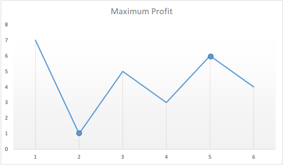
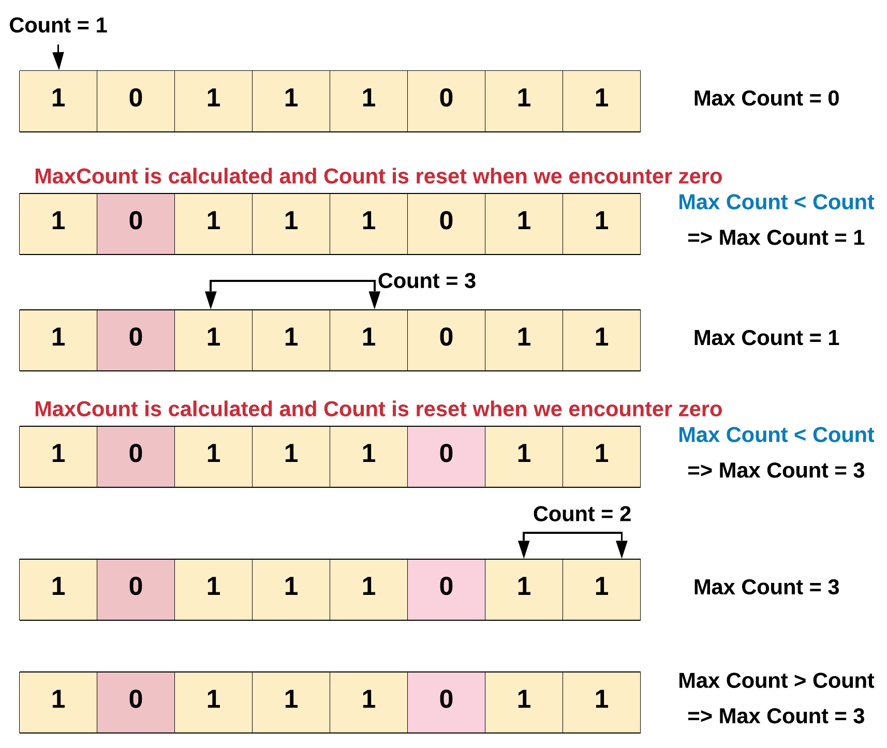

# Array
{: .no_toc }

<details open markdown="block">
  <summary>
    Table of contents
  </summary>
  {: .text-delta }
1. TOC
{:toc}
</details>

---
 

## Maximum Subarray

Given an integer array `nums`, find the subarray which has the largest sum and return its *sum*.

**Example 1:**
```log
Input: nums = [-2,1,-3,4,-1,2,1,-5,4]
Output: 6
Explanation: [4,-1,2,1] has the largest sum = 6.
```

**Example 2:**
```log
Input: nums = [1]
Output: 1
```

**Example 3:**
```log
Input: nums = [5,4,-1,7,8]
Output: 23
```

**Constraints:**

* `1 <= nums.length <= 105`

* `-104 <= nums[i] <= 104`

### Solution 1 : Optimized Brute Force

**Algorithm**

1. Initialize a variable `maxSubarray = -infinity` to keep track of the best subarray. We need to use negative infinity, not 0, because it is possible that there are only negative numbers in the array.

2. Use a for loop that considers each index of the array as a starting point.

3. For each starting point, create a variable `currentSubarray = 0`. Then, loop through the array from the starting index, adding each element to `currentSubarray`. Every time we add an element it represents a possible subarray - so continuously update `maxSubarray` to contain the maximum out of the `currentSubarray` and itself.

4. Return `maxSubarray`.

#### Implementation
```java
class Solution {
    public int maxSubArray(int[] nums) {
        int maxSubarray = Integer.MIN_VALUE;
        for (int i = 0; i < nums.length; i++) {
            int currentSubarray = 0;
            for (int j = i; j < nums.length; j++) {
                currentSubarray += nums[j];
                maxSubarray = Math.max(maxSubarray, currentSubarray);
            }
        }
        
        return maxSubarray;
    }
}
```

####  Complexity Analysis

**Time Complexity**: O(N^2), where N is the length of `nums`.

 * We use 2 nested `for` loops, with each loop iterating through `nums`.
 
**Space Complexity**: O(1)

 * No matter how big the input is, we are only ever using 2 variables: `ans` and `currentSubarray`.

### Solution 2 : Dynamic Programming, Kadane's Algorithm

**Algorithm**

1. Initialize 2 integer variables. Set both of them equal to the first value in the array.

   * `currentSubarray` will keep the running count of the current subarray we are focusing on.

   * `maxSubarray` will be our final return value. Continuously update it whenever we find a bigger subarray.
2. Iterate through the array, starting with the 2nd element (as we used the first element to initialize our variables). For each number, add it to the `currentSubarray` we are building. If `currentSubarray` becomes negative, we know it isn't worth keeping, so throw it away. Remember to update `maxSubarray` every time we find a new maximum.

3. Return `maxSubarray`.

#### Implementation

A clever way to update `currentSubarray` is using `currentSubarray = max(num, currentSubarray + num)`. If `currentSubarray` is negative, then `num > currentSubarray + num`.

```java
class Solution {
    public int maxSubArray(int[] nums) {
        // Initialize our variables using the first element.
        int currentSubarray = nums[0];
        int maxSubarray = nums[0];
        
        // Start with the 2nd element since we already used the first one.
        for (int i = 1; i < nums.length; i++) {
            int num = nums[i];
            // If current_subarray is negative, throw it away. Otherwise, keep adding to it.
            currentSubarray = Math.max(num, currentSubarray + num);
            maxSubarray = Math.max(maxSubarray, currentSubarray);
        }
        
        return maxSubarray;
    }
}
```

#### Complexity Analysis

**Time complexity:** O(N), where N is the length of `nums`.

   We iterate through every element of `nums` exactly once.

**Space complexity:** O(1)

   No matter how long the input is, we are only ever using 2 variables: `currentSubarray` and `maxSubarray`.

### Solution 3 : Divide and Conquer (Advanced)

**Algorithm**

Now that we know how to find the best subarray containing elements from both sides of any given array, the algorithm is as follows:
 1. Define a helper function that we will use for recursion.

    * This function will take an input `left` and `right`, which defines the bounds of the array. The return value of this function will be the best possible subarray for the array that fits between `left` and `right`.

    * If `left > right`, we have an empty array. Return negative infinity.

    * Find the midpoint of our array. This is `(left + right) / 2`, rounded down. Using this midpoint, find the best possible subarray that uses elements from both sides of the array with the algorithm detailed in the animation above.

    * The best subarray using elements from both sides is only 1 of 3 possibilities. We still need to find the best subarray using only the left or right halves. So, call this function again, once with the left half, and once with the right half.

    * Return the largest of the 3 values - the best left half sum, the best right half sum, and the best combined sum.
 2. Call our helper function with the entire input array `(left = 0, right = length - 1)`. This is our final answer, so return it.

#### Implementation
```java
class Solution {
    private int[] numsArray;
    
    public int maxSubArray(int[] nums) {
        numsArray = nums;
        
        // Our helper function is designed to solve this problem for
        // any array - so just call it using the entire input!
        return findBestSubarray(0, numsArray.length - 1);
    }
    
    private int findBestSubarray(int left, int right) {
        // Base case - empty array.
        if (left > right) {
            return Integer.MIN_VALUE;
        }
        
        int mid = Math.floorDiv(left + right, 2);
        int curr = 0;
        int bestLeftSum = 0;
        int bestRightSum = 0;
        
        // Iterate from the middle to the beginning.
        for (int i = mid - 1; i >= left; i--) {
            curr += numsArray[i];
            bestLeftSum = Math.max(bestLeftSum, curr);
        }
        
        // Reset curr and iterate from the middle to the end.
        curr = 0;
        for (int i = mid + 1; i <= right; i++) {
            curr += numsArray[i];
            bestRightSum = Math.max(bestRightSum, curr);
        }
        
        // The bestCombinedSum uses the middle element and the best
        // possible sum from each half.
        int bestCombinedSum = numsArray[mid] + bestLeftSum + bestRightSum;
        
        // Find the best subarray possible from both halves.
        int leftHalf = findBestSubarray(left, mid - 1);
        int rightHalf = findBestSubarray(mid + 1, right);
        
        // The largest of the 3 is the answer for any given input array.
        return Math.max(bestCombinedSum, Math.max(leftHalf, rightHalf));
    }
}
```

#### Complexity Analysis

**Time complexity:** O(N⋅logN), where N is the length of `nums`.

On our first call to `findBestSubarray`, we use for loops to visit every element of `nums`. Then, we split the array in half and call `findBestSubarray` with each half. Both those calls will then iterate through every element in that half, which combined is every element of `nums` again. Then, both those halves will be split in half, and 4 more calls to `findBestSubarray` will happen, each with a quarter of `nums`. As you can see, every time the array is split, we still need to handle every element of the original input `nums`. We have to do this logN times since that's how many times an array can be split in half.

**Space complexity:** O(logN), where N is the length of `nums`.

The extra space we use relative to input size is solely occupied by the recursion stack. Each time the array gets split in half, another call of `findBestSubarray` will be added to the recursion stack, until calls start to get resolved by the base case - remember, the base case happens at an empty array, which occurs after logN calls.


---

## Valid Sudoku

Determine if a 9 x 9 Sudoku board is valid. Only the filled cells need to be validated according to the following rules:

1. Each row must contain the digits 1-9 without repetition.
2. Each column must contain the digits 1-9 without repetition.
3. Each of the nine 3 x 3 sub-boxes of the grid must contain the digits 1-9 without repetition.

Note:
- A Sudoku board (partially filled) could be valid but is not necessarily solvable.
- Only the filled cells need to be validated according to the mentioned rules.


**Example 1:**
```log
Input: board =
[["5","3",".",".","7",".",".",".","."]
,["6",".",".","1","9","5",".",".","."]
,[".","9","8",".",".",".",".","6","."]
,["8",".",".",".","6",".",".",".","3"]
,["4",".",".","8",".","3",".",".","1"]
,["7",".",".",".","2",".",".",".","6"]
,[".","6",".",".",".",".","2","8","."]
,[".",".",".","4","1","9",".",".","5"]
,[".",".",".",".","8",".",".","7","9"]]
```

Output: true

**Example 2:**
```log
Input: board =
[["8","3",".",".","7",".",".",".","."]
,["6",".",".","1","9","5",".",".","."]
,[".","9","8",".",".",".",".","6","."]
,["8",".",".",".","6",".",".",".","3"]
,["4",".",".","8",".","3",".",".","1"]
,["7",".",".",".","2",".",".",".","6"]
,[".","6",".",".",".",".","2","8","."]
,[".",".",".","4","1","9",".",".","5"]
,[".",".",".",".","8",".",".","7","9"]]
```

Output: false

Explanation: Same as Example 1, except with the 5 in the top left corner being modified to 8. Since there are two 8's in the top left 3x3 sub-box, it is invalid.

**Constraints:**

board.length == 9
board[i].length == 9
board[i][j] is a digit 1-9 or '.'.


###  Solution 1

Collect the set of things we see, encoded as strings. `For example`:

- '4' in row 7 is encoded as "(4)7".
- '4' in column 7 is encoded as "7(4)".
- '4' in the top-right block is encoded as "0(4)2".

Scream `false` if we ever fail to add something because it was already added (i.e., seen before).


####  Implementation

```java
 class Solution {
    public boolean isValidSudoku(char[][] board) {
        Set seen = new HashSet();
        for (int i=0; i<9; ++i) {
            for (int j=0; j<9; ++j) {
                if (board[i][j] != '.') {
                    String b = "(" + board[i][j] + ")";
                    if (!seen.add(b + i) || !seen.add(j + b) || !seen.add(i/3 + b + j/3))
                        return false;
                }
            }
        }
        return true;
    }
}
```

**Edit:** We can also make it really clear and self-explaining.


```java
 class Solution {
    public boolean isValidSudoku(char[][] board) {
        Set seen = new HashSet();
        for (int i=0; i<9; ++i) {
            for (int j=0; j<9; ++j) {
                char number = board[i][j];
                if (number != '.')
                    if (!seen.add(number + " in row " + i) ||
                            !seen.add(number + " in column " + j) ||
                            !seen.add(number + " in block " + i/3 + "-" + j/3))
                        return false;
            }
        }
        return true;
    }
}
```

####  Runtime
37 ms

####  Memory
49.4 MB

####  Complexity Analysis

**Time Complexity**:

**Space Complexity**:

###  Solution 2


####  Implementation

```java
 class Solution {
    public boolean isValidSudoku(char[][] board) {
        for(int i = 0; i<9; i++){
            HashSet<Character> rows = new HashSet<Character>();
            HashSet<Character> columns = new HashSet<Character>();
            HashSet<Character> cube = new HashSet<Character>();
            for (int j = 0; j < 9;j++){
                if(board[i][j]!='.' && !rows.add(board[i][j]))
                    return false;
                if(board[j][i]!='.' && !columns.add(board[j][i]))
                    return false;
                int RowIndex = 3*(i/3);
                int ColIndex = 3*(i%3);
                if(board[RowIndex + j/3][ColIndex + j%3]!='.' && !cube.add(board[RowIndex + j/3][ColIndex + j%3]))
                    return false;
            }
        }
        return true;
    }

}
```


####  Runtime
2 ms

####  Memory
42.4 MB


---

## Minimum Number of Platforms Required for a Railway/Bus Station

Given the arrival and departure times of all trains that reach a railway station, the task is to find the minimum number of platforms required for the railway station so that no train waits.
We are given two arrays that represent the arrival and departure times of trains that stop.

Examples:

- Input: arr[] = {9:00, 9:40, 9:50, 11:00, 15:00, 18:00}
- dep[] = {9:10, 12:00, 11:20, 11:30, 19:00, 20:00}
- Output: 3
- Explanation: There are at-most three trains at a time (time between 9:40 to 12:00)

All events sorted by time.
Total platforms at any time can be obtained by subtracting total
departures from total arrivals by that time.
Time     Event Type     Total Platforms Needed at this Time                               
9:00       Arrival                  1
9:10       Departure                0
9:40       Arrival                  1
9:50       Arrival                  2
11:00      Arrival                  3
11:20      Departure                2
11:30      Departure                1
12:00      Departure                0
15:00      Arrival                  1
18:00      Arrival                  2
19:00      Departure                1
20:00      Departure                0

Minimum Platforms needed on railway station = Maximum platforms
needed at any time
= 3  

- Input: arr[] = {9:00, 9:40}
- dep[] = {9:10, 12:00}
- Output: 1
- Explanation: Only one platform is needed.


- Input: N=6,
- arr[] = {9:00, 9:45, 9:55, 11:00, 15:00, 18:00}
- dep[] = {9:20, 12:00, 11:30, 11:50, 19:00, 20:00}
- Output:3
- Explanation: There are at-most three trains at a time. The train at 11:00 arrived but the trains which had arrived at 9:45 and 9:55 have still not departed. So, we need at least three platforms here.


###  Efficient Approach by Sorting

**Intuition:** At first we need to sort both the arrays. When the events will be sorted, it will be easy to track the count of trains that have arrived but not departed yet. 
Total platforms needed at one time can be found by taking the difference of arrivals and departures at that time and the maximum value of all times will be the final answer.

**Approach:**  At first we need to sort both the arrays. When the events will be sorted, it will be easy to track the count of trains that have arrived but not departed yet. 
Total platforms needed at one time can be found by taking the difference of arrivals and departures at that time and the maximum value of all times will be the final answer. 
`If(arr[i]<=dep[j])` means if arrival time is less than or equal to the departure time then- we need one more platform. So increment count as well as increment i. 
`If(arr[i]>dep[j])` means arrival time is more than the departure time then- we have one extra platform which we can reduce. So decrement count but increment j. Update the ans with `max(ans, count)` after each iteration of the while loop.


####  Implementation

```java
import java.util.*;
class TUF {
    static int findPlatform(int arr[], int dep[], int n) {
        Arrays.sort(arr);
        Arrays.sort(dep);
        int plat_needed = 1, result = 1;
        int i = 1, j = 0;

        while (i < n && j < n) {
            if (arr[i] <= dep[j]) {
                plat_needed++;
                i++;
            }else if (arr[i] > dep[j]) {
                plat_needed--;
                j++;
            }
            if (plat_needed > result)
                result = plat_needed;
        }
        return result;
    }
    
    public static void main (String[] args) {
        int[] arr ={900,945,955,1100,1500,1800};
        int[] dep={920,1200,1130,1150,1900,2000};
        int n=arr.length;
        int totalCount=findPlatform(arr,dep,n);
        System.out.println("Minimum number of Platforms required "+totalCount);
    }
} 
```

**Output:**

Minimum number of Platforms required 3

####  Complexity Analysis

**Time Complexity**:
O(nlogn)   (Sorting takes O(nlogn) and traversal of arrays takes O(n) so overall time complexity is O(nlogn)).

**Space Complexity**:
O(1)   (No extra space used).


### Naive Approach

**Intuition:** Take each interval of arrival and departure one by one and count the number of overlapping time intervals. This can easily be done using nested for-loops. Maintain the maximum value of the count during the process and return the maximum value at the end.

**Approach**: We need to run two nested for-loops. Inside the inner loop count the number of intervals which intersect with the interval represented by the outer loop. As soon as the inner loop ends just update the maximum value of count and proceed with the next iteration of the outer loop. After the process ends we will get the maximum value of the count.


####  Implementation

```java
 import java.util.*;
class TUF {
    static int countPlatforms(int n,int arr[],int dep[]){
        int ans=1; //final value
        for(int i=0;i<=n-1;i++) {
            int count=1; // count of overlapping interval of only this   iteration
            for(int j=i+1;j<=n-1;j++){
                if((arr[i]>=arr[j] && arr[i]<=dep[j]) ||
                        (arr[j]>=arr[i] && arr[j]<=dep[i])){
                    count++;
                }
            }
            ans=Math.max(ans,count); //updating the value
        }
        return ans;
    }
    public static void main (String[] args) {
        int[] arr ={900,945,955,1100,1500,1800};
        int[] dep={920,1200,1130,1150,1900,2000};
        int n=arr.length;
        int totalCount=countPlatforms(n,arr,dep);
        System.out.println("Minimum number of Platforms required "+totalCount);
    }
}
```

Output:

Minimum number of Platforms required 3

####  Complexity Analysis

**Time Complexity**:
O(n^2)  (due to two nested loops).

**Space Complexity**:
O(1)  (no extra space used).


## Custom ArrayList 

ArrayList is very similar to Array but provides the feature of dynamic space allocation when the number of objects in the list grows.

### Custom ArrayList using Array

In Array, we have to provide the size at the time of initialization but that is not required for ArrayList.

Actually, when you initialize ArrayList, it automatically assigns its initial capacity to 10.

####  Implementation

```java

import java.util.Arrays;

//Implement ArrayList using Array
public class CustomArrayList<E> {
    private static final int DEFAULT_INITIAL_CAPACITY = 5;
    private static final Object[] EMPTY_ELEMENT_DATA = {};
    private int size;

    /**
     * The array elements to be stored inside
     * customArrayListElementData.
     */
    private transient Object[] customArrayListElementData;

    /**
     * Constructs a custom arrayList with an initial capacity.
     *
     * @param initialCapacity
     */
    public CustomArrayList(int initialCapacity) {
        super();
        if (initialCapacity < 0)
            throw new IllegalArgumentException("Illegal Capacity: " +
                    initialCapacity);
        this.customArrayListElementData = new Object[initialCapacity];
    }

    /**
     * Constructs an empty list.
     */
    public CustomArrayList() {
        super();
        this.customArrayListElementData = EMPTY_ELEMENT_DATA;
    }

    /**
     * @return the size of the CustomArrayList
     */
    public int size() {
        return size;
    }

    /**
     * @return true/false if size is greater then 0 return true else false.
     */
    public boolean isEmpty() {
        return size == 0;
    }

    /**
     * return true
     *
     * @param e
     */
    public boolean add(E e) {
        ensureCapacity(size + 1);
        customArrayListElementData[size++] = e;
        return true;
    }

    public void clear() {
        for (int i = 0; i < size; i++)
            customArrayListElementData[i] = null;

        size = 0;

    }

    /**
     * Returns the element at the specified position in this list.
     *
     * @param index
     * @return
     */
    @SuppressWarnings("unchecked")
    public E get(int index) {
        if (index >= size) {
            throw new ArrayIndexOutOfBoundsException("array index out of bound exception with index at" + index);
        }
        return (E) customArrayListElementData[index];
    }

    /**
     * add element at specific index position and shift the
     * customArrayListElementData.
     *
     * @param index
     * @param element
     */
    public void add(int index, E element) {
        ensureCapacity(size + 1);
        System.arraycopy(customArrayListElementData, index, customArrayListElementData, index + 1, size - index);
        customArrayListElementData[index] = element;
        size++;

    }

    /**
     * Remove the element from the customArrayListElementData
     * and shift the elements position.
     *
     * @param index
     * @return
     */
    @SuppressWarnings("unchecked")
    public E remove(int index) {
        E oldValue = (E) customArrayListElementData[index];

        int removeNumber = size - index - 1;
        if (removeNumber > 0) {
            System.arraycopy(customArrayListElementData, index + 1, customArrayListElementData, index, removeNumber);
        }
        customArrayListElementData[--size] = null;
        return oldValue;
    }

    /**
     * Increases the capacity to ensure that it can hold at least the
     * number of elements specified by the minimum capacity argument.
     *
     * @param minCapacity the desired minimum capacity
     */
    private void growCustomArrayList(int minCapacity) {
        int oldCapacity = customArrayListElementData.length;
        int newCapacity = oldCapacity + (oldCapacity / 2);
        if (newCapacity - minCapacity < 0)
            newCapacity = minCapacity;
        customArrayListElementData = Arrays.copyOf(customArrayListElementData, newCapacity);
    }

    /**
     * ensure the capacity and grow the customArrayList vi
     * growCustomArrayList(minCapacity);
     *
     * @param minCapacity
     */
    private void ensureCapacity(int minCapacity) {
        if (customArrayListElementData == EMPTY_ELEMENT_DATA) {
            minCapacity = Math.max(DEFAULT_INITIAL_CAPACITY, minCapacity);
        }

        if (minCapacity - customArrayListElementData.length > 0)
            growCustomArrayList(minCapacity);
    }

    /**
     * main method to test the custome array list
     */
    public static void main(String[] args) {
        CustomArrayList<String> strList = new CustomArrayList<>();
        strList.add("str1");
        strList.add("str2");
        System.out.println("after adding elements size =" + strList.size());
        strList.remove(1);
        System.out.println("after removing element size =" + strList.size());
    }
}

/*
Output:
after adding elements size =2
after removing element size =1
 */ 
```
--- 

## Sort an Array

Given an array of integers nums, sort the array in ascending order and return it.

You must solve the problem **without using any built-in** functions in O(nlog(n)) time complexity and with the smallest space complexity possible.

**Example 1:**

```log
Input: nums = [5,2,3,1]
Output: [1,2,3,5]
Explanation: After sorting the array, the positions of some numbers are not changed (for example, 2 and 3), while the positions of other numbers are changed (for example, 1 and 5).
```

**Example 2:**

```log
Input: nums = [5,1,1,2,0,0]
Output: [0,0,1,1,2,5]
Explanation: Note that the values of nums are not necessairly unique.
```

**Constraints:**

```log
1 <= nums.length <= 5 * 104
-5 * 104 <= nums[i] <= 5 * 104
```

### Solution 1

**Algorithms:**

* quick sort
* top-down merge sort
* bottom-up merge sort
* heap sort
* selection sort
* insertion sort
* bubble sort (TLE)

#### implementations : 

**1. Quick sort:**

```java
class Solution {
    public List<Integer> sortArray(int[] nums) {
        List<Integer> res = new ArrayList<>();
        if (nums == null || nums.length == 0) return res;
        quickSort(nums, 0, nums.length - 1);
        for (int i : nums) res.add(i);
        return res;
    }
    private void quickSort(int[] nums, int l, int r) {
        if (l >= r) return;
        int mid = partition(nums, l, r);
        quickSort(nums, l, mid);
        quickSort(nums, mid + 1, r);
    }
    private int partition(int[] nums, int l, int r) {
        int pivot = nums[l];
        while (l < r) {
            while (l < r && nums[r] >= pivot) r--;
            nums[l] = nums[r];
            while (l < r && nums[l] <= pivot) l++;
            nums[r] = nums[l];
        }
        nums[l] = pivot;
        return l;
    }
}
```
**2. Top-down merge sort**

```java
class Solution {
    public List<Integer> sortArray(int[] nums) {
        List<Integer> res = new ArrayList<>();
        if (nums == null || nums.length == 0) return res;
        mergeSort(nums, 0, nums.length - 1);
        for (int i : nums) res.add(i);
        return res;
    }
    private void mergeSort(int[] nums, int l, int r) {
        if (l >= r) return;
        int mid = l + (r - l) / 2;
        mergeSort(nums, l, mid);
        mergeSort(nums, mid + 1, r);
        merge(nums, l, r);
    }
    private void merge(int[] nums, int l, int r) {
        int mid = l + (r - l) / 2;
        int[] tmp = new int[r - l + 1];
        int i = l, j = mid + 1, k = 0;
        while (i <= mid || j <= r) {
            if (i > mid || j <= r && nums[i] > nums[j]) {
                tmp[k++] = nums[j++];
            } else {
                tmp[k++] = nums[i++];
            }
        }
        System.arraycopy(tmp, 0, nums, l, r - l + 1);
    }
}
```

**3. Bottom-up merge sort**

```java
class Solution {
    public List<Integer> sortArray(int[] nums) {
        List<Integer> res = new ArrayList<>();
        if (nums == null || nums.length == 0) return res;
        mergeSort2(nums);
        for (int i : nums) res.add(i);
        return res;
    }
    private void mergeSort2(int[] nums) {
        for (int size = 1; size < nums.length; size *= 2) {
            for (int i = 0; i < nums.length - size; i += 2 * size) {
                int mid = i + size - 1;
                int end = Math.min(i + 2 * size - 1, nums.length - 1);
                merge2(nums, i, mid, end);
            }
        }
    }
    private void merge2(int[] nums, int l, int mid, int r) {
        int[] tmp = new int[r - l + 1];
        int i = l, j = mid + 1, k = 0;
        while (i <= mid || j <= r) {
            if (i > mid || j <= r && nums[i] > nums[j]) {
                tmp[k++] = nums[j++];
            } else {
                tmp[k++] = nums[i++];
            }
        }
        System.arraycopy(tmp, 0, nums, l, r - l + 1);
    }
}
```
**4. Heap sort**

```java
class Solution {
    public List<Integer> sortArray(int[] nums) {
        List<Integer> res = new ArrayList<>();
        if (nums == null || nums.length == 0) return res;
        heapSort(nums);
        for (int i : nums) res.add(i);
        return res;
    }
    private void heapSort(int[] nums) {
        for (int i = nums.length / 2 - 1; i >= 0; i--) {
            heapify(nums, i, nums.length - 1);
        }
        for (int i = nums.length - 1; i >= 1; i--) {
            swap(nums, 0, i);
            heapify(nums, 0, i - 1);
        }
    }
    private void heapify(int[] nums, int i, int end) {
        while (i <= end) {
            int l = 2 * i + 1, r = 2 * i + 2;
            int maxIndex = i;
            if (l <= end && nums[l] > nums[maxIndex]) maxIndex = l;
            if (r <= end && nums[r] > nums[maxIndex]) maxIndex = r;
            if (maxIndex == i) break;
            swap(nums, i, maxIndex);
            i = maxIndex;
        }
    }
    private void swap(int[] nums, int i, int j) {
        int tmp = nums[i];
        nums[i] = nums[j];
        nums[j] = tmp;
    }
}
```
**5. Selection sort**
```java
class Solution {
    public List<Integer> sortArray(int[] nums) {
        List<Integer> res = new ArrayList<>();
        if (nums == null || nums.length == 0) return res;
        selectionSort(nums);
        for (int i : nums) res.add(i);
        return res;
    }
    private void selectionSort(int[] nums) {
        for (int i = 0; i < nums.length; i++) {
            int minIndex = i;
            for (int j = i + 1; j < nums.length; j++) {
                if (nums[j] < nums[minIndex]) minIndex = j;
            }
            if (minIndex != i) swap(nums, i, minIndex);
        }
    }
    private void swap(int[] nums, int i, int j) {
        nums[i] = nums[i] ^ nums[j];
        nums[j] = nums[i] ^ nums[j];
        nums[i] = nums[i] ^ nums[j];
    }
}
```
**6. Insertion sort**

```java
class Solution {
    public List<Integer> sortArray(int[] nums) {
        List<Integer> res = new ArrayList<>();
        if (nums == null || nums.length == 0) return res;
        insertionSort(nums);
        for (int i : nums) res.add(i);
        return res;
    }
    private void insertionSort(int[] nums) {
        for (int i = 1; i < nums.length; i++) {
            for (int j = i; j >= 1; j--) {
                if (nums[j] >= nums[j - 1]) break;
                swap(nums, j, j - 1);
            }
        }
    }
    private void swap(int[] nums, int i, int j) {
        nums[i] = nums[i] ^ nums[j];
        nums[j] = nums[i] ^ nums[j];
        nums[i] = nums[i] ^ nums[j];
    }
}
```
**7. bubble sort (TLE)**

```java
class Solution {
    public List<Integer> sortArray(int[] nums) {
        List<Integer> res = new ArrayList<>();
        if (nums == null || nums.length == 0) return res;
        bubbleSort(nums);
        for (int i : nums) res.add(i);
        return res;
    }
    private void bubbleSort(int[] nums) {
        for (int k = nums.length - 1; k >= 1; k--) {
            for (int i = 0; i < k; i++) {
                if (nums[i] > nums[i + 1]) swap(nums, i, i + 1);
            }
        }
    }
    private void swap(int[] nums, int i, int j) {
        nums[i] = nums[i] ^ nums[j];
        nums[j] = nums[i] ^ nums[j];
        nums[i] = nums[i] ^ nums[j];
    }
}
```
### Solution 2 : Merge sort

```java
public int[] sortArray(int[] nums) {
     mergesort(nums, 0, nums.length-1);
     return nums;
    }
	
    public void mergesort(int[] nums, int start, int end){
        if(start < end){
            int mid = (start + end) / 2;
            mergesort(nums, start, mid);
            mergesort(nums, mid+1, end);
            merge(nums, start, mid, end);
        }
    }
    
    public void merge(int[] nums, int start, int mid, int end){
    int i= start,  j= mid+1, k=0;
    int[] temp = new int[end-start+1];
    while( i <= mid && j<= end)
    {
        if (nums[i] < nums[j])
            temp[k++] = nums[i++];
        else
            temp[k++] = nums[j++];
    }
    while (i <= mid) { temp[k++] = nums[i++]; } //copy remaining elements
    while (j <= end) { temp[k++] = nums[j++]; } //copy remaining elements
    for (int pointer = start; pointer <= end; pointer++){
        nums[pointer] = temp[pointer-start];
    }
  }
```


---

## Single Number

Given a non-empty array of integers `nums`, every element appears twice except for one. Find that single one.

You must implement a solution with a linear runtime complexity and use only constant extra space.

**Example 1:**

```log
Input: nums = [2,2,1]
Output: 1
```

**Example 2:**

```log
Input: nums = [4,1,2,1,2]
Output: 4
```

**Example 3:**

```log
Input: nums = [1]
Output: 1
```

**Constraints:**
```log
1 <= nums.length <= 3 * 104
-3 * 104 <= nums[i] <= 3 * 104
Each element in the array appears twice except for one element which appears only once.
```
### Solution 1 : List operation

**Algorithm**

* Iterate over all the elements in \text{nums}nums
* If some number in \text{nums}nums is new to array, append it
* If some number is already in the array, remove it

#### Implementation

```java
class Solution {
  public int singleNumber(int[] nums) {
    List<Integer> no_duplicate_list = new ArrayList<>();

    for (int i : nums) {
      if (!no_duplicate_list.contains(i)) {
        no_duplicate_list.add(i);
      } else {
        no_duplicate_list.remove(new Integer(i));
      }
    }
    return no_duplicate_list.get(0);
  }
}
```
#### Complexity Analysis

**Time complexity :** O(n^2). We iterate through nums, taking O(n) time. We search the whole list to find whether there is duplicate number, taking O(n) time. Because search is in the for loop, so we have to multiply both time complexities which is O(n^2).

**Space complexity :** O(n). We need a list of size nn to contain elements in nums.

### Solution 2 : Hash Table

**Algorithm**

We use hash table to avoid the O(n) time required for searching the elements.

* Iterate through all elements in `nums` and set up key/value pair.

* Return the element which appeared only once.

#### Implementation
```java
class Solution {
  public int singleNumber(int[] nums) {
    HashMap<Integer, Integer> hash_table = new HashMap<>();

    for (int i : nums) {
      hash_table.put(i, hash_table.getOrDefault(i, 0) + 1);
    }
    for (int i : nums) {
      if (hash_table.get(i) == 1) {
        return i;
      }
    }
    return 0;
  }
}
```
#### Complexity Analysis

**Time complexity :** O(n⋅1)=O(n). Time complexity of for loop is O(n).

**Space complexity :** O(n). The space required by *hash_table* is equal to the number of elements in `nums`.

### Solution 3 : Math

**Concept**

`2 * (a + b + c) - (a + a + b + b + c) = c`

#### Implementation
```java
class Solution {
  public int singleNumber(int[] nums) {
    int sumOfSet = 0, sumOfNums = 0;
    Set<Integer> set = new HashSet();

    for (int num : nums) {
      if (!set.contains(num)) {
        set.add(num);
        sumOfSet += num;
      }
      sumOfNums += num;
    }
    return 2 * sumOfSet - sumOfNums;
  }
}
```

#### Complexity Analysis

**Time complexity :** O(n+n)=O(n). sum will call next to iterate through `nums`. We can see it as `sum(list(i, for i in nums))` which means the time complexity is O(n) because of the number of elements(n) in `nums`.

**Space complexity :** O(n+n)=O(n). set needs space for the elements in `nums`.

### Solution 4 : Bit Manipulation

**Concept**

* If we take XOR of zero and some bit, it will return that bit
   - a ⊕ 0 = a
  
* If we take XOR of two same bits, it will return 0
   - a ⊕ a = 0
  
* a ⊕ b ⊕ a = (a⊕a) ⊕ b = 0 ⊕ b = b

So we can XOR all bits together to find the unique number.

#### Implementation 
```java
class Solution {
  public int singleNumber(int[] nums) {
    int a = 0;
    for (int i : nums) {
      a ^= i;
    }
    return a;
  }
}
```

#### Complexity Analysis

**Time complexity :** O(n). We only iterate through `nums`, so the time complexity is the number of elements in `nums`.

**Space complexity :** O(1).

---

## Find All Numbers Disappeared in an Array

Given an array `nums` of n integers where `nums[i]` is in the range `[1, n]`, return an array of all the integers in the range `[1, n]` that do not appear in `nums`.

**Example 1:**
```log
Input: nums = [4,3,2,7,8,2,3,1]
Output: [5,6]
```

**Example 2:**
```log
Input: nums = [1,1]
Output: [2]
```

**Constraints:**
```log
n == nums.length
1 <= n <= 105
1 <= nums[i] <= n
```

### Solution 1 : Using Hash Map

**Intuition**

The intuition behind using a hash map is pretty clear in this case. We are given that the array would be of size `N` and it should contain numbers from `1` to `N`. However, some of the numbers are missing. All we have to do is keep track of which numbers we encounter in the array and then iterate from 1⋯N and check which numbers did not appear in the hash table. Those will be our missing numbers.

**Algorithm**

1. Initialize a hash map, hash to keep track of the numbers that we encounter in the array. Note that we can use a set data structure as well in this case since we are not concerned about the frequency counts of elements.

 

      Note that for the purposes of illustration, we have use a hash map of size 14 and have ordered the keys of the hash map from 0 to 14. Also, we will be using a simple hash function that directly maps the array entries to their corresponding keys in the hash map. Usually, the mapping is not this simple and is dependent upon the hash function being used in the implementation of the hash map.


2. Next, iterate over the given array one element at a time and for each element, insert an entry in the hash map. Even if an entry were to exist before in the hash map, it will simply be over-written. For the above example, let's look at the final state of the hash map once we process the last element of the array.


3. Now that we know the unique set of elements from the array, we can simply find out the missing elements from the range 1⋯N.

4. Iterate over all the numbers from 1⋯N and for each number, check if there's an entry in the hash map. If there is no entry, add that missing number to a result array that we will return from the function eventually.

#### Implementation 
```java
class Solution {
    public List<Integer> findDisappearedNumbers(int[] nums) {
        
        // Hash table for keeping track of the numbers in the array
        // Note that we can also use a set here since we are not 
        // really concerned with the frequency of numbers.
        HashMap<Integer, Boolean> hashTable = new HashMap<Integer, Boolean>();
        
        // Add each of the numbers to the hash table
        for (int i = 0; i < nums.length; i++) {
            hashTable.put(nums[i], true);
        }
        
        // Response array that would contain the missing numbers
        List<Integer> result = new LinkedList<Integer>();
        
        // Iterate over the numbers from 1 to N and add all those
        // that don't appear in the hash table. 
        for (int i = 1; i <= nums.length; i++) {
            if (!hashTable.containsKey(i)) {
                result.add(i);
            }
        }
        
        return result;
    }
}
```
#### Complexity Analysis

**Time Complexity :** O(N)

**Space Complexity :** O(N)

### Solution 2 : O(1) Space InPlace Modification Solution

**Intuition**

We definitely need to keep track of all the unique numbers that appear in the array. However, we don't want to use any extra space for it. This solution that we will look at in just a moment springs from the fact that

    All the elements are in the range [1, N]

Since we are given this information, we can make use of the input array itself to somehow mark visited numbers and then find our missing numbers. Now, we don't want to change the actual data in the array but who's stopping us from changing the magnitude of numbers in the array? That is the basic idea behind this algorithm.

    We will be negating the numbers seen in the array and use the sign of each of the numbers for finding our missing numbers. We will be treating numbers in the array as indices and mark corresponding locations in the array as negative.

**Algorithm**

1. Iterate over the input array one element at a time.

2. For each element `nums[i]`, mark the element at the corresponding location negative if it's not already marked so i.e. ***nums[nums[i]−1]×−1*** .

3. Now, loop over numbers from 1⋯N and for each number check if `nums[j]` is negative. If it is negative, that means we've seen this number somewhere in the array.

4. Add all the numbers to the resultant array which don't have their corresponding locations marked as negative in the original array.

#### Implementation 
```java
class Solution {
    public List<Integer> findDisappearedNumbers(int[] nums) {
        
        // Iterate over each of the elements in the original array
        for (int i = 0; i < nums.length; i++) {
            
            // Treat the value as the new index
            int newIndex = Math.abs(nums[i]) - 1;
            
            // Check the magnitude of value at this new index
            // If the magnitude is positive, make it negative 
            // thus indicating that the number nums[i] has 
            // appeared or has been visited.
            if (nums[newIndex] > 0) {
                nums[newIndex] *= -1;
            }
        }
        
        // Response array that would contain the missing numbers
        List<Integer> result = new LinkedList<Integer>();
        
        // Iterate over the numbers from 1 to N and add all those
        // that have positive magnitude in the array
        for (int i = 1; i <= nums.length; i++) {
            
            if (nums[i - 1] > 0) {
                result.add(i);
            }
        }
        
        return result;
    }
}
```
#### Complexity Analysis

**Time Complexity :** O(N)

**Space Complexity :** O(1) since we are reusing the input array itself as a hash table and the space occupied by the output array doesn't count toward the space complexity of the algorithm.

### Solution 3 : Java solution [100%]

I simply allocated a separate index for each number, then checked which indexes are zero - these are our numbers we are looking for.

#### Implementation

```java
class Solution {
    public List<Integer> findDisappearedNumbers(int[] nums) {
        int[] res = new int[nums.length + 1];

        for (int num : nums) {
            res[num] = num;
        }

        List<Integer> result = new ArrayList<>(res.length);
        for (int i = 1; i < res.length; i++) {
            if (res[i] == 0) {
                result.add(i);
            }
        }

        return result;
    }
}
```

---

## Find All Duplicates in an Array

Given an integer array `nums` of length n where all the integers of `nums` are in the range [1, n] and each integer appears once or twice, return an array of all the integers that appears twice.

You must write an algorithm that runs in O(n) time and uses only constant extra space.


**Example 1:**

```log
Input: nums = [4,3,2,7,8,2,3,1]
Output: [2,3]
```


**Example 2:**

```log
Input: nums = [1,1,2]
Output: [1]
```


**Example 3:**

```log
Input: nums = [1]
Output: []
```


**Constraints:**

```log
* n == nums.length
* 1 <= n <= 105
* 1 <= nums[i] <= n
* Each element in nums appears once or twice.
```

### Solution 1 : Brute Force

**Intuition**

Check for a second occurrence of every element in the rest of the array.

**Algorithm**

When we iterate over the elements of the input array, we can simply look for any other occurrence of the current element in the rest of the array.

Since an element can only occur once or twice, we don't have to worry about getting duplicates of elements that appear twice:

 - Case - I: If an element occurs only once in the array, when you look for it in the rest of the array, you'll find nothing.

 - Case - II: If an element occurs twice, you'll find the second occurrence of the element in the rest of the array. When you chance upon the second occurrence in a later iteration, it'd be the same as Case - I (since there are no more occurrences of this element in the rest of the array).

#### Implementation

```java
class Solution {
    public List<Integer> findDuplicates(int[] nums) {
        List<Integer> ans = new ArrayList<>();

        for (int i = 0; i < nums.length; i++) {
            for (int j = i + 1; j < nums.length; j++) {
                if (nums[j] == nums[i]) {
                    ans.add(nums[i]);
                    break;
                }
            }
        }

        return ans;
    }
}
```

#### Complexity Analysis

**Time complexity :** {O}(n^2). For each element in the array, we search for another occurrence in the rest of the array. Hence, for the i^{th} element in the array, we might end up looking through all n - i remaining elements in the worst case. So, we can end up going through about n^2 elements in the worst case.

 

**Space complexity :** No extra space required, other than the space for the output list.


### Solution 2 : Sort and Compare Adjacent Elements

**Intuition**

After sorting a list of elements, all elements of equivalent value get placed together. Thus, when you sort an array, equivalent elements form contiguous blocks.

**Algorithm**

  * Sort the array.

  * Compare every element with it's neighbors. If an element occurs more than once, it'll be equal to at-least one of it's neighbors.

To simplify:

1. Compare every element with its predecessor.

   * Obviously the first element doesn't have a predecessor, so we can skip it.

2. Once we've found a match with a predecessor, we can skip the next element entirely!

   * Why? Well, if an element matches with its predecessor, it cannot possibly match with its successor as well. Thus, the next iteration (i.e. comparison between the next element and the current element) can be safely skipped.

#### Implementation 

```java
class Solution {
    public List<Integer> findDuplicates(int[] nums) {
        List<Integer> ans = new ArrayList<>();

        Arrays.sort(nums);

        for (int i = 1; i < nums.length; i++) {
            if (nums[i] == nums[i - 1]) {
                ans.add(nums[i]);
                i++;        // skip over next element
            }
        }

        return ans;
    }
}
```
#### Complexity Analysis

**Time complexity :** O(nlogn)+O(n)≃O(nlogn).

A performant comparison-based sorting algorithm will run in O(nlogn) time. Note that this can be reduced to O(n) using a special sorting algorithm like Radix Sort.

Traversing the array after sorting takes linear time i.e. O(n).

**Space complexity :** No extra space required, other than the space for the output list. Sorting can be done in-place.

### Solution 3 : Store Seen Elements in a Set / Map

**Intuition**

In Solution 1 we used two loops (one nested within the other) to look for two occurrences of an element. In almost all similar situations, you can usually substitute one of the loops with a set / map. Often, it's a worthy trade-off: for a bit of extra memory, you can reduce the order of your runtime complexity.

**Algorithm**

We store all elements that we've seen till now in a map / set. When we visit an element, we query the map / set to figure out if we've seen this element before.

#### Implementation

```java
class Solution {
    public List<Integer> findDuplicates(int[] nums) {
        List<Integer> ans = new ArrayList<>();
        Set<Integer> seen = new HashSet<>();

        for (int num : nums) {
            if (seen.contains(num)) {
                ans.add(num);
            } else {
                seen.add(num);
            }
        }

        return ans;
    }
}
```
#### Complexity Analysis

**Time complexity :** O(n) average case. O(n^2) worst case.

It takes a linear amount of time to iterate through the array.

Lookups in a hashset are constant time on average, however those can degrade to linear time in the worst case. Note that an alternative is to use tree-based sets, which give logarithmic time lookups always.

**Space complexity :** Upto O(n) extra space required for the set.

If you are tight on space, you can significantly reduce your physical space requirements by using bitsets [1] instead of sets. This data-structure requires just one bit per element, so you can be done in just nn bits of data for elements that go up-to nn. Of course, this doesn't reduce your space complexity: bitsets still grow linearly with the range of values that the elements can take.

### Solution 4 : Mark Visited Elements in the Input Array itself

**Intuition**

All the above approaches have ignored a key piece of information in the problem statement:

    The integers in the input array arr satisfy 1 ≤ arr[i] ≤ n, where n is the size of array. 


This presents us with two key insights:

1. All the integers present in the array are positive. i.e. `arr[i] > 0` for any valid index `i`. 

2. The decrement of any integers present in the array must be an accessible index in the array.
i.e. for any integer `x` in the array, `x-1` is a valid index, and thus, `arr[x-1]` is a valid reference to an element in the array.

**Algorithm**

1. Iterate over the array and for every element `x` in the array, negate the value at index `abs(x)-1`. 

  - The negation operation effectively marks the value `abs(x)` as seen / visited.

2. Iterate over the array again, for every element `x` in the array:

  - If the value at index `abs(x)-1` is positive, it must have been negated twice. Thus `abs(x)` must have appeared twice in the array. We add `abs(x)` to the result.

  - In the above case, when we reach the second occurrence of `abs(x)`, we need to avoid fulfilling this condition again. So, we'll additionally negate the value at index `abs(x)-1`.


```java
class Solution {
    public List<Integer> findDuplicates(int[] nums) {
        List<Integer> ans = new ArrayList<>();

        for (int num : nums) {
            nums[Math.abs(num) - 1] *= -1;
        }

        for (int num : nums) {
            if (nums[Math.abs(num) - 1] > 0) {
                ans.add(Math.abs(num));
                nums[Math.abs(num) - 1] *= -1;
            }
        }

        return ans;
    }
}
```
Definitely! Notice that if an element `x` occurs just once in the array, the value at index `abs(x)-1` becomes negative and remains so for all of the iterations that follow.

- Traverse through the array. When we see an element `x` for the first time, we'll negate the value at index `abs(x)-1`.

- But, the next time we see an element `x`, we don't need to negate again! If the value at index `abs(x)-1` is already negative, we know that we've seen element `x` before.

So, now we are relying on a single negation to mark the visited status of an element. This is similar to what we did in solution 3, except that we are re-using the array (with some smart negations) instead of a separate set.

```java
class Solution {
    public List<Integer> findDuplicates(int[] nums) {
        List<Integer> ans = new ArrayList<>();

        for (int num : nums) {
            if (nums[Math.abs(num) - 1] < 0) { // seen before
                ans.add(Math.abs(num));
            }
            nums[Math.abs(num) - 1] *= -1;
        }

        return ans;
    }
}
```

#### Complexity Analysis

**Time complexity :** O(n). We iterate over the array twice. Each negation operation occurs in constant time.

**Space complexity :** No extra space required, other than the space for the output list. We re-use the input array to store visited status.

---

## Median of Two Sorted Arrays

Given two sorted arrays `nums1` and `nums2` of size `m` and `n` respectively, return the median of the two sorted arrays.

The overall run time complexity should be O(log (m+n)).

**Example 1:**

```log
Input: nums1 = [1,3], nums2 = [2]
Output: 2.00000
Explanation: merged array = [1,2,3] and median is 2.
```

**Example 2:**

```log
Input: nums1 = [1,2], nums2 = [3,4]
Output: 2.50000
Explanation: merged array = [1,2,3,4] and median is (2 + 3) / 2 = 2.5.
```

**Constraints:**

```log
* nums1.length == m
* nums2.length == n
* 0 <= m <= 1000
* 0 <= n <= 1000
* 1 <= m + n <= 2000
* -106 <= nums1[i], nums2[i] <= 106
```

### Solution 1

* param `nums1` the first sorted arrays.

* param `nums2` the second sorted arrays.

* return the median of the two sorted arrays.

#### Implementation
```java
class Solution {
    public double findMedianSortedArrays(int[] nums1, int[] nums2) {
        int index1 = 0;
        int index2 = 0;
        int med1 = 0;
        int med2 = 0;
        for (int i = 0; i <= (nums1.length + nums2.length) / 2; i++) {
            med1 = med2;
            if (index1 == nums1.length) {
                med2 = nums2[index2];
                index2++;
            } else if (index2 == nums2.length) {
                med2 = nums1[index1];
                index1++;
            } else if (nums1[index1] < nums2[index2]) {
                med2 = nums1[index1];
                index1++;
            } else {
                med2 = nums2[index2];
                index2++;
            }
        }

        // the median is the average of two numbers
        if ((nums1.length + nums2.length) % 2 == 0) {
            return (float) (med1 + med2) / 2;
        }

        return med2;
    }
}
```
#### Complexity Analysis

**Time complexity :** O(m+n). Although the running time is similar, it is worse than the required O(log (m+n)).

**Space complexity :**  O(1).

### Solution 2 

#### Implemenatation
```java
class Solution {
    public double findMedianSortedArrays(int[] nums1, int[] nums2) {
        if(nums1.length > nums2.length)return findMedianSortedArrays(nums2,nums1);
        int x = nums1.length;
        int y = nums2.length;
        int low = 0;
        int high = x;
        while(low<=high){
            int partX =  (low+high)/2;
            int partY =  (x+y+1)/2 - partX;
            int xLeft = partX == 0 ? Integer.MIN_VALUE : nums1[partX-1];
            int xRight = partX == x ? Integer.MAX_VALUE : nums1[partX];
            int yLeft = partY == 0 ? Integer.MIN_VALUE : nums2[partY-1];
            int yRight = partY == y ? Integer.MAX_VALUE : nums2[partY];
            if(xLeft<=yRight && yLeft<=xRight){
               if((x+y)%2==0){
                   return ((double)Math.max(xLeft,yLeft) + Math.min(xRight,yRight))/2;
               }else{
                   return Math.max(xLeft,yLeft);
               } 
            }else if(xLeft>yRight){
                high = partX -1;
            }else{
                low = partX+1;
            }
        }
        return 0;
    }
}
```
---

## Product of Array Except Self

Given an integer array `nums`, return an array answer such that `answer[i]` is equal to the product of all the elements of `nums` except `nums[i]`.

The product of any prefix or suffix of `nums` is guaranteed to fit in a 32-bit integer.

You must write an algorithm that runs in `O(n)` time and without using the division operation.


**Example 1:**
```log
Input: nums = [1,2,3,4]
Output: [24,12,8,6]
```

**Example 2:**
```log
Input: nums = [-1,1,0,-3,3]
Output: [0,0,9,0,0]
```

**Constraints:**
```log
* 2 <= nums.length <= 105
* -30 <= nums[i] <= 30
* The product of any prefix or suffix of nums is guaranteed to fit in a 32-bit integer.
```

### Solution 1 : O(1) space approach

Although the above solution is good enough to solve the problem since we are not using division anymore, there's a follow-up component as well which asks us to solve this using constant space. Understandably so, the output array does not count towards the space complexity. This approach is essentially an extension of the approach above. Basically, we will be using the output array as one of `L` or `R` and we will be constructing the other one on the fly. Let's look at the algorithm based on this idea.

**Algorithm**

1. Initialize the empty `answer` array where for a given index `i`, `answer[i]` would contain the product of all the numbers to the left of `i`.

2. We construct the `answer` array the same way we constructed the `L` array in the previous approach. These two algorithms are exactly the same except that we are trying to save up on space.

3. The only change in this approach is that we don't explicitly build the `R` array from before. Instead, we simply use a variable to keep track of the running product of elements to the right and we keep updating the `answer` array by doing `answer[i] = answer[i]∗R`. For a given index `i`, `answer[i]` contains the product of all the elements to the left and `R` would contain product of all the elements to the right. We then update `R` as `R = R * nums[i]`.

#### Implementtation

```java
class Solution {
    public int[] productExceptSelf(int[] nums) {

        // The length of the input array 
        int length = nums.length;

        // Final answer array to be returned
        int[] answer = new int[length];

        // answer[i] contains the product of all the elements to the left
        // Note: for the element at index '0', there are no elements to the left,
        // so the answer[0] would be 1
        answer[0] = 1;
        for (int i = 1; i < length; i++) {

            // answer[i - 1] already contains the product of elements to the left of 'i - 1'
            // Simply multiplying it with nums[i - 1] would give the product of all 
            // elements to the left of index 'i'
            answer[i] = nums[i - 1] * answer[i - 1];
        }

        // R contains the product of all the elements to the right
        // Note: for the element at index 'length - 1', there are no elements to the right,
        // so the R would be 1
        int R = 1;
        for (int i = length - 1; i >= 0; i--) {

            // For the index 'i', R would contain the 
            // product of all elements to the right. We update R accordingly
            answer[i] = answer[i] * R;
            R *= nums[i];
        }

        return answer;
    }
}
```

#### Complexity analysis

**Time complexity** : O(N) where `N` represents the number of elements in the input array. We use one iteration to construct the array `L`, one to update the array `answer`.

**Space complexity** : O(1) since don't use any additional array for our computations. The problem statement mentions that using the `answer` array doesn't add to the space complexity.

### Solution 2 : Left and Right product lists

**Algorithm**

1. Initialize two empty arrays, `L` and `R` where for a given index `i`, `L[i]` would contain the product of all the numbers to the left of `i` and `R[i]` would contain the product of all the numbers to the right of `i`.

2. We would need two different loops to fill in values for the two arrays. For the array `L`, `L[0]` would be 1 since there are no elements to the left of the first element. For the rest of the elements, we simply use `L[i] = L[i - 1] * nums[i - 1]`. Remember that `L[i]` represents product of all the elements to the left of element at index `i`.

3. For the other array, we do the same thing but in reverse i.e. we start with the initial value of 1 in `R[length−1]` where `length` is the number of elements in the array, and keep updating `R[i]` in reverse. Essentially, `R[i] = R[i + 1] * nums[i + 1]`. Remember that `R[i]` represents product of all the elements to the right of element at index `i`.

4. Once we have the two arrays set up properly, we simply iterate over the input array one element at a time, and for each element at index `i`, we find the product except self as `L[i] * R[i]`.

#### Implementation

```java
class Solution {
    public int[] productExceptSelf(int[] nums) {

        // The length of the input array
        int length = nums.length;

        // The left and right arrays as described in the algorithm
        int[] L = new int[length];
        int[] R = new int[length];

        // Final answer array to be returned
        int[] answer = new int[length];

        // L[i] contains the product of all the elements to the left
        // Note: for the element at index '0', there are no elements to the left,
        // so L[0] would be 1
        L[0] = 1;
        for (int i = 1; i < length; i++) {

            // L[i - 1] already contains the product of elements to the left of 'i - 1'
            // Simply multiplying it with nums[i - 1] would give the product of all
            // elements to the left of index 'i'
            L[i] = nums[i - 1] * L[i - 1];
        }

        // R[i] contains the product of all the elements to the right
        // Note: for the element at index 'length - 1', there are no elements to the right,
        // so the R[length - 1] would be 1
        R[length - 1] = 1;
        for (int i = length - 2; i >= 0; i--) {

            // R[i + 1] already contains the product of elements to the right of 'i + 1'
            // Simply multiplying it with nums[i + 1] would give the product of all
            // elements to the right of index 'i'
            R[i] = nums[i + 1] * R[i + 1];
        }

        // Constructing the answer array
        for (int i = 0; i < length; i++) {
            // For the first element, R[i] would be product except self
            // For the last element of the array, product except self would be L[i]
            // Else, multiple product of all elements to the left and to the right
            answer[i] = L[i] * R[i];
        }

        return answer;
    }
}
```
#### Complexity analysis

**Time complexity** : O(N) where N represents the number of elements in the input array. We use one iteration to construct the array L, one to construct the array R and one last to construct the `answer` array using L and R.

**Space complexity** : O(N) used up by the two intermediate arrays that we constructed to keep track of product of elements to the left and right.

---

## Count the Number of Consistent Strings

You are given a string `allowed` consisting of distinct characters and an array of strings `words`. A string is consistent if all characters in the string appear in the string `allowed`.

Return the number of consistent strings in the array `words`.


**Example 1:**

```log
Input: allowed = "ab", words = ["ad","bd","aaab","baa","badab"]
Output: 2
Explanation: Strings "aaab" and "baa" are consistent since they only contain characters 'a' and 'b'.
```

**Example 2:**

```log
Input: allowed = "abc", words = ["a","b","c","ab","ac","bc","abc"]
Output: 7
Explanation: All strings are consistent.
```

**Example 3:**
```log
Input: allowed = "cad", words = ["cc","acd","b","ba","bac","bad","ac","d"]
Output: 4
Explanation: Strings "cc", "acd", "ac", and "d" are consistent.
```

**Constraints:**

```log
* 1 <= words.length <= 104
* 1 <= allowed.length <= 26
* 1 <= words[i].length <= 10
* The characters in allowed are distinct.
* words[i] and allowed contain only lowercase English letters.
```

### Solution

#### Implementation 

```java
class Solution {
    public int countConsistentStrings(String allowed, String[] words) {
        int consistent = 0;
        Set<Character> allowedLetters = new HashSet<>(); // added Set to search in O(1)

        for (char letter : allowed.toCharArray()) {
            allowedLetters.add(letter);
        }

        for (String word : words) {
            for (int i = 0; i < word.length(); i++) {
                if (!allowedLetters.contains(word.charAt(i))) {
                    break;
                }

                if (i == word.length() - 1) {
                    consistent++;
                }
            }
        }

        return consistent;
    }
}
```
---

## Unique Number of Occurrences

Given an array of integers `arr`, return `true` if the number of occurrences of each value in the array is **unique**, or `false` otherwise.

**Example 1:**

```log
Input: arr = [1,2,2,1,1,3]
Output: true
Explanation: The value 1 has 3 occurrences, 2 has 2 and 3 has 1. No two values have the same number of occurrences.
```

**Example 2:**

```log
Input: arr = [1,2]
Output: false
```

**Example 3:**

```log
Input: arr = [-3,0,1,-3,1,1,1,-3,10,0]
Output: true
```

**Constraints:**

```log
1 <= arr.length <= 1000
-1000 <= arr[i] <= 1000
```

### Solution 1 : Counting Sort

**Algorithm**

Store the frequencies of elements of array `arr` in the array `freq`.

Sort the array `freq` in ascending order.

Iterate over the array `freq`, and for each non-zero value, check if the next value is the same. If yes, return `false`.

We can return `true` after iterating over the whole array.

#### Implementation

```java
class Solution {
    // Constant to make elements non-negative.
    final int K = 1000;
    
    public boolean uniqueOccurrences(int[] arr) {
        int freq[] = new int[2 * K + 1];
      
        // Store the frequency of elements in the unordered map.
        for (int num : arr) {
            freq[num + K]++;
        }
        
        // Sort the frequency count.
        Arrays.sort(freq);
        
        // If the adjacent freq count is equal, then the freq count isn't unique.
        for (int i = 0; i < 2 * K; i++) {
            if (freq[i] != 0 && freq[i] == freq[i + 1]) {
                return false;
            }
        }
        
        // If all the elements are traversed, it implies frequency counts are unique.
        return true;
    }
}
```

#### Complexity Analysis

Here, `N` is the size of array `arr`, and `K` is equal to 1000.

**Time complexity:** O(N+KlogK).

We first iterate over the array `arr` to store the frequency in the array `freq`. This takes O(N) time. Then we sort the array `freq` that has a size of 2K = 2000. Hence it takes O(2Klog2K) time that can be simplified to O(KlogK). In the end, we iterate over the array `freq` to check duplicate values, and this takes O(2K) time. Therefore the total time complexity is equal to O(N+KlogK).

**Space complexity:** O(K).

The only space required is the frequency array `freq` of size 2K to store the frequency of all the elements. Thus, the total space complexity is equal to O(K).

### Solution 2 : HashMap & HashSet

**Intuition**

If we have the frequencies of all elements, we can put them in a hash set. If the size of the hash set is equal to the number of elements, it implies that the frequencies are unique. Hence, we will find the frequencies of all elements in a hash map and then put them in a hash set.

**Algorithm**

Store the frequencies of elements in the array `arr` in the hash map `freq`.

Iterate over the hash map `freq` and insert the frequencies of all unique elements of array `arr` in the hash set `freqSet`.

Return `true` if the size of hash set `freqSet` is equal to the size of hash map `freq`, otherwise return `false`.

#### Implementation

```java
class Solution {
    public boolean uniqueOccurrences(int[] arr) {
        // Store the frequency of elements in the unordered map.
        Map<Integer, Integer> freq = new HashMap<>();
        for (int num : arr) {
            freq.put(num, freq.getOrDefault(num, 0) + 1);
        }
        
        // Store the frequency count of elements in the unordered set.
        Set<Integer> freqSet = new HashSet<>(freq.values());
        
        // If the set size is equal to the map size, 
        // It implies frequency counts are unique.
        return freq.size() == freqSet.size();
    }
}
```

#### Complexity Analysis

Here, N is the size of array `arr`.

**Time complexity:** O(N).

We iterate over the array `arr` to find the frequency and store them in the hash map `freq`. Then, we insert these frequencies in the hash set `freqSet`, which has the insertion complexity of O(1). Hence, the total time complexity is equal to O(N).

**Space complexity:** O(N).

We are storing the N frequencies in the hash map `freq` that takes O(1) space for each element. We also store the frequency count in the hash set. Therefore, the total space complexity is equal to O(N).

---

## Best Time to Buy and Sell Stock

You are given an array `prices` where `prices[i]` is the price of a given stock on the ith day.

You want to maximize your profit by choosing a single day to buy one stock and choosing a different day in the future to sell that stock.

*Return the maximum profit you can achieve from this transaction*. If you cannot achieve any profit, return `0`.

**Example 1:**

```log
Input: prices = [7,1,5,3,6,4]
Output: 5
Explanation: Buy on day 2 (price = 1) and sell on day 5 (price = 6), profit = 6-1 = 5.
Note that buying on day 2 and selling on day 1 is not allowed because you must buy before you sell.
```

**Example 2:**

```log
Input: prices = [7,6,4,3,1]
Output: 0
Explanation: In this case, no transactions are done and the max profit = 0.
```

**Constraints:**

* `1 <= prices.length <= 105`
* `0 <= prices[i] <= 104`


### Solution 1 : Brute Force

#### Implementation
```java
public class Solution {
    public int maxProfit(int prices[]) {
        int maxprofit = 0;
        for (int i = 0; i < prices.length - 1; i++) {
            for (int j = i + 1; j < prices.length; j++) {
                int profit = prices[j] - prices[i];
                if (profit > maxprofit)
                    maxprofit = profit;
            }
        }
        return maxprofit;
    }
}
```

#### Complexity Analysis

**Time complexity:** O(n^2). Loop runs {n(n-1)}/2 times.

**Space complexity:** O(1). Only two variables - `maxprofit` and `profit` are used.

### Solution 2 : One Pass

Say the given array is:

     [7, 1, 5, 3, 6, 4]

If we plot the numbers of the given array on a graph, we get:



The points of interest are the peaks and valleys in the given graph. We need to find the largest price following each valley, which difference could be the max profit. We can maintain two variables - minprice and maxprofit corresponding to the smallest valley and maximum profit (maximum difference between selling price and minprice) obtained so far respectively.

#### Implementation

```java
public class Solution {
    public int maxProfit(int prices[]) {
        int minprice = Integer.MAX_VALUE;
        int maxprofit = 0;
        for (int i = 0; i < prices.length; i++) {
            if (prices[i] < minprice)
                minprice = prices[i];
            else if (prices[i] - minprice > maxprofit)
                maxprofit = prices[i] - minprice;
        }
        return maxprofit;
    }
}
```

#### Complexity Analysis

**Time complexity:** O(n). Only a single pass is needed.

**Space complexity:** O(1). Only two variables are used.

---

## String Compression

Given an array of characters `chars`, compress it using the following algorithm:

Begin with an empty string `s`. For each group of **consecutive repeating characters** in `chars`:

 * If the group's length is `1`, append the character to `s`.

 * Otherwise, append the character followed by the group's length.

The compressed string `s` **should not be returned separately**, but instead, be stored **in the input character array** `chars`. Note that group lengths that are `10` or longer will be split into multiple characters in `chars`.

After you are done **modifying the input array**, return the new length of the array.

You must write an algorithm that uses only constant extra space.

**Example 1:**

```log
Input: chars = ["a","a","b","b","c","c","c"]
Output: Return 6, and the first 6 characters of the input array should be: ["a","2","b","2","c","3"]
Explanation: The groups are "aa", "bb", and "ccc". This compresses to "a2b2c3".
```

**Example 2:**

```log
Input: chars = ["a"]
Output: Return 1, and the first character of the input array should be: ["a"]
Explanation: The only group is "a", which remains uncompressed since it's a single character.
```

**Example 3:**

```log
Input: chars = ["a","b","b","b","b","b","b","b","b","b","b","b","b"]
Output: Return 4, and the first 4 characters of the input array should be: ["a","b","1","2"].
Explanation: The groups are "a" and "bbbbbbbbbbbb". This compresses to "ab12".
```

**Constraints:**

* `1 <= chars.length <= 2000`

* `chars[i]` is a lowercase English letter, uppercase English letter, digit, or symbol.

### Solution 

#### Implementation
```java
public class solution {
public int compress(char[] chars) {
        int index = 0, count = 0;
        // We traverse the entire array with this iteration.
        for (int i = 0; i < chars.length; i++) {
            count++; // We keep note of number of characters in sequence.
            /* When the next character is not as same as the previous one,
             * we modify the array from the beginning with the current character.
             * Note that the array will only become shorter as we keep updating the data.
             * So there is no need to create another array.
             */
            if (i+1 == chars.length || chars[i] != chars[i+1]) {
                chars[index++] = chars[i];
                // If there are multiple characters, we add the number to the array.
                if (count != 1) {
                    for (char c : Integer.toString(count).toCharArray()) {
                        chars[index++] = c;
                    }
                }
                // We initialize count to zero for the next character check.
                count = 0;
            }
        }
        return index;
    }
}
```

## Subsets

Given an integer array `nums` of **unique** elements, return *all possible subsets (the power set)*.

The solution set **must not** contain duplicate subsets. Return the solution in **any order**.

**Example 1:**

```log
Input: nums = [1,2,3]
Output: [[],[1],[2],[1,2],[3],[1,3],[2,3],[1,2,3]]
```

**Example 2:**
```log
Input: nums = [0]
Output: [[],[0]]
```

**Constraints:**

* `1 <= nums.length <= 10`

* `-10 <= nums[i] <= 10`

* All the numbers of `nums` are **unique**.

### Solution 


---

## Max Consecutive Ones

Given a binary array `nums`, return the maximum number of consecutive 1's in the array.

**Example 1:**
```log
Input: nums = [1,1,0,1,1,1]
Output: 3
Explanation: The first two digits or the last three digits are consecutive 1s. The maximum number of consecutive 1s is 3.
```

**Example 2:**
```log
Input: nums = [1,0,1,1,0,1]
Output: 2
```

**Constraints:**

* `1 <= nums.length <= 105`

* `nums[i]` is either `0` or `1`.

### Solution 1 : One pass

**Intuition**

The intuition is pretty simple. We keep a count of the number of 1's encountered. And reset the count whenever we encounter anything other than 1 (which is 0 for this problem). Thus, maintaining count of 1's between zeros or rather maintaining counts of contiguous 1's. It's the same as keeping a track of the number of hours of sleep you had, without waking up in between.

**Algorithm**

1. Maintain a counter for the number of `1`'s.

2. Increment the counter by `1`, whenever you encounter a `1`.

3. Whenever you encounter a 0

   a. Use the current count of `1`'s to find the maximum contiguous `1`'s till now.

   b. Afterwards, reset the counter for `1`'s to 0.

4. Return the maximum in the end.

 

In the above diagram we found out that the maximum number of consecutive `1`'s is `3`. There were two breaks in the count we encountered while iterating the array. Every time the break i.e. `0` was encountered we had to reset the count of `1` to zero.

     Note - The maximum count is only calculated when we encounter a break i.e. 0, since thats where a subarray of 1's ends.

#### Implementation
```java
class Solution {
  public int findMaxConsecutiveOnes(int[] nums) {
    int count = 0;
    int maxCount = 0;
    for(int i = 0; i < nums.length; i++) {
      if(nums[i] == 1) {
        // Increment the count of 1's by one.
        count += 1;
      } else {
        // Find the maximum till now.
        maxCount = Math.max(maxCount, count);
        // Reset count of 1.
        count = 0;
      }
    }
    return Math.max(maxCount, count);
  }
}
```

#### Complexity Analysis

**Time Complexity:** O(N), where N is the number of elements in the array.

**Space Complexity:** O(1). We do not use any extra space.

### Solution 2 : Easy java solution

```java
class Solution {
public int findMaxConsecutiveOnes(int[] nums)
{
int count=0,max=0;
for (int i=0; i<nums.length; i++)
{
if(nums[i]==1)
{
count++;
}
else
{
max=Math.max(max,count);
count=0;
}
}
return Math.max(count,max); //to get all test cases i.e(when nums[]=[1]
}
}
```
---

## Find First and Last Position of Element in Sorted Array (1)

Given an array of integers `nums` sorted in non-decreasing order, find the starting and ending position of a given `target` value.

If `target` is not found in the array, return `[-1, -1]`.

You must write an algorithm with `O(log n)` runtime complexity.

**Example 1:**
```log
Input: nums = [5,7,7,8,8,10], target = 8
Output: [3,4]
```

**Example 2:**
```log
Input: nums = [5,7,7,8,8,10], target = 6
Output: [-1,-1]
```

**Example 3:**
```log
Input: nums = [], target = 0
Output: [-1,-1]
```

**Constraints:**

* `0 <= nums.length <= 105`

* `-109 <= nums[i] <= 109`

* `nums` is a non-decreasing array.

* `-109 <= target <= 109`

### Solution 1 : Binary Search

**Algorithm**

1. Define a function called `findBound` which takes three arguments: the `array`, the `target` to search for, and a boolean value `isFirst` which indicates if we are trying to find the first or the last occurrence of `target`.

2. We use 2 variables to keep track of the subarray that we are scanning. Let's call them `begin` and `end`. Initially, `begin` is set to `0` and `end` is set to the last index of the array.

3. We iterate until `begin` is greater than or equal to `end`.

4. At each step, we calculate the middle element `mid = (begin + end) / 2`. We use the value of the middle element to decide which half of the array we need to search.
   * *nums[mid] == target*
       * isFirst is true ~ This implies that we are trying to find the first occurrence of the element. If `mid == begin` or `nums[mid - 1] != target`, then we return mid as the first occurrence of the target. Otherwise, we update `end = mid - 1`

       * isFirst is false ~ This implies we are trying to find the last occurrence of the element. If `mid == end` or `nums[mid + 1] != target`, then we return mid as the last occurrence of the target. Otherwise, we update `begin = mid + 1`
   * *nums[mid] > target* ~ We update `end = mid - 1` since we must discard the right side of the array as the middle element is greater than target.

   * *nums[mid] < target* ~ We update `begin = mid + 1` since we must discard the left side of the array as the middle element is less than target.
5. We return a value of -1 at the end of our function which indicates that target was not found in the array.

6. In the main searchRange function, we first call `findBound` with `isFirst` set to true. If this value is -1, we can simply return `[-1, -1]`. Otherwise, we call `findBound` with `isFirst` set to false to get the last occurrence and then return the result.

#### Implementation
```java
class Solution {
    public int[] searchRange(int[] nums, int target) {
        
        int firstOccurrence = this.findBound(nums, target, true);
        
        if (firstOccurrence == -1) {
            return new int[]{-1, -1};
        }
        
        int lastOccurrence = this.findBound(nums, target, false);
        
        return new int[]{firstOccurrence, lastOccurrence};
    }
    
    private int findBound(int[] nums, int target, boolean isFirst) {
        int N = nums.length;
        int begin = 0, end = N - 1;
        
        while (begin <= end) {
            
            int mid = (begin + end) / 2;
            
            if (nums[mid] == target) {
                
                if (isFirst) {
                    
                    // This means we found our lower bound.
                    if (mid == begin || nums[mid - 1] != target) {
                        return mid;
                    }
                    
                    // Search on the left side for the bound.
                    end = mid - 1;
                    
                } else {
                    
                    // This means we found our upper bound.
                    if (mid == end || nums[mid + 1] != target) {
                        return mid;
                    }
                    
                    // Search on the right side for the bound.
                    begin = mid + 1;
                }
                
            } else if (nums[mid] > target) {
                end = mid - 1;
            } else {
                begin = mid + 1;
            }
        }
        
        return -1;
    }
}
```
#### Complexity Analysis

**Time Complexity:** O(logN) considering there are N elements in the array. This is because binary search takes logarithmic time to scan an array of N elements. Why? Because at each step we discard half of the array we are scanning and hence, we're done after a logarithmic number of steps. We simply perform binary search twice in this case.

**Space Complexity:** O(1) since we only use space for a few variables and our result array, all of which require constant space.

---

## Rearrange positive and negative numbers with constant extra space

Given an array of positive and negative numbers, arrange them such that all negative integers appear before all the positive integers in the array without using any additional data structure like a hash table, arrays, etc. The order of appearance should be maintained.

**Examples:**
```log
Input:  [12 11 -13 -5 6 -7 5 -3 -6]
Output: [-13 -5 -7 -3 -6 12 11 6 5]
```
### Solution 1 : Modified Partition Process of Quick Sort

We can reverse the order of positive numbers whenever the relative order is changed. This will happen if there are more than one positive element between the last negative number in the left subarray and the current negative element.

Below are the steps on how this will happen:
```log
Current Array :- [Ln, P1, P2, P3, N1, .......]
Here, Ln is the left subarray(can be empty) that contains only negative elements. P1, P2, P3 are the positive numbers and N1
is the negative number that we want to move at correct place.
If difference of indices between positive number and negative number is greater than 1,
1. Swap P1 and N1, we get [Ln, N1, P2, P3, P1, ......]
2. Rotate array by one position to right, i.e. rotate array [P2, P3, P1], we get [Ln, N1, P1, P2, P3, ......]
```

```java
// Java program for
// moving negative numbers to left
// while maintaining the order
class GFG {
 
  static int[] rotateSubArray(int[] arr, int l, int r) {
    int temp = arr[r];
    for (int j = r; j > l - 1; j--) {
      arr[j] = arr[j - 1];
    }
    arr[l] = temp;
 
    return arr;
  }
 
  static int[] moveNegative(int[] arr) {
 
    int last_negative_index = -1;
 
    for (int i = 0; i < arr.length; i++) {
      if (arr[i] < 0) {
        last_negative_index += 1;
        int temp = arr[i];
        arr[i] = arr[last_negative_index];
        arr[last_negative_index] = temp;
 
        // Done to manage order too
        if (i - last_negative_index >= 2)
          rotateSubArray(arr, last_negative_index + 1, i);
      }
    }
 
    return arr;
  }
 
  // Driver Code
  public static void main(String args[]) {
    int[] arr = { 5, 5, -3, 4, -8, 0, -7, 3, -9, -3, 9, -2, 1 };
    arr = moveNegative(arr);
 
    for (int i : arr) {
      System.out.print(i + " ");
    }
  }
}
```

#### Complexity Analysis

**Time Complexity:** O(n2).

**Auxiliary Space:** O(1).

### Solution 2 : Modified Insertion Sort

**Algorithm:**

* Loop from i = 1 to n - 1.

   a) If the current element is positive, do nothing.

   b) If the current element arr[i] is negative, 

* we insert it into sequence arr[0..i-1] such that all positive elements in arr[0..i-1] are shifted one position to their right and arr[i] is inserted at index of first positive element.

```java
// Java program to Rearrange positive
// and negative numbers in a array
import java.io.*;
 
class GFG {
    // A utility function to print
    // an array of size n
    static void printArray(int arr[], int n)
    {
        for (int i = 0; i < n; i++)
            System.out.print(arr[i] + " ");
        System.out.println();
    }
 
    // Function to Rearrange positive and negative
    // numbers in a array
    static void RearrangePosNeg(int arr[], int n)
    {
        int key, j;
        for (int i = 1; i < n; i++) {
            key = arr[i];
 
            // if current element is positive
            // do nothing
            if (key > 0)
                continue;
 
            /* if current element is negative,
            shift positive elements of arr[0..i-1],
            to one position to their right */
            j = i - 1;
            while (j >= 0 && arr[j] > 0) {
                arr[j + 1] = arr[j];
                j = j - 1;
            }
 
            // Put negative element at its right position
            arr[j + 1] = key;
        }
    }
 
    // Driver program
    public static void main(String[] args)
    {
        int arr[] = { -12, 11, -13, -5, 6, -7, 5, -3, -6 };
        int n = arr.length;
        RearrangePosNeg(arr, n);
        printArray(arr, n);
    }
}
```

#### Complexity Analysis

**Time Complexity:** O(n2).

**Auxiliary Space:** O(1).

### Solution 3 : Optimized Merge Sort

Merge method of standard merge sort algorithm can be modified to solve this problem. While merging two sorted halves say left and right, we need to merge in such a way that negative part of left and right sub-array is copied first followed by positive part of left and right sub-array.

```java
// Java program to Rearrange positive
// and negative numbers in a array
import java.io.*;
 
class GFG {
    /* Function to print an array */
    static void printArray(int A[], int size)
    {
        for (int i = 0; i < size; i++)
            System.out.print(A[i] + " ");
        System.out.println();
    }
 
    // Merges two subarrays of arr[].
    // First subarray is arr[l..m]
    // Second subarray is arr[m+1..r]
    static void merge(int arr[], int l, int m, int r)
    {
        int i, j, k;
        int n1 = m - l + 1;
        int n2 = r - m;
 
        /* create temp arrays */
        int L[] = new int[n1];
        int R[] = new int[n2];
 
        /* Copy data to temp arrays L[] and R[] */
        for (i = 0; i < n1; i++)
            L[i] = arr[l + i];
        for (j = 0; j < n2; j++)
            R[j] = arr[m + 1 + j];
 
        /* Merge the temp arrays back into arr[l..r]*/
        // Initial index of first subarray
        i = 0;
 
        // Initial index of second subarray
        j = 0;
 
        // Initial index of merged subarray
        k = l;
 
        // Note the order of appearance of elements should
        // be maintained - we copy elements of left subarray
        // first followed by that of right subarray
 
        // copy negative elements of left subarray
        while (i < n1 && L[i] < 0)
            arr[k++] = L[i++];
 
        // copy negative elements of right subarray
        while (j < n2 && R[j] < 0)
            arr[k++] = R[j++];
 
        // copy positive elements of left subarray
        while (i < n1)
            arr[k++] = L[i++];
 
        // copy positive elements of right subarray
        while (j < n2)
            arr[k++] = R[j++];
    }
 
    // Function to Rearrange positive and negative
    // numbers in a array
    static void RearrangePosNeg(int arr[], int l, int r)
    {
        if (l < r) {
            // Same as (l + r)/2, but avoids overflow for
            // large l and h
            int m = l + (r - l) / 2;
 
            // Sort first and second halves
            RearrangePosNeg(arr, l, m);
            RearrangePosNeg(arr, m + 1, r);
 
            merge(arr, l, m, r);
        }
    }
 
    // Driver program
    public static void main(String[] args)
    {
        int arr[] = { -12, 11, -13, -5, 6, -7, 5, -3, -6 };
        int arr_size = arr.length;
        RearrangePosNeg(arr, 0, arr_size - 1);
        printArray(arr, arr_size);
    }
}
```

#### Complexity Analysis

**Time Complexity:** O(n log n).

**Auxiliary Space:** O(n1 + n2 + log n), log n, as implicit stack is used due to recursive call.

---

## Target Sum

You are given an integer array `nums` and an integer `target`.

You want to build an *expression* out of nums by adding one of the symbols `+` and `-` before each integer in nums and then concatenate all the integers.

* For example, if `nums = [2, 1]`, you can add a `+` before `2` and `a` `-` before `1` and concatenate them to build the expression `+2-1`.
Return the number of different *expressions* that you can build, which evaluates to `target`.

**Example 1:**
```log
Input: nums = [1,1,1,1,1], target = 3
Output: 5
Explanation: There are 5 ways to assign symbols to make the sum of nums be target 3.
-1 + 1 + 1 + 1 + 1 = 3
+1 - 1 + 1 + 1 + 1 = 3
+1 + 1 - 1 + 1 + 1 = 3
+1 + 1 + 1 - 1 + 1 = 3
+1 + 1 + 1 + 1 - 1 = 3
```

**Example 2:**
```log
Input: nums = [1], target = 1
Output: 1
```

**Constraints:**

* `1 <= nums.length <= 20`

* `0 <= nums[i] <= 1000`

* `0 <= sum(nums[i]) <= 1000`

* `-1000 <= target <= 1000`

### Solution 1 : Brute Force

**Algorithm**

The brute force approach is based on recursion. We need to try to put both the `+` and `-` symbols at every location in the given `nums` array and find out the assignments which lead to the required result `S`.

For this, we make use of a recursive function `calculate(nums, i, sum, S)`, which returns the assignments leading to the sum `S`, starting from the `i^{th}` index onwards, provided the sum of elements up to the `i^{th}` element is sum. This function appends a `+` sign and a `-` sign both to the element at the current index and calls itself with the updated `sum` as `sum+nums[i]` and `sum−nums[i]` respectively along with the updated current index as `i+1`. Whenever we reach the end of the array, we compare the sum obtained with `S`. If they are equal, we increment the `count` value to be returned.

Thus, the function call `calculate(nums, 0, 0, S)` returns the required number of assignments.

#### Implementation
```java
public class Solution {
    int count = 0;
    
    public int findTargetSumWays(int[] nums, int S) {
        calculate(nums, 0, 0, S);
        return count;
    }
    
    public void calculate(int[] nums, int i, int sum, int S) {
        if (i == nums.length) {
            if (sum == S) {
                count++;
            }
        } else {
            calculate(nums, i + 1, sum + nums[i], S);
            calculate(nums, i + 1, sum - nums[i], S);
        }
    }
}
```
#### Complexity Analysis

**Time complexity:** O(2^n). Size of recursion tree will be 2^n . n refers to the size of `nums` array.

**Space complexity:** O(n). The depth of the recursion tree can go up to n.

### Solution 2 : Recursion with Memoization

**Algorithm**

In the last approach, we can observe that a lot of redundant function calls were made with the same value of `i` as the current index and the same value of `sum` as the current sum, since the same values could be obtained through multiple paths in the recursion tree. In order to remove this redundancy, we make use of memoization as well to store the results which have been calculated earlier.

Thus, for every call to `calculate(nums, i, sum, S)`, we store the result obtained in `memo[i][sum + total]`, where total stands for the sum of all the elements from the input array. The factor of total has been added as an offset to the `sum` value to map all the `sum` possible to positive integer range. By making use of memoization, we can get the result of each redundant function call in constant time.

#### Implementation

```java
public class Solution {
    int total;
    
    public int findTargetSumWays(int[] nums, int S) {
        total = Arrays.stream(nums).sum();
        
        int[][] memo = new int[nums.length][2 * total + 1];
        for (int[] row : memo) {
            Arrays.fill(row, Integer.MIN_VALUE);
        }
        return calculate(nums, 0, 0, S, memo);
    }
    
    public int calculate(int[] nums, int i, int sum, int S, int[][] memo) {
        if (i == nums.length) {
            if (sum == S) {
                return 1;
            } else {
                return 0;
            }
        } else {
            if (memo[i][sum + total] != Integer.MIN_VALUE) {
                return memo[i][sum + total];
            }
            int add = calculate(nums, i + 1, sum + nums[i], S, memo);
            int subtract = calculate(nums, i + 1, sum - nums[i], S, memo);
            memo[i][sum + total] = add + subtract;
            return memo[i][sum + total];
        }
    }
}
```

#### Complexity Analysis

**Time complexity:** O(t⋅n). The `memo` array of size `O(t⋅n)` has been filled just once. Here, `t` refers to the sum of the `nums` array and `n` refers to the length of the `nums` array.

**Space complexity:** O(t⋅n). The depth of recursion tree can go up to `n`. The `memo` array contains `t⋅n` elements.

### Solution 3 : 2D Dynamic Programming

#### Implementation
```java
public class Solution {
    public int findTargetSumWays(int[] nums, int S) {
        int total = Arrays.stream(nums).sum();
        int[][] dp = new int[nums.length][2 * total + 1];
        dp[0][nums[0] + total] = 1;
        dp[0][-nums[0] + total] += 1;
        
        for (int i = 1; i < nums.length; i++) {
            for (int sum = -total; sum <= total; sum++) {
                if (dp[i - 1][sum + total] > 0) {
                    dp[i][sum + nums[i] + total] += dp[i - 1][sum + total];
                    dp[i][sum - nums[i] + total] += dp[i - 1][sum + total];
                }
            }
        }
        
        return Math.abs(S) > total ? 0 : dp[nums.length - 1][S + total];
    }
}
```

#### Complexity Analysis

**Time complexity:** O(t⋅n). The `dp` array of size O(t⋅n) has been filled just once. Here, `t` refers to the sum of the `nums` array and `n` refers to the length of the `nums` array.

**Space complexity:** O(t⋅n). `dp` array of size t⋅n is used.

### Solution 4 : 1D Dynamic Programming

#### Implementation 
```java
public class Solution {
    public int findTargetSumWays(int[] nums, int S) {
        int total = Arrays.stream(nums).sum();
        int[] dp = new int[2 * total + 1];
        dp[nums[0] + total] = 1;
        dp[-nums[0] + total] += 1;
        
        for (int i = 1; i < nums.length; i++) {
            int[] next = new int[2 * total + 1];
            for (int sum = -total; sum <= total; sum++) {
                if (dp[sum + total] > 0) {
                    next[sum + nums[i] + total] += dp[sum + total];
                    next[sum - nums[i] + total] += dp[sum + total];
                }
            }
            dp = next;
        }
        
        return Math.abs(S) > total ? 0 : dp[S + total];
    }
}
```
#### Complexity Analysis

**Time complexity:** O(t⋅n). Each of the *n* `dp` arrays of size `t` has been filled just once. Here, `t` refers to the sum of the `nums` array and `n` refers to the length of the `nums` array.

**Space complexity:** O(t). Two `dp` arrays of size `2⋅t+1` are used, therefore the space usage is O(t).

---

## Find First And Last Positions Of Element In Sorted Array (2)

Given an array of integers `nums` sorted in *ascending order*, find the starting and ending position of a given target value.

If target is not found in the array, return [-1, -1].

`Follow up:` Could you write an algorithm with O(log n) runtime complexity?

**Thoughts Before Coding**

- The brute force approach will be two perform a single iteration through the input array to find the starting and ending indices
- This approach will us O(n) time complexity
- Since, we are looking for elements inside a sorted array
- We can use modified binary search
- We will find the ending index and then the starting index
- How can we find the `end` index?
- For each of the element at index `mid`
- If `nums[mid]` is equal to `target`
- This means we will need to continue our search to the right with `mid` inclusive
- How can we find the `start` index?
- For each of the element at index `mid`
- If `nums[mid]` is equal to `target`
- This means we will need to continue our search to the left with `mid` inclusive

### Solution 

**Algorithm**

Lets first find the `end` index
- Create two variables
- left, our left boundary
- right, our right boundary
- While `left` is less than `right`
- Calculate `mid`
- `mid = (left + (right - left) / 2) + 1`
- `+1`, we pick the *upper mid index*
- `[8, (8)]`
- If `nums[mid]` is equal to `target`
- Set `left` to `mid`
- Else if `nums[mid]` is less than `target`
- Set `left` to `mid + 1`
- Else `nums[mid]` is greater than `target`
- Set `right` to `mid - 1`
- If `left` is out of bound (all elements inside the input array is less than `target`)
- Set `end` to `-1`
- If `nums[left]` is not equal to `target`
- Set `end` to `-1`
- Set `end` to `left` (rightmost index)
- If `end` is equal to `-1`
- Return` { -1, -1 }`
- Find the `start` index
- Create two variables
- left, the left boundary
- right, the right boundary
- While `left` is less than `right`
- Calculate the `mid` index
- `mid = left + (right - left) / 2`
-` [(8), 8]`
- If `nums[mid]` is equal to `target`
- Set `right` to `mid`
- Else if `nums[mid]` is less than `target`
- Set `'left' `to `mid + 1`
- Else
- Set `right` to `mid - 1`
- Set `start` to `left`
- Return `{ start, end }`

#### Implementation
```java
public class FindFirstAndLastPositionsOfElementInSortedArray {
    public int[] searchRange(int[] nums, int target) {
        int end = findEndIndex(nums, target);

        if (end == -1) return new int[] { -1, -1 };

        int start = findStartIndex(nums, target);

        return new int[] { start, end };
    }

    private int findStartIndex(int[] nums, int target) {
        int left = 0, right = nums.length - 1;

        while (left < right) {
            int mid = left + (right - left) / 2;

            if (nums[mid] == target) {
                right = mid;
            } else if (nums[mid] < target) {
                left = mid + 1;
            } else {
                right = mid - 1;
            }
        }

        return left;
    }

    private int findEndIndex(int[] nums, int target) {
        int left = 0, right = nums.length - 1;

        while (left < right) {
            int mid = (left + (right - left) / 2) + 1;

            if (nums[mid] == target) {
                left = mid;
            } else if (nums[mid] < target) {
                left = mid + 1;
            } else {
                right = mid - 1;
            }
        }

        return (left >= nums.length || nums[left] != target) ? -1 : left;
    }
}
```

#### Complexity Analysis

**Time Complexity: ** O(2 * logn) = O(logn), where n is the length of the input array O(2 * logn), 2 binary search

**Space Complexity:** O(1).

---

## Find K Closest Elements

Given a sorted integer array `arr`, two integers `k` and `x`, return the `k` closest integers to `x` in the array. The result should also be sorted in ascending order.

An integer `a` is closer to `x` than an integer `b` if:

`|a - x| < |b - x|`, or
`|a - x| == |b - x|` and `a < b`


**Example 1:**
```log
Input: arr = [1,2,3,4,5], k = 4, x = 3
Output: [1,2,3,4]
```

**Example 2:**
```log
Input: arr = [1,2,3,4,5], k = 4, x = -1
Output: [1,2,3,4]
```

**Constraints:**

* `1 <= k <= arr.length`

* `1 <= arr.length <= 104`

* `arr` is sorted in *ascending order*.

* `-104 <= arr[i], x <= 104`

### Solution 1 : Sort With Custom Comparator

**Intuition**

This first approach is the most intuitive one that most people probably think of first - check every number in `arr` for its distance from `x` and sort the numbers by this criterion. Then, the answer will be the first `k` elements of our new sorted array.

**Algorithm**

Create a new array `sortedArr`, that is arr sorted with a custom comparator. The comparator should be `abs(x - num)` for each num in `arr`. Sorting the array in ascending order means that the first `k` elements will be the `k` closest elements to `x`.

We also have to sort the "sorted" array, since the problem wants our output in ascending order. Return the first `k` elements of `sortedArr`, sorted by value, in ascending order.

#### Implementation

```java
class Solution {
    public List<Integer> findClosestElements(int[] arr, int k, int x) {
        // Convert from array to list first to make use of Collections.sort()
        List<Integer> sortedArr = new ArrayList<Integer>();
        for (int num: arr) {
            sortedArr.add(num);
        }
        
        // Sort using custom comparator
        Collections.sort(sortedArr, (num1, num2) -> Math.abs(num1 - x) - Math.abs(num2 - x));
        
        // Only take k elements
        sortedArr = sortedArr.subList(0, k);
        
        // Sort again to have output in ascending order
        Collections.sort(sortedArr);
        return sortedArr;
    }
}
```
#### Complexity Analysis

Given `N` as the length of `arr`,

**Time complexity:** O(N⋅log(N)+k⋅log(k)).

To build `sortedArr`, we need to sort every element in the array by a new criteria: `x - num`. This costs O(N⋅log(N)). Then, we have to sort `sortedArr` again to get the output in ascending order. This costs O(k⋅log(k)) time since `sortedArr`.length is only `k`.

**Space complexity:** O(N).

Before we slice `sortedArr` to contain only `k` elements, it contains every element from `arr`, which requires O(N) extra space. Note that we can use less space if we sort the input in place.

### Solution 2 : Binary Search + Sliding Window

**Algorithm**

As a base case, if `arr.length == k`, return `arr`.

Use binary search to find the index of the closest element to `x` in `arr`. Initailize two pointers left and right, with left set equal to this index, and right equal to this index plus one.

While the window's size is less than `k`, check which number is closer to `x: arr[left]` or `arr[right]`. Whichever pointer has the closer number, move that pointer towards the edge to include that element in our output.

Return the elements inside `arr` contained within the window defined between left and right.

#### Implementation

```java
class Solution {
    public List<Integer> findClosestElements(int[] arr, int k, int x) {
        List<Integer> result = new ArrayList<Integer>();
        
        // Base case
        if (arr.length == k) {
            for (int i = 0; i < k; i++) {
                result.add(arr[i]);
            }
            
            return result;
        }
        
        // Binary search to find the closest element
        int left = 0;
        int right = arr.length;
        int mid = 0;
        while (left < right) {
            mid = (left + right) / 2;
            if (arr[mid] >= x) {
                right = mid;
            } else {
                left = mid + 1;
            }
        }
        
        // Initialize our sliding window's bounds
        left -= 1;
        right = left + 1;
        
        // While the window size is less than k
        while (right - left - 1 < k) {
            // Be careful to not go out of bounds
            if (left == -1) {
                right += 1;
                continue;
            }
            
            // Expand the window towards the side with the closer number
            // Be careful to not go out of bounds with the pointers
            if (right == arr.length || Math.abs(arr[left] - x) <= Math.abs(arr[right] - x)) {
                left -= 1;
            } else {
                right += 1;
            }
        } 

        // Build and return the window
        for (int i = left + 1; i < right; i++) {
            result.add(arr[i]);
        }
        
        return result;
    }
}
```

#### Complexity Analysis

Given `N` as the length of `arr`,

**Time complexity:** O(log(N)+k).

The initial binary search to find where we should start our window costs O(log(N)). Our sliding window initially starts with size 0 and we expand it one by one until it is of size k, thus it costs O(k) to expand the window.

**Space complexity:** O(1)

We only use integer variables left and right that are O(1) regardless of input size. Space used for the output is not counted towards the space complexity.

### Solution 3 : Binary Search To Find The Left Bound

**Algorithm**

Initalize two variables to perform binary search with, `left = 0` and `right = len(arr) - k`.

Perform a binary search. At each operation, calculate `mid = (left + right) / 2` and compare the two elements located at `arr[mid]` and `arr[mid + k]`. If the element at `arr[mid]` is closer to `x`, then move the right pointer. If the element at `arr[mid + k]` is closer to `x`, then move the left pointer. Remember, the smaller element always wins when there is a tie.

At the end of the binary search, we have located the `leftmost` index for the final answer. Return the subarray starting at this index that contains `k` elements.

#### Implementation
```java
class Solution {
    public List<Integer> findClosestElements(int[] arr, int k, int x) {
        // Initialize binary search bounds
        int left = 0;
        int right = arr.length - k;
        
        // Binary search against the criteria described
        while (left < right) {
            int mid = (left + right) / 2;
            if (x - arr[mid] > arr[mid + k] - x) {
                left = mid + 1;
            } else {
                right = mid;
            }
        }
        
        // Create output in correct format
        List<Integer> result = new ArrayList<Integer>();
        for (int i = left; i < left + k; i++) {
            result.add(arr[i]);
        }
        
        return result;
    }
}
```

#### Complexity Analysis

Given `N` as the length of `arr`,

**Time complexity:** O(log(N−k)+k).

Although finding the bounds only takes O(log(N−k)) time from the binary search, it still costs us O(k) to build the final output.

Java implementations require O(k) time to build the result. However, it is worth noting that if the input array were given as a list instead of an array of integers, then the Java implementation could use the `ArrayList.subList()` method to build the result in O(1) time. If this were the case, the Java solution would have an (extremely fast) overall time complexity of O(log(N−k)).

**Space complexity:** O(1).

Again, we use a constant amount of space for our pointers, and space used for the output does not count towards the space complexity.

---

## Kth Largest Element in an Array

Given an integer array `nums` and an integer `k`, return the `kth` largest element in the array.

**Note** :  that it is the `kth` *largest element* in the sorted order, not the `kth` *distinct element*.

You must solve it in O(n) time complexity.

**Example 1:**
```log
Input: nums = [3,2,1,5,6,4], k = 2
Output: 5
```
**Example 2:**
```log
Input: nums = [3,2,3,1,2,4,5,5,6], k = 4
Output: 4
```

**Constraints:**

* `1 <= k <= nums.length <= 105`

* `-104 <= nums[i] <= 104`

### Solution 1 : Sort

The naive solution would be to sort an array first and then return `kth` element from the end, something like `sorted(nums)[-k]` on Python. That would be an algorithm of O(NlogN) time complexity and O(1) space complexity. This time complexity is not really exciting so let's check how to improve it by using some additional space.

### Solution 2 : Heap

The idea is to init a heap "the smallest element first", and add all elements from the array into this heap one by one keeping the size of the heap always less or equal to `k`. That would results in a heap containing `k` largest elements of the array.

The head of this heap is the answer, i.e. the `kth` largest element of the array.

The **time complexity** of adding an element in a heap of size `k` is `O(logk)`, and we do it `N` times that means `O(Nlogk)` time complexity for the algorithm.

This algorithm improves time complexity, but one pays with `O(k)` **space complexity**.

#### Implementation
```java
class Solution {
    public int findKthLargest(int[] nums, int k) {
        // init heap 'the smallest element first'
        PriorityQueue<Integer> heap =
            new PriorityQueue<Integer>((n1, n2) -> n1 - n2);

        // keep k largest elements in the heap
        for (int n: nums) {
          heap.add(n);
          if (heap.size() > k)
            heap.poll();
        }

        // output
        return heap.poll();        
  }
}
```
#### Complexity Analysis

**Time complexity :** O(Nlogk).

**Space complexity :** O(k) to store the heap elements.

### Solution 3 : Quickselect

```java
import java.util.Random;
class Solution {
  int [] nums;

  public void swap(int a, int b) {
    int tmp = this.nums[a];
    this.nums[a] = this.nums[b];
    this.nums[b] = tmp;
  }


  public int partition(int left, int right, int pivot_index) {
    int pivot = this.nums[pivot_index];
    // 1. move pivot to end
    swap(pivot_index, right);
    int store_index = left;

    // 2. move all smaller elements to the left
    for (int i = left; i <= right; i++) {
      if (this.nums[i] < pivot) {
        swap(store_index, i);
        store_index++;
      }
    }

    // 3. move pivot to its final place
    swap(store_index, right);

    return store_index;
  }

  public int quickselect(int left, int right, int k_smallest) {
    /*
    Returns the k-th smallest element of list within left..right.
    */

    if (left == right) // If the list contains only one element,
      return this.nums[left];  // return that element

    // select a random pivot_index
    Random random_num = new Random();
    int pivot_index = left + random_num.nextInt(right - left); 
    
    pivot_index = partition(left, right, pivot_index);

    // the pivot is on (N - k)th smallest position
    if (k_smallest == pivot_index)
      return this.nums[k_smallest];
    // go left side
    else if (k_smallest < pivot_index)
      return quickselect(left, pivot_index - 1, k_smallest);
    // go right side
    return quickselect(pivot_index + 1, right, k_smallest);
  }

  public int findKthLargest(int[] nums, int k) {
    this.nums = nums;
    int size = nums.length;
    // kth largest is (N - k)th smallest
    return quickselect(0, size - 1, size - k);
  }
}
```

####  Complexity Analysis

**Time complexity :** O(N) in the average case, O(N^2) in the worst case.

**Space complexity :** O(1).

---

## Container With Most Water

You are given an integer array height of length `n`. There are `n` vertical lines drawn such that the two endpoints of the ith line are `(i, 0)` and `(i, height[i])`.

Find two lines that together with the x-axis form a container, such that the container contains the most water.

Return the maximum amount of water a container can store.

*Notice* that you may not slant the container.

**Example 1:**


```log
Input: height = [1,8,6,2,5,4,8,3,7]
Output: 49
Explanation: The above vertical lines are represented by array [1,8,6,2,5,4,8,3,7]. In this case, the max area of water (blue section) the container can contain is 49.
```

**Example2 :**
```log
Input: height = [1,1]
Output: 1
```

**Constraints:**

* `n == height.length`

* `2 <= n <= 105`

* `0 <= height[i] <= 104`

### Solution 1 : Brute Force

**Algorithm**

In this case, we will simply consider the area for every possible pair of the lines and find out the maximum area out of those.

     Note: Brute force approaches are often included because they are intuitive starting points when solving a problem. However, they are often expected to receive Time Limit Exceeded since they would not be accepted in an interview setting.

```java
public class Solution {
    public int maxArea(int[] height) {
        int maxarea = 0;
        for (int left = 0; left < height.length; left++) {
            for (int right = left + 1; right < height.length; right++) {
                int width = right - left;
                maxarea = Math.max(maxarea, Math.min(height[left], height[right]) * width);
            }
        }
        return maxarea;
    }
}
```

#### Complexity Analysis

**Time complexity:** O(n^2). Calculating area for all {n(n-1)}/{2} height pairs.

**Space complexity:** O(1). Constant extra space is used.

### Solution 2 : Two Pointer Approach

**Algorithm**

The intuition behind this approach is that the area formed between the lines will always be limited by the height of the shorter line. Further, the farther the lines, the more will be the area obtained.

We take two pointers, one at the beginning and one at the end of the array constituting the length of the lines. Futher, we maintain a variable `maxarea` to store the maximum area obtained till now. At every step, we find out the area formed between them, update `maxarea` and move the pointer pointing to the shorter line towards the other end by one step.

How does this approach work?

Initially we consider the area constituting the exterior most lines. Now, to maximize the area, we need to consider the area between the lines of larger lengths. If we try to move the pointer at the longer line inwards, we won't gain any increase in area, since it is limited by the shorter line. But moving the shorter line's pointer could turn out to be beneficial, as per the same argument, despite the reduction in the width. This is done since a relatively longer line obtained by moving the shorter line's pointer might overcome the reduction in area caused by the width reduction.

```java
public class Solution {
    public int maxArea(int[] height) {
        int maxarea = 0;
        int left = 0; 
        int right = height.length - 1;
        while (left < right) {
            int width = right - left;
            maxarea = Math.max(maxarea, Math.min(height[left], height[right]) * width);
            if (height[left] <= height[right]) {
                left++;
            } else {
                right--;
            }
        }
        return maxarea;
    }
}
```
#### Complexity Analysis

**Time complexity:** O(n). Single pass.

**Space complexity:** O(1). Constant space is used.

### Solution 3 : 

**Algorithm**

check for every possible subarrays

**Time:** O(N^2)

**Example**
```log
height = [1,8,6,2,5,4,8,3,7]
(0,1) (1,2) (2,3) .....
(0,2) (1,3)
(0,3) (1,4)
(0,4) (1,5)
(0,5) (1,6)
(0,6) (1,7)
(0,7) (1,8)
(0,8)
```

1. `area = (j-i)*Math.min(height[i],height[j]);`

2. `j-i` : width

3. `Math.min(height[i],height[j])` : height

4. But we can approch greedly , 

    * Let say `(0,8)` `height[0]` is less than `height[8]` so no need to check for `(0,1) ... (0,7)` because `(j-i :width is going to decrease)` and height part will either remain **constant** or **decrease** `Math.min(height[i],height[j]) : height` I know that` height[0]<height[8]` and `height[1]...height[7] `can be either greater than `height[0]` (new height will be `height[0]` i.e as of previous height `(0,8)`)less than `height[0]` (new height will be less than `height[0]` i.e less than previous height `(0,8)`) equal to `height[0]` (same as of earlier) so `width` is decreasing and `height` is also decreasing/constant . No need to check for `(0,1)...(0,7)` discard them and increase pointer from `0` to `1`.(increase the pointer from where the `height` is less).

#### Implementation
```java
class Solution {
    public int maxArea(int[] height) {
        int i=0;
        int j=height.length-1;
        
        int ans=0;
        while(i!=j){
            
            int area=(j-i)*Math.min(height[i],height[j]);
            
            if(area>ans){
                ans=area;
            }
            
            if(height[i]>height[j]){
                j--;
            }else{
                i++;
            }
        }
        return ans;
    }
}
```

---

## Intersection of Two Arrays

Given two integer arrays `nums1` and `nums2`, return an array of their intersection. Each element in the result must be unique and you may return the result in any order.

**Example 1:**
```log
Input: nums1 = [1,2,2,1], nums2 = [2,2]
Output: [2]
```

**Example 2:**
```log
Input: nums1 = [4,9,5], nums2 = [9,4,9,8,4]
Output: [9,4]
Explanation: [4,9] is also accepted.
```

**Constraints:**

* `1 <= nums1.length, nums2.length <= 1000`

* `0 <= nums1[i], nums2[i] <= 1000`

### Solution 1 : Two Sets

**Intuition**

The naive approach would be to iterate along the first array `nums1` and to check for each value if this value in `nums2` or not. If yes - add the value to output. Such an approach would result in a pretty bad `O(n×m)` time complexity, where n and m are arrays' lengths.

      To solve the problem in linear time, let's use the structure set, which provides in/contains operation in O(1) time in average case.

#### Implementation

```java
class Solution {
  public int[] set_intersection(HashSet<Integer> set1, HashSet<Integer> set2) {
    int [] output = new int[set1.size()];
    int idx = 0;
    for (Integer s : set1)
      if (set2.contains(s)) output[idx++] = s;

    return Arrays.copyOf(output, idx);
  }

  public int[] intersection(int[] nums1, int[] nums2) {
    HashSet<Integer> set1 = new HashSet<Integer>();
    for (Integer n : nums1) set1.add(n);
    HashSet<Integer> set2 = new HashSet<Integer>();
    for (Integer n : nums2) set2.add(n);

    if (set1.size() < set2.size()) return set_intersection(set1, set2);
    else return set_intersection(set2, set1);
  }
}
```
#### Complexity Analysis

**Time complexity :** O(n+m), where n and m are arrays' lengths. O(n) time is used to convert `nums1` into set, O(m) time is used to convert `nums2`, and contains/in operations are O(1) in the average case.

**Space complexity :** O(m+n) in the worst case when all elements in the arrays are different.

### Solution 2 : Built-in Set Intersection

**Intuition**

There are built-in intersection facilities, which provide O(n+m) time complexity in the average case and O(n×m) time complexity in the worst case.

#### Implementation
```java
class Solution {
  public int[] intersection(int[] nums1, int[] nums2) {
    HashSet<Integer> set1 = new HashSet<Integer>();
    for (Integer n : nums1) set1.add(n);
    HashSet<Integer> set2 = new HashSet<Integer>();
    for (Integer n : nums2) set2.add(n);

    set1.retainAll(set2);

    int [] output = new int[set1.size()];
    int idx = 0;
    for (int s : set1) output[idx++] = s;
    return output;
  }
}
```

#### Complexity Analysis

**Time complexity :** O(n+m) in the average case and O(n×m) in the worst case when *load factor is high enough*.

**Space complexity :** O(n+m) in the worst case when all elements in the arrays are different.

### Solution 3 : HashMap

**Algorithm**

Use a HashMap to store the first array, then check each element of the second array and see if it is in the map. Note that since we need to output all repeated elements, we also need to count the occurrence of each array element in the map, and consume it when we compare with the second array.

#### Implementation
```java
class Solution {
    public int[] intersect(int[] nums1, int[] nums2) {
        
        if(nums1 == null || nums2 == null || nums1.length==0  || nums2.length==0)
            return new int[0];
        // step1: Put elements in nums1 into the map
        HashMap<Integer,Integer> map = new HashMap<>();
        for(int num:nums1)
            if(map.containsKey(num))
                map.put(num,map.get(num)+1);
            else
                map.put(num,1);
// step 2: iterate the nums2 and get the result        
        List<Integer> result = new ArrayList<>();
        
            for (int num : nums2) {
                if (map.containsKey(num) && map.get(num) > 0) 
                {   result.add(num);
                    int freq = map.get(num);
                    freq--;
                    map.put(num, freq);
            }
        }
         
        return listToArray(result);
    }
     
    private int[] listToArray(List<Integer> list) {
        int[] result = new int[list.size()];
        for (int i = 0; i < list.size(); i++) {
            result[i] = list.get(i);
        }
         
        return result;
    }
}
```
### Solution 4 : ArrayList

**Algorithm**

Sort the two arrays and iterate over to find out the intersections. So the overall time complexity is bounded by O(n logn), where n is the length of the longer array. The main body of the loop is bounded by O(m + n).

#### Implementation

```java
class Solution {
    public int[] intersect(int[] nums1, int[] nums2) {
        
     
        if (nums1 == null || nums2 == null || nums1.length == 0 || nums2.length == 0) {
            return new int[0];
        }
         
        int i = 0;
        int j = 0;
         
        Arrays.sort(nums1);
        Arrays.sort(nums2);
         
        List<Integer> result = new ArrayList<>();
         
        while (i < nums1.length && j < nums2.length) {
            if (nums1[i] == nums2[j]) {
                result.add(nums1[i]);
                i++;
                j++;
            } else if (nums1[i] < nums2[j]){
                i++;
            } else {
                j++;
            }
        }
         
        // Convert list to array
        return listToArray(result);
    }
     
    private int[] listToArray(List<Integer> list) {
        int[] result = new int[list.size()];
         
        for (int i = 0; i < list.size(); i++) {
            result[i] = list.get(i);
        }
         
        return result;
    }
}
```

---

## Move Zeroes

Given an integer array `nums`, move all 0's to the end of it while maintaining the relative order of the non-zero elements.

    Note that you must do this in-place without making a copy of the array.

**Example 1:**
```log
Input: nums = [0,1,0,3,12]
Output: [1,3,12,0,0]
```

**Example 2:**
```log
Input: nums = [0]
Output: [0]
```

**Constraints:**

* `1 <= nums.length <= 104`

* `-231 <= nums[i] <= 231 - 1`

### Solution 

---

## Top K Frequent Elements

Given an integer array `nums` and an integer `k`, return the `k` most frequent elements. You may return the answer in any order.

**Example 1:**
```log
Input: nums = [1,1,1,2,2,3], k = 2
Output: [1,2]
```

**Example 2:**
```log
Input: nums = [1], k = 1
Output: [1]
```

**Constraints:**

* `1 <= nums.length <= 105`

* `-104 <= nums[i] <= 104`

* `k` is in the range `[1, the number of unique elements in the array]`.

* It is **guaranteed** that the answer is **unique**.

### Solution 1 : Heap

Let's start from the simple `heap` approach with O(Nlogk) time complexity. To ensure that O(Nlogk) is always less than O(NlogN), the particular case k=N could be considered separately and solved in O(N) time.

**Algorithm**

* The first step is to build a hash map `element -> its frequency`. In Java, we use the data structure `HashMap`. This step takes O(N) time where N is a number of elements in the list.

* The second step is to build a heap of size k using N elements. To add the first k elements takes a linear time O(k) in the average case, and O(log1+log2+...+logk)=O(logk!)=O(klogk) in the worst case. It's equivalent to `heapify implementation in Python`. After the first k elements we start to push and pop at each step, N - k steps in total. The time complexity of heap push/pop is O(logk) and we do it N - k times that means O((N−k)logk) time complexity. Adding both parts up, we get O(Nlogk) time complexity for the second step.

* The third and the last step is to convert the heap into an output array. That could be done in O(klogk) time.

#### Implementation
```java
class Solution {
    public int[] topKFrequent(int[] nums, int k) {
        // O(1) time
        if (k == nums.length) {
            return nums;
        }
        
        // 1. build hash map : character and how often it appears
        // O(N) time
        Map<Integer, Integer> count = new HashMap();
        for (int n: nums) {
          count.put(n, count.getOrDefault(n, 0) + 1);
        }

        // init heap 'the less frequent element first'
        Queue<Integer> heap = new PriorityQueue<>(
            (n1, n2) -> count.get(n1) - count.get(n2));

        // 2. keep k top frequent elements in the heap
        // O(N log k) < O(N log N) time
        for (int n: count.keySet()) {
          heap.add(n);
          if (heap.size() > k) heap.poll();    
        }

        // 3. build an output array
        // O(k log k) time
        int[] top = new int[k];
        for(int i = k - 1; i >= 0; --i) {
            top[i] = heap.poll();
        }
        return top;
    }
}
```

#### Complexity Analysis

**Time complexity :** O(Nlogk) if k<N and O(N) in the particular case of N=k. That ensures time complexity to be better than O(NlogN).

**Space complexity :** O(N+k) to store the hash map with not more N elements and a heap with k elements.

### Solution 2 : Quickselect (Hoare's selection algorithm)

#### Implementation
```java
class Solution {
    int[] unique;
    Map<Integer, Integer> count;

    public void swap(int a, int b) {
        int tmp = unique[a];
        unique[a] = unique[b];
        unique[b] = tmp;
    }

    public int partition(int left, int right, int pivot_index) {
        int pivot_frequency = count.get(unique[pivot_index]);
        // 1. move pivot to end
        swap(pivot_index, right);
        int store_index = left;

        // 2. move all less frequent elements to the left
        for (int i = left; i <= right; i++) {
            if (count.get(unique[i]) < pivot_frequency) {
                swap(store_index, i);
                store_index++;
            }
        }

        // 3. move pivot to its final place
        swap(store_index, right);

        return store_index;
    }
    
    public void quickselect(int left, int right, int k_smallest) {
        /*
        Sort a list within left..right till kth less frequent element
        takes its place. 
        */

        // base case: the list contains only one element
        if (left == right) return;
        
        // select a random pivot_index
        Random random_num = new Random();
        int pivot_index = left + random_num.nextInt(right - left); 

        // find the pivot position in a sorted list
        pivot_index = partition(left, right, pivot_index);

        // if the pivot is in its final sorted position
        if (k_smallest == pivot_index) {
            return;    
        } else if (k_smallest < pivot_index) {
            // go left
            quickselect(left, pivot_index - 1, k_smallest);     
        } else {
            // go right 
            quickselect(pivot_index + 1, right, k_smallest);  
        }
    }
    
    public int[] topKFrequent(int[] nums, int k) {
        // build hash map : character and how often it appears
        count = new HashMap();
        for (int num: nums) {
            count.put(num, count.getOrDefault(num, 0) + 1);
        }
        
        // array of unique elements
        int n = count.size();
        unique = new int[n]; 
        int i = 0;
        for (int num: count.keySet()) {
            unique[i] = num;
            i++;
        }
        
        // kth top frequent element is (n - k)th less frequent.
        // Do a partial sort: from less frequent to the most frequent, till
        // (n - k)th less frequent element takes its place (n - k) in a sorted array. 
        // All element on the left are less frequent.
        // All the elements on the right are more frequent. 
        quickselect(0, n - 1, n - k);
        // Return top k frequent elements
        return Arrays.copyOfRange(unique, n - k, n);
    }
}
```
## Form minimum number from given sequence

Auxiliary Given a pattern containing only `I’s` and `D’s`. `I` for increasing and `D` for decreasing. Device an algorithm to print the minimum number following that pattern. Digits from 1-9 and digits can’t repeat.

**Examples:**
```log
Input: D        Output: 21
Input: I        Output: 12
Input: DD       Output: 321
Input: II       Output: 123
Input: DIDI     Output: 21435
Input: IIDDD    Output: 126543
Input: DDIDDIID Output: 321654798
```
### Solution 1 :

**Algorithm**

* Since digits can’t repeat, there can be at most 9 digits in output.

* Also, number of digits in output is one more than number of characters in input. Note that the first character of input corresponds to two digits in output.

* Idea is to iterate over input array and keep track of last printed digit and maximum digit printed so far.

#### Implementation
```java
// Java program to print minimum number that can be formed
// from a given sequence of Is and Ds
class GFG
{
	
	// Prints the minimum number that can be formed from
	// input sequence of I's and D's
	static void PrintMinNumberForPattern(String arr)
	{
		// Initialize current_max (to make sure that
		// we don't use repeated character
		int curr_max = 0;

		// Initialize last_entry (Keeps track for
		// last printed digit)
		int last_entry = 0;

		int j;

		// Iterate over input array
		for (int i = 0; i < arr.length(); i++)
		{
			// Initialize 'noOfNextD' to get count of
			// next D's available
			int noOfNextD = 0;

			switch (arr.charAt(i))
			{
				case 'I':
					// If letter is 'I'

					// Calculate number of next consecutive D's
					// available
					j = i + 1;
					while (j < arr.length() && arr.charAt(j) == 'D')
					{
						noOfNextD++;
						j++;
					}

					if (i == 0)
					{
						curr_max = noOfNextD + 2;

						// If 'I' is first letter, print incremented
						// sequence from 1
						System.out.print(" " + ++last_entry);
						System.out.print(" " + curr_max);

						// Set max digit reached
						last_entry = curr_max;
					}
					else
					{
						// If not first letter

						// Get next digit to print
						curr_max = curr_max + noOfNextD + 1;

						// Print digit for I
						last_entry = curr_max;
						System.out.print(" " + last_entry);
					}

					// For all next consecutive 'D' print
					// decremented sequence
					for (int k = 0; k < noOfNextD; k++)
					{
						System.out.print(" " + --last_entry);
						i++;
					}
					break;

				// If letter is 'D'
				case 'D':
					if (i == 0)
					{
						// If 'D' is first letter in sequence
						// Find number of Next D's available
						j = i + 1;
						while (j < arr.length()&&arr.charAt(j) == 'D')
						{
							noOfNextD++;
							j++;
						}

						// Calculate first digit to print based on
						// number of consecutive D's
						curr_max = noOfNextD + 2;

						// Print twice for the first time
						System.out.print(" " + curr_max + " " + (curr_max - 1));

						// Store last entry
						last_entry = curr_max - 1;
					}
					else
					{
						// If current 'D' is not first letter

						// Decrement last_entry
						System.out.print(" " + (last_entry - 1));
						last_entry--;
					}
					break;
			}
		}
		System.out.println();
	}

	// Driver code
	public static void main(String[] args)
	{
		PrintMinNumberForPattern("IDID");
		PrintMinNumberForPattern("I");
		PrintMinNumberForPattern("DD");
		PrintMinNumberForPattern("II");
		PrintMinNumberForPattern("DIDI");
		PrintMinNumberForPattern("IIDDD");
		PrintMinNumberForPattern("DDIDDIID");
	}
}

// This code is contributed by Princi Singh

```
**Output**
```log
 1 3 2 5 4
 1 2
 3 2 1
 1 2 3
 2 1 4 3 5
 1 2 6 5 4 3
 3 2 1 6 5 4 7 9 8
```

#### Complexity Analysis

**Time Complexity:** O(N^2), overall time complexity. Where, N is the length of the string.

**Auxiliary Space:** O(1).

*This solution is suggested by **Swapnil Trambake**.*

### Solution 2 :

**Intution**

Let’s observe a few facts in case of a minimum number:

* The digits can’t repeat hence there can be 9 digits at most in output.

* To form a minimum number , at every index of the output, we are interested in the minimum number which can be placed at that index.

**Algorithm**

The idea is to iterate over the entire input array , keeping track of the minimum number (1-9) which can be placed at that position of the output.

The tricky part of course occurs when ‘D’ is encountered at index other than 0. In such a case we have to track the nearest ‘I’ to the left of ‘D’ and increment each number in the output vector by 1 in between ‘I’ and ‘D’.
We cover the base case as follows:

* If the first character of input is ‘I’ then we append 1 and 2 in the output vector and the minimum available number is set to 3 .The index of most recent ‘I’ is set to 1.

* If the first character of input is ‘D’ then we append 2 and 1 in the output vector and the minimum available number is set to 3, and the index of most recent ‘I’ is set to 0.

Now we iterate the input string from index 1 till its end and:

* If the character scanned is ‘I’ , a minimum value that has not been used yet is appended to the output vector .We increment the value of minimum no. available and index of most recent ‘I’ is also updated.

* If the character scanned is ‘D’ at index i of input array, we append the ith element from output vector in the output and track the nearest ‘I’ to the left of ‘D’ and increment each number in the output vector by 1 in between ‘I’ and ‘D’.

#### Implementation
```java
// Java program to print minimum number that can be formed
// from a given sequence of Is and Ds
import java.io.*;
import java.util.*;
public class GFG {

	static void printLeast(String arr)
	{
			// min_avail represents the minimum number which is
			// still available for inserting in the output vector.
			// pos_of_I keeps track of the most recent index
			// where 'I' was encountered w.r.t the output vector
			int min_avail = 1, pos_of_I = 0;

			//vector to store the output
			ArrayList<Integer> al = new ArrayList<>();
			
			// cover the base cases
			if (arr.charAt(0) == 'I')
			{
				al.add(1);
				al.add(2);
				min_avail = 3;
				pos_of_I = 1;
			}

			else
			{
				al.add(2);
				al.add(1);
				min_avail = 3;
				pos_of_I = 0;
			}

			// Traverse rest of the input
			for (int i = 1; i < arr.length(); i++)
			{
				if (arr.charAt(i) == 'I')
				{
					al.add(min_avail);
					min_avail++;
					pos_of_I = i + 1;
				}
				else
				{
					al.add(al.get(i));
					for (int j = pos_of_I; j <= i; j++)
							al.set(j, al.get(j) + 1);

					min_avail++;
				}
			}

			// print the number
			for (int i = 0; i < al.size(); i++)
				System.out.print(al.get(i) + " ");
			System.out.println();
	}


	// Driver code
	public static void main(String args[])
	{
			printLeast("IDID");
			printLeast("I");
			printLeast("DD");
			printLeast("II");
			printLeast("DIDI");
			printLeast("IIDDD");
			printLeast("DDIDDIID");
	}
}
// This code is contributed by rachana soma
```

**Output**
```log
 1 3 2 5 4
 1 2
 3 2 1
 1 2 3
 2 1 4 3 5
 1 2 6 5 4 3
 3 2 1 6 5 4 7 9 8
```

#### Complexity Analysis

**Time Complexity:** O(N^2), overall time complexity. Where, N is the length of the string.

**Auxiliary Space:** O(1).

*This solution is suggested by **Ashutosh Kumar**.*

---

## Sort Array by Increasing Frequency

Given an array of integers `nums`, sort the array in **increasing** order based on the frequency of the values. If multiple values have the same frequency, sort them in **decreasing** order.

*Return the sorted array.*

**Example 1:**
```log
Input: nums = [1,1,2,2,2,3]
Output: [3,1,1,2,2,2]
Explanation: '3' has a frequency of 1, '1' has a frequency of 2, and '2' has a frequency of 3.
```

**Example 2:**
```log
Input: nums = [2,3,1,3,2]
Output: [1,3,3,2,2]
Explanation: '2' and '3' both have a frequency of 2, so they are sorted in decreasing order.

```

**Example 3:**
```log
Input: nums = [-1,1,-6,4,5,-6,1,4,1]
Output: [5,-1,4,4,-6,-6,1,1,1]

```

**Constraints:**

* `1 <= nums.length <= 100`

* `-100 <= nums[i] <= 100`

### Solution : Simple Custom Sort with Detailed Explanation!

custom sort explanation:

* **.stream(nums)**
iterates through the nums array

* **.boxed()**
converts each int to Integer object, this is because .sorted() can only operate on objects

* **.sorted((a,b) -> map.get(a) != map.get(b) ? map.get(a) - map.get(b) : b - a)**
if frequency of two numbers are not the same, sort by ascending frequency. If frequencies are the same, sort by decending numeric value

* **.mapToInt(n -> n)**
converts Integer to int

* **.toArray()**
returns array

#### Implementation
```java
public class Student{
    public int[] frequencySort(int[] nums) {
        Map<Integer, Integer> map = new HashMap<>();
        // count frequency of each number
        Arrays.stream(nums).forEach(n -> map.put(n, map.getOrDefault(n, 0) + 1));
        // custom sort
        return Arrays.stream(nums).boxed()
                .sorted((a,b) -> map.get(a) != map.get(b) ? map.get(a) - map.get(b) : b - a)
                .mapToInt(n -> n)
                .toArray();
    }    
}
```
---

## Pairs of Songs With Total Durations Divisible by 60

You are given a list of songs where the ``ith`` song has a duration of `time[i]` seconds.

*Return the number of pairs of songs for which their total duration in seconds is divisible by 60.* Formally, we want the number of indices `i`, `j` such that `i < j` with `(time[i] + time[j]) % 60 == 0`.

**Example 1:**
```log
Input: time = [30,20,150,100,40]
Output: 3
Explanation: Three pairs have a total duration divisible by 60:
(time[0] = 30, time[2] = 150): total duration 180
(time[1] = 20, time[3] = 100): total duration 120
(time[1] = 20, time[4] = 40): total duration 60
```

**Example 2:**
```log
Input: time = [60,60,60]
Output: 3
Explanation: All three pairs have a total duration of 120, which is divisible by 60.
```

**Constraints:**

* `1 <= time.length <= 6 * 104`

* `1 <= time[i] <= 500`

### Solution 1 : Brute Force

One of the most straightforward approaches would be iterating through the entire array using a nested loop to examine that, for each element `a` in time, whether there is another element `b` such that `(a + b) % 60 == 0`. Note that this approach might be too brutal to pass an interview.

#### Implementation
```java
class Solution {
    public int numPairsDivisibleBy60(int[] time) {
        int count = 0, n = time.length;
        for (int i = 0; i < n; i++) {
            // j starts with i+1 so that i is always to the left of j
            // to avoid repetitive counting
            for (int j = i + 1; j < n; j++) {
                if ((time[i] + time[j]) % 60 == 0) {
                    count++;
                }
            }
        }
        return count;
    }
}
```
#### Complexity Analysis

**Time complexity:** O(n^2), when n is the length of the input array. For each item in time, we iterate through the rest of the array to find a qualified complement taking O(n) time.

**Space complexity:** O(1).

### Solution 2 : Use an Array to Store Frequencies

#### Implementation
```java
class Solution {
    public int numPairsDivisibleBy60(int[] time) {
        int remainders[] = new int[60];
        int count = 0;
        for (int t: time) {
            if (t % 60 == 0) { // check if a%60==0 && b%60==0
                count += remainders[0];
            } else { // check if a%60+b%60==60
                count += remainders[60 - t % 60];
            }
            remainders[t % 60]++; // remember to update the remainders
        }
        return count;
    }
}
```

#### Complexity Analysis

**Time complexity:** O(n), when n is the length of the input array, because we would visit each element in time once.

**Space complexity:** O(1), because the size of the array remainders is fixed with 60.

### Solution 3 : Simple and Good Solution!! (99.7%)

#### Implementation

This solution only use an array. Map is good alternative to solve but it may be not good performance.

**Time complexity :** O(n)

```java
class Solution {
    public int numPairsDivisibleBy60(int[] time) {
        int array[] = new int[60];
        int retVal = 0;
        for(int i : time) {
            int n = i % 60;
            retVal += array[n==0 ? 0 : 60-n];
            array[n]++;
        }
        return retVal;
    }
}
```
## Minimum Size Subarray Sum

Given an array of positive integers `nums` and a positive integer `target`, return *the **minimal length** of a subarray whose sum is greater than or equal to* `target`. If there is no such subarray, return `0` instead.

**Example 1:**
```log
Input: target = 7, nums = [2,3,1,2,4,3]
Output: 2
Explanation: The subarray [4,3] has the minimal length under the problem constraint.
```

**Example 2:**
```log
Input: target = 4, nums = [1,4,4]
Output: 1
```

**Example 3:**
```log
Input: target = 11, nums = [1,1,1,1,1,1,1,1]
Output: 0
```

**Constraints:**

* `1 <= target <= 109`

* `1 <= nums.length <= 105`

* `1 <= nums[i] <= 104`

### Solution : O(n) solution (two pointers)

#### Implementation
```java
public class Solution {
    public int minSubArrayLen(int s, int[] a) {
        if (a == null || a.length == 0)
            return 0;

        int i = 0, j = 0, sum = 0, min = Integer.MAX_VALUE;

        while (j < a.length) {
            sum += a[j++];

            while (sum >= s) {
                min = Math.min(min, j - i);
                sum -= a[i++];
            }
        }

        return min == Integer.MAX_VALUE ? 0 : min;
    }   
}
```


---


## More Details 
1. [JAVA Kadane's Algorithm](https://leetcode.com/problems/maximum-subarray/discuss/1595097/JAVA-or-Kadane's-Algorithm-or-Explanation-Using-Image)
2. [36. Valid Sudoku](https://leetcode.com/problems/valid-sudoku/discuss/15472/Short%2BSimple-Java-using-Strings)
3. [Minimum number of platforms required for a railway](https://takeuforward.org/data-structure/minimum-number-of-platforms-required-for-a-railway/)
4. [Write a program to create custom (your own) ArrayList in java](http://www.javamakeuse.com/2014/09/write-program-to-create-custom-your-own.html)