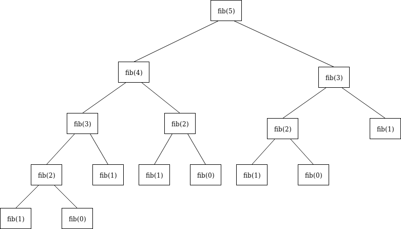
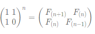
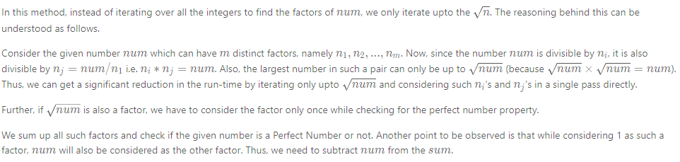

# Intergers
{: .no_toc }

<details open markdown="block">
  <summary>
    Table of contents
  </summary>
  {: .text-delta }
1. TOC
{:toc}
</details>


---

## Palindrome Number

Given an integer `x`, return `true` if `x` is a palindrome and `false` otherwise.

**Example 1:**
```log
Input: x = 121
Output: true
Explanation: 121 reads as 121 from left to right and from right to left.
```

**Example 2:**
```log
Input: x = -121
Output: false
Explanation: From left to right, it reads -121. From right to left, it becomes 121-. Therefore it is not a palindrome.

```

**Example 3:**
```log
Input: x = 10
Output: false
Explanation: Reads 01 from right to left. Therefore it is not a palindrome.
```

**Constraints:**

* `-231 <= x <= 231 - 1`

### Solution 1 : O(1) space solution

#### Implementation
```java
public class Solution{
    public boolean isPalindrome(int x) {
        if(x<0 || (x!=0 && x%10==0))
            return false;
        int res = 0;
        while(x>res){
            res = res*10 + x%10;
            x = x/10;
        }
        return (x==res || x==res/10);
    }  
}
```
### Solution 2 : Beats 99.5 java solutions, easy to understand

####  Implementation
```java
public class Solution {
    static int v;
    public static boolean isPalindrome(int x) {
        //optimizations
        if(x<0) return false;
        if(x<10) return true;
        if(x%10==0) return false;
        if(x<100&&x%11==0) return true;
        if(x<1000&&((x/100)*10+x%10)%11==0) return true;

        //actual logic
        v=x%10;
        x=x/10;
        while(x-v>0)
        {
                v=v*10+x%10;
                x/=10;
        }
        if(v>x){v/=10;}
        return v==x?true:false;
    }
}
```

### Solution 3 : No String

####  Implementation
```java
class Solution {
    public boolean isPalindrome(int x) {
        int original = x;
        int rev = 0;
        while(x>0){
            rev = x%10 + rev*10;
            x= x/10;
        }
        return rev==original ? true : false;
    }
}
```


---

## Fizz Buzz

Given an integer n, return a string array answer (1-indexed) where:

- answer[i] == "FizzBuzz" if i is divisible by 3 and 5.
- answer[i] == "Fizz" if i is divisible by 3.
- answer[i] == "Buzz" if i is divisible by 5.
- answer[i] == i (as a string) if none of the above conditions are true.

**Example:**

Input: n = 15
Output: ["1","2","Fizz","4","Buzz","Fizz","7","8","Fizz","Buzz","11","Fizz","13","14","FizzBuzz"]


###  Solution 


###  Implementation
```java
class FizzBuzzSolution {
    public List<String> fizzBuzz(int n) {
        List<String> ls = new ArrayList<String>();
        for (int i = 1; i <= n; i++) {
            if (i%3 == 0 && i%5 == 0) ls.add("FizzBuzz");
            else if (i%3 == 0) ls.add("Fizz");
            else if (i%5 == 0) ls.add("Buzz");
            else ls.add(Integer.toString(i));
        }
        return ls;
    }
}
```

###  Complexity Analysis

**Time Complexity**: O(n) 1ms time taken.

**Space Complexity**: O(n)


---

## Prime Numbers

A prime number is a natural number greater than one that has no positive divisors other than one and itself.

For example, 7 is prime because 1 and 7 are its only positive integer factors, whereas 12 is not because it has the divisors 3 and 2 in addition to 1, 4 and 6.

###  Generating Prime Numbers

The method checks each numbers divisibility by the numbers in a range from 2 till number-1.

If at any point we encounter a number that is divisible, we return false. At the end when we find that number is not divisible by any of its prior number, we return true indicating its a prime number.

####  Implementation

```java
class Solution {
 public static List<Integer> primeNumbersBruteForce(int n) {
  List<Integer> primeNumbers = new LinkedList<>();
  for (int i = 2; i <= n; i++) {
   if (isPrimeBruteForce(i)) {
    primeNumbers.add(i);
   }
  }
  return primeNumbers;
 }
 public static boolean isPrimeBruteForce(int number) {
  for (int i = 2; i < number; i++) {
   if (number % i == 0) {
    return false;
   }
  }
  return true;
 }    
}

```


####  Complexity Analysis

**Time Complexity**:
O(n^2)
**Space Complexity**:
O(n)

###  Efficiency and Optimization

When a number is not a prime, this number can be factored into two factors namely a and b i.e. number = a * b. If both a and b were greater than the square root of n, a*b would be greater than n.

So at least one of those factors must be less than or equal the square root of a number and to check if a number is prime, we only need to test for factors lower than or equal to the square root of the number being checked.

Additionally, prime numbers can never be an even number as even numbers are all divisible by 2.

Keeping in mind above ideas, let's improve the algorithm:

####  Implementation

```java
 class Solution {
 public static List<Integer> primeNumbersBruteForce(int n) {
  List<Integer> primeNumbers = new LinkedList<>();
  if (n >= 2) {
   primeNumbers.add(2);
  }
  for (int i = 3; i <= n; i += 2) {
   if (isPrimeBruteForce(i)) {
    primeNumbers.add(i);
   }
  }
  return primeNumbers;
 }
 private static boolean isPrimeBruteForce(int number) {
  for (int i = 2; i*i <= number; i++) {
   if (number % i == 0) {
    return false;
   }
  }
  return true;
 }
 }
```


###  Using Java 8
```java
 class Solution {
 public static List<Integer> primeNumbersTill(int n) {
  return IntStream.rangeClosed(2, n)
          .filter(x -> isPrime(x)).boxed()
          .collect(Collectors.toList());
 }
 private static boolean isPrime(int number) {
  return IntStream.rangeClosed(2, (int) (Math.sqrt(number)))
          .allMatch(n -> x % n != 0);
 }
}
```


---

## Add Two Numbers

[Leetcode URL](https://leetcode.com/problems/add-two-numbers/)

You are given two non-empty linked lists representing two non-negative integers. The digits are stored in reverse order, and each of their nodes contains a single digit. Add the two numbers and return the sum as a linked list.

You may assume the two numbers do not contain any leading zero, except the number 0 itself.

**Example 1:**


```log
Input: l1 = [2,4,3], l2 = [5,6,4]
Output: [7,0,8]
Explanation: 342 + 465 = 807.
```

**Example 2:**

```log
Input: l1 = [0], l2 = [0]
Output: [0]
```

**Example 3:**

```log
Input: l1 = [9,9,9,9,9,9,9], l2 = [9,9,9,9]
Output: [8,9,9,9,0,0,0,1]
```

### Solution 1: Elementary Math

**Intuition**

Keep track of the carry using a variable and simulate digits-by-digits sum starting from the head of list, which contains the least-significant digit.


Figure 1. Visualization of the addition of two numbers: 342 + 465 = 807342+4=807.
Each node contains a single digit and the digits are stored in reverse order.


**Algorithm**

Just like how you would sum two numbers on a piece of paper, we begin by summing the least-significant digits, which is the head of l1l1 and l2l2. Since each digit is in the range of 0 \ldots 90…9, summing two digits may "overflow". For example 5 + 7 = 125+7=12. In this case, we set the current digit to 22 and bring over the carry = 1carry=1 to the next iteration. carrycarry must be either 00 or 11 because the largest possible sum of two digits (including the carry) is 9 + 9 + 1 = 199+9+1=19.

The pseudocode is as following:

Initialize current node to dummy head of the returning list.
Initialize carry to 00.
Initialize pp and qq to head of l1 and l2 respectively.
Loop through lists l1 and l2 until you reach both ends.
Set x to node p's value. If p has reached the end of l1, set to 0.
Set y to node q's value. If q has reached the end of l2, set to 0.
Set sum = x + y + carry.
Update carry = sum / 10.
Create a new node with the digit value of (sum mod10) and set it to current node's next, then advance current node to next.
Advance both pp and qq.
1.Check if carry = 1, if so append a new node with digit 11 to the returning list.
2.Return dummy head's next node.

Note that we use a dummy head to simplify the code. Without a dummy head, you would have to write extra conditional statements to initialize the head's value.

Take extra caution of the following cases:


| Test case | Explanation                             |
|-----------|-----------------------------------------|
| l1=[0,1]  | When one list is longer than the other. | 
| l2=[0,1,2] |  When one list is longer than the other.| 
| l1=[]     | When one list is null, which means an empty list.| 
| l2=[0,1]  |  When one list is null, which means an empty list.| 
|   l1=[9,9] | The sum could have an extra carry of one at the end, which is easy to forget.| 
|    l2=[1]|  The sum could have an extra carry of one at the end, which is easy to forget. |   


#### Implementation 

```java

/**
 * Definition for singly-linked list.
 * public class ListNode {
 *     int val;
 *     ListNode next;
 *     ListNode() {}
 *     ListNode(int val) { this.val = val; }
 *     ListNode(int val, ListNode next) { this.val = val; this.next = next; }
 * }
 */
class Solution {

 public ListNode addTwoNumbers(ListNode l1, ListNode l2) {
  ListNode dummyHead = new ListNode(0);
  ListNode p = l1, q = l2, curr = dummyHead;
  int carry = 0;
  while (p != null || q != null) {
   int x = (p != null) ? p.val : 0;
   int y = (q != null) ? q.val : 0;
   int sum = carry + x + y;
   carry = sum / 10;
   curr.next = new ListNode(sum % 10);
   curr = curr.next;
   if (p != null) p = p.next;
   if (q != null) q = q.next;
  }
  if (carry > 0) {
   curr.next = new ListNode(carry);
  }
  return dummyHead.next;
 }
}
```

#### Complexity Analysis

**Time complexity** : O(max(m,n)). Assume that mm and nn represents the length of l1 and l2 respectively, the algorithm above iterates at most  `max(m,n)` times.

**Space complexity** : O(max(m,n)). The length of the new list is at most  max(m,n)+1.

### Solution 2

#### Implementation
```java
public class AddTwoNumbers {

    private static ListNode addTwoNumbers(ListNode l1, ListNode l2) {
        // Head of the new linked list - this is the head of the resultant list
        ListNode head = null;
        // Reference of head which is null at this point
        ListNode temp = null;
        // Carry
        int carry = 0;
        // Loop for the two lists
        while (l1 != null || l2 != null) {
            // At the start of each iteration, we should add carry from the last iteration
            int sum = carry;
            // Since the lengths of the lists may be unequal, we are checking if the
            // current node is null for one of the lists
            if (l1 != null) {
                sum += l1.val;
                l1 = l1.next;
            }
            if (l2 != null) {
                sum += l2.val;
                l2 = l2.next;
            }
            // At this point, we will add the total sum % 10 to the new node
            // in the resultant list
            ListNode node = new ListNode(sum % 10);
            // Carry to be added in the next iteration
            carry = sum / 10;
            // If this is the first node or head
            if (temp == null) {
                temp = head = node;
            }
            // For any other node
            else {
                temp.next = node;
                temp = temp.next;
            }
        }
        // After the last iteration, we will check if there is carry left
        // If it's left then we will create a new node and add it
        if (carry > 0) {
            temp.next = new ListNode(carry);
        }
        return head;
    }
}
```

#### Complexity Analysis

**Time Complexity** : Since we are iterating both the lists only once, the time complexity would be O(m + n). Here m and n are the numbers of nodes in the two linked lists.

**Space Complexity** : Since we are using extra space only for our variables, our space complexity would be O(1). One might argue that we are using another list to store our result so the space complexity should also be O(m + n).


---

## Fibonacci Number

The Fibonacci numbers, commonly denoted F(n) form a sequence, called the Fibonacci sequence, such that each number is the sum of the two preceding ones, starting from 0 and 1. That is,
```log
F(0) = 0, F(1) = 1
F(n) = F(n - 1) + F(n - 2), for n > 1.
```

Given n, calculate F(n).

**Example 1:**
```log
Input: n = 2
Output: 1
Explanation: F(2) = F(1) + F(0) = 1 + 0 = 1.
```

**Example 2:**
```log
Input: n = 3
Output: 2
Explanation: F(3) = F(2) + F(1) = 1 + 1 = 2.
```

**Example 3:**
```log
Input: n = 4
Output: 3
Explanation: F(4) = F(3) + F(2) = 2 + 1 = 3.
```

**Constraints:**

```log
0 <= n <= 30
```

### Solution 1 : Recursion

**Intuition**

Use recursion to compute the Fibonacci number of a given integer.



             Figure 1. An example tree representing what fib(5) would look like

**Algorithm**

* Check if the provided input value, N, is less than or equal to 1. If true, return N.

* Otherwise, the function `fib(int N)` calls itself, with the result of the 2 previous numbers being added to each other, passed in as the argument. This is derived directly from the `recurrence relation`: F_{n} = F_{n-1} + F_{n-2}
  
* Do this until all numbers have been computed, then return the resulting answer.

#### Implementation

```java
public class Solution {
    public int fib(int N) {
        if (N <= 1) {
            return N;
        }
        return fib(N - 1) + fib(N - 2);
    }
}
```
#### Complexity Analysis

* **Time complexity:** O(2^N). This is the slowest way to solve the Fibonacci Sequence because it takes exponential time. The amount of operations needed, for each level of recursion, grows exponentially as the depth approaches N.

* **Space complexity:** O(N). We need space proportional to N to account for the max size of the stack, in memory. This stack keeps track of the function calls to `fib(N)`. This has the potential to be bad in cases that there isn't enough physical memory to handle the increasingly growing stack, leading to a StackOverflowError. The Java docs have a good explanation of this, describing it as an error that occurs because an application recurses too deeply.

### Solution 2 : Bottom-Up Approach using Tabulation

**Intuition**

Improve upon the recursive approach by using iteration, still solving for all of the sub-problems and returning the answer for N, using already computed Fibonacci values. While using a bottom-up approach, we can iteratively compute and store the values, only returning once we reach the result.

**Algorithm**

* If N is less than or equal to 1, return N
* Otherwise, iterate through N, storing each computed answer in an array along the way.
* Use this array as a reference to the 2 previous numbers to calculate the current Fibonacci number.
* Once we've reached the last number, return it's Fibonacci number.

#### Implementation

```java
class Solution {
    public int fib(int N) {
        if (N <= 1) {
            return N;
        }
                  
        int[] cache = new int[N + 1];
        cache[1] = 1;
        for (int i = 2; i <= N; i++) {
            cache[i] = cache[i - 1] + cache[i - 2];
        }
    
        return cache[N];
    }
}
```
#### Complexity Analysis

**Time complexity:** O(N). Each number, starting at 2 up to and including N, is visited, computed and then stored for O(1) access later on.

**Space complexity:** O(N). The size of the data structure is proportional to N.

### Solution 3 : Top-Down Approach using Memoization

**Intuition**

Solve for all of the sub-problems, use memoization to store the pre-computed answers, then return the answer for N. We will leverage recursion, but in a smarter way by not repeating the work to calculate existing values.

**Algorithm**

* At first, create a map with 0 -> 0 and 1 -> 1 pairs.
* Call `fib(N)` function.
     1. At every recursive call of `fib(N)`, if N exists in the map, return the cached value for N.
     2. Otherwise, set the key N, in our mapping, to the value of fib(N - 1) + fib(N - 2) and return the computed value.

#### Implementation
```java
class Solution {
    // Creating a hash map with 0 -> 0 and 1 -> 1 pairs
    private Map<Integer, Integer> cache = new HashMap<>(Map.of(0, 0, 1, 1));

    public int fib(int N) {
        if (cache.containsKey(N)) {
            return cache.get(N);
        }
        cache.put(N, fib(N - 1) + fib(N - 2));
        return cache.get(N);
    }
}
```

#### Complexity Analysis

**Time complexity:** O(N). Each number, starting at 2 up to and including N, is visited, computed and then stored for O(1) access later on.

**Space complexity:** O(N). The size of the stack in memory is proportional to N. Also, the memoization hash table is used, which occupies O(N) space.

### Solution 4 : Iterative Bottom-Up Approach

**Intuition**

Let's get rid of the need to use all of that space and instead use the minimum amount of space required. Notice that during each recursive call in the top-down approach and each iteration in the bottom-up approach, we only needed to look at the results of `fib(N-1)` and `fib(N-2)` to determine the result of `fib(N)`. Therefore, we can achieve O(1) space complexity by only storing the value of the two previous numbers and updating them as we iterate to N.

**Algorithm**

* Check if N <= 1, if it is, then we should return N.
* We need 3 variables to store each state `fib(N), fib(N-1), and fib(N-2)`.
* Preset the initial values:
   - Initialize current with 0.
   - Initialize prev1 with 1, since this will represent `fib(N-1)` when computing the current value.
   - Initialize prev2 with 0, since this will represent `fib(N-2)` when computing the current value.
* Iterate, incrementally by 1, all the way up to and including N. Starting at 2, since 0 and 1 are pre-computed.
* Set the current value to prev1 + prev2 because that is the value we are currently computing.
* Set the prev2 value to prev1.
* Set the prev1 value to current.
* When we reach N+1, we will exit the loop and return the previously set current value.

#### Implementation


```java
class Solution {
    public int fib(int N) {
        if (N <= 1) {
            return N;
        }

        int current = 0;
        int prev1 = 1;
        int prev2 = 0;

        for (int i = 2; i <= N; i++) {
            current = prev1 + prev2;
            prev2 = prev1;
            prev1 = current;
        }
        return current;
    }
}
```

#### Complexity Analysis

**Time complexity:** O(N). Each value from 2 to N is computed once. Thus, the time it takes to find the answer is directly proportional to N where N is the Fibonacci Number we are looking to compute.

**Space complexity:** O(1). This requires 1 unit of space for the integer N and 3 units of space to store the computed values (current, prev1, and prev2) for every loop iteration. The amount of space used is independent of N, so this approach uses a constant amount of space.

### Solution 5 : Matrix Exponentiation

**Intuition**

Use Matrix Exponentiation to get the Fibonacci number from the element at (0, 0) in the resultant matrix.

In order to do this we can rely on the matrix equation for the Fibonacci sequence, to find the `Nth` Fibonacci number:

 

**Algorithm**

* Check if N is less than or equal to 1. If it is, return N.
* Use a recursive function, matrixPower, to calculate the power of a given matrix A. The power will be N-1, where N is the `Nth` Fibonacci number.
* The matrixPower function will be performed for N/2 of the Fibonacci numbers.
* Within matrixPower, call the multiply function to multiply 2 matrices.
* Once we finish doing the calculations, return A[0][0] to get the Nth Fibonacci number.

#### Implementation

```java
//TODO: 

```
#### Complexity Analysis

**Time complexity:** O(logN). By halving the N value in every matrixPower's call to itself, we are halving the work needed to be done.

**Space complexity:** O(logN). The size of the stack in memory is proportional to the function calls to matrixPower plus the memory used to account for the matrices which use constant space.

### Solution 6 : Math

**Intuition**


Here's a link to find out more about how the Fibonacci sequence and the `golden ratio` work.

We can derive the most efficient solution to this problem using only constant space!

**Algorithm**

Use the `golden ratio` formula to calculate the `Nth` Fibonacci number.

#### Implementation

```java
class Solution {
    public int fib(int N) {
        double goldenRatio = (1 + Math.sqrt(5)) / 2;
        return (int) Math.round(Math.pow(goldenRatio, N) / Math.sqrt(5));
    }
}
```

#### Complexity Analysis

**Time complexity:** O(logN). We do not use loops or recursion, so the time required equals the time spent performing the calculation using Binet's formula. However, raising the golden_ratio to the power of N requires O(logN) time.

**Space complexity:** O(1). The space used is the space needed to create the variable to store the `golden ratio`.

### Solution 7 : Alternative methods 

#### Implementation 1 : Iterative

```java
class Solution 
{
    public int fib(int N)
    {
        if(N <= 1)
            return N;
        
		int a = 0, b = 1;
		
		while(N-- > 1)
		{
			int sum = a + b;
			a = b;
			b = sum;
		}
        return b;
    }
}
```

**Time complexity:**  O(n).

**Space complexity:** O(1).

#### Implementation 2 : Recursive

```java
class Solution 
{
    public int fib(int N)
    {
        if(N <= 1)
            return N;
        else
            return fib(N - 1) + fib(N - 2);
    }
}
```
**Time complexity:** O(2^n)- since T(n) = T(n-1) + T(n-2)is an exponential time.

**Space complexity:** O(n) - space for recursive function call stack

#### Implementation 3 : Dynamic Programming - Top Down Approach

```java
class Solution 
{
    int[] fib_cache = new int[31];
	
	public int fib(int N)
    {
        if(N <= 1)
            return N;
        else if(fib_cache[N] != 0)
            return fib_cache[N];
		else 
            return fib_cache[N] = fib(N - 1) + fib(N - 2);
    }
}
```
**Time complexity:** O(n).

**Space complexity:** O(n).

#### Implementation 4 : Dynamic Programming - Bottom Up Approach

```java
class Solution 
{
    public int fib(int N)
    {
        if(N <= 1)
            return N;

		int[] fib_cache = new int[N + 1];
		fib_cache[1] = 1;

		for(int i = 2; i <= N; i++)
		{
			fib_cache[i] = fib_cache[i - 1] + fib_cache[i - 2];
		}
		return fib_cache[N];
    }
}
```
**Time complexity:** O(n).

**Space complexity:** O(n).


---

## Perfect Number

A `perfect number` is a **positive integer** that is equal to the sum of its **positive divisors**, excluding the number itself. A divisor of an integer `x` is an integer that can divide `x` evenly.

Given an integer `n`, return `true` if `n` is a `perfect number`, otherwise return `false`.


**Example 1:**

```log
Input: num = 28
Output: true
Explanation: 28 = 1 + 2 + 4 + 7 + 14
1, 2, 4, 7, and 14 are all divisors of 28.
```

**Example 2:**

```log
Input: num = 7
Output: false
```

**Constraints:**

```log
1 <= num <= 108
```

### Solution 1 : Brute Force [Time Limit Exceeded]

**Algorithm**

In brute force approach, we consider every possible number to be a divisor of the given number `num`, by iterating over all the numbers lesser than `num`. Then, we add up all the factors to check if the given number satisfies the `Perfect Number` property. This approach obviously fails if the number `num` is very large.

#### Implementation

```java

public class Solution {
    public boolean checkPerfectNumber(int num) {
        if (num <= 0) {
            return false;
        }
        int sum = 0;
        for (int i = 1; i < num; i++) {
            if (num % i == 0) {
                sum += i;
            }

        }
        return sum == num;
    }
}
```

#### Complexity Analysis

**Time complexity** : O(n). We iterate over all the numbers lesser than `n`.

**Space complexity** : O(1). Constant extra space is used.

### Solution 2 : Better Brute Force [Time Limit Exceeded]

**Algorithm**

We can little optimize the brute force by breaking the loop when the value of `sum` increase the value of `num`. In that case, we can directly return `false`.

#### Implementation

```java

public class Solution {
    public boolean checkPerfectNumber(int num) {
        if (num <= 0) {
            return false;
        }
        int sum = 0;
        for (int i = 1; i < num; i++) {
            if (num % i == 0) {
                sum += i;
            }
            if(sum>num) {
                return false;
            }
        }
        return sum == num;
    }
}
```
#### Complexity Analysis

**Time complexity** : O(n). In worst case, we iterate over all the numbers lesser than `n`.

**Space complexity** : O(1). Constant extra space is used.

### Solution 3 : Optimal Solution [Accepted]

**Algorithm**

 

#### Implementation

```java
class Solution {
    public boolean checkPerfectNumber(int num) {
        if (num <= 0) {
            return false;
        }
        int sum = 0;
        for (int i = 1; i * i <= num; i++) {
            if (num % i == 0) {
                sum += i;
                if (i * i != num) {
                    sum += num / i;
                }

            }
        }
        return sum - num == num;
    }
}
```
#### Complexity Analysis

**Time complexity** : O(sqrt{n}). We iterate only over the range 1 < i ≤ \sqrt{num}.

**Space complexity** : O(1). Constant extra space is used.

### Solution 4 : Euclid-Euler Theorem [Accepted]

**Algorithm**

Euclid proved that 2^{p−1}(2^p − 1) is an even perfect number whenever 2^p − 1 is prime, where *p* is prime.

For example, the first four perfect numbers are generated by the formula 2^{p−1}(2^p − 1), with *p* a prime number, as follows:

```log
for p = 2:   21(22 − 1) = 6
for p = 3:   22(23 − 1) = 28
for p = 5:   24(25 − 1) = 496
for p = 7:   26(27 − 1) = 8128.
```

Prime numbers of the form 2^p − 1 are known as Mersenne primes. For 2^p − 1 to be prime, it is necessary that *p* itself be prime. However, not all numbers of the form 2^p − 1 with a prime *p* are prime; for example, 2^{11} − 1 = 2047 = 23 × 89 is not a prime number.

You can see that for small value of *p*, its related perfect number goes very high. So, we need to evaluate perfect numbers for some primes (2, 3, 5, 7, 13, 17, 19, 31) only, as for bigger prime its perfect number will not fit in 64 bits.

#### Implementation

```java
public class Solution {
    public int pn(int p) {
        return (1 << (p - 1)) * ((1 << p) - 1);
    }
    public boolean checkPerfectNumber(int num) {
        int[] primes=new int[]{2,3,5,7,13,17,19,31};
        for (int prime: primes) {
            if (pn(prime) == num)
                return true;
        }
        return false;
    }
}
```

#### Complexity Analysis

**Time complexity** : O(logn). Number of primes will be in order log *num*.

**Space complexity** : O(logn). Space used to store primes.

---

## Two Sum

Given an array of integers nums and an integer target, return indices of the two numbers such that they add up to target.

You may assume that each input would have exactly one solution, and you may not use the same element twice.

You can return the answer in any order.

**Example 1:**

```log
Input: nums = [2,7,11,15], target = 9
Output: [0,1]
Explanation: Because nums[0] + nums[1] == 9, we return [0, 1].
```

**Example 2:**

```log
Input: nums = [3,2,4], target = 6
Output: [1,2]
```

**Example 3:**

```log
Input: nums = [3,3], target = 6
Output: [0,1]
```

**Constraints:**

```log
2 <= nums.length <= 104
-109 <= nums[i] <= 109
-109 <= target <= 109
```

### Solution 1 : Brute Force

**Algorithm**

The brute force approach is simple. Loop through each element *x* and find if there is another value that equals to target - x.

#### Implementation

```java
class Solution {
    public int[] twoSum(int[] nums, int target) {
        for (int i = 0; i < nums.length; i++) {
            for (int j = i + 1; j < nums.length; j++) {
                if (nums[j] == target - nums[i]) {
                    return new int[] { i, j };
                }
            }
        }
        // In case there is no solution, we'll just return null
        return null;
    }
}
```

#### Complexity Analysis

**Time complexity:** O(n^2). For each element, we try to find its complement by looping through the rest of the array which takes O(n) time. Therefore, the time complexity is O(n^2).

**Space complexity:** O(1). The space required does not depend on the size of the input array, so only constant space is used.

### Solution 2 : Two-pass Hash Table

**Intuition**

To improve our runtime complexity, we need a more efficient way to check if the complement exists in the array. If the complement exists, we need to get its index. What is the best way to maintain a mapping of each element in the array to its index? A hash table.

We can reduce the lookup time from O(n) to O(1) by trading space for speed. A hash table is well suited for this purpose because it supports fast lookup in near constant time. I say "near" because if a collision occurred, a lookup could degenerate to O(n) time. However, lookup in a hash table should be amortized O(1) time as long as the hash function was chosen carefully.

**Algorithm**

A simple implementation uses two iterations. In the first iteration, we add each element's value as a key and its index as a value to the hash table. Then, in the second iteration, we check if each element's complement *(target - nums[i])* exists in the hash table. If it does exist, we return current element's index and its complement's index. Beware that the complement must not be nums[i] itself!

#### Implementation

```java
class Solution {
    public int[] twoSum(int[] nums, int target) {
        Map<Integer, Integer> map = new HashMap<>();
        for (int i = 0; i < nums.length; i++) {
            map.put(nums[i], i);
        }
        for (int i = 0; i < nums.length; i++) {
            int complement = target - nums[i];
            if (map.containsKey(complement) && map.get(complement) != i) {
                return new int[] { i, map.get(complement) };
            }
        }
        // In case there is no solution, we'll just return null
        return null;
    }
}
```

#### Complexity Analysis

**Time complexity:** O(n). We traverse the list containing nn elements exactly twice. Since the hash table reduces the lookup time to O(1), the overall time complexity is O(n).

**Space complexity:** O(n). The extra space required depends on the number of items stored in the hash table, which stores exactly nn elements.

### Solution 3 : One-pass Hash Table

**Algorithm**

It turns out we can do it in one-pass. While we are iterating and inserting elements into the hash table, we also look back to check if current element's complement already exists in the hash table. If it exists, we have found a solution and return the indices immediately.

#### Implementation

```java
class Solution {
    public int[] twoSum(int[] nums, int target) {
        Map<Integer, Integer> map = new HashMap<>();
        for (int i = 0; i < nums.length; i++) {
            int complement = target - nums[i];
            if (map.containsKey(complement)) {
                return new int[] { map.get(complement), i };
            }
            map.put(nums[i], i);
        }
        // In case there is no solution, we'll just return null
        return null;
    }
}
```

#### Complexity Analysis

**Time complexity:** O(n). We traverse the list containing n elements only once. Each lookup in the table costs only O(1) time.

**Space complexity:** O(n). The extra space required depends on the number of items stored in the hash table, which stores at most *n* elements.

### Solution 4 : O(nlogn), beats  98.85%

**Algorithm**

step1 : copy an array, and sort it using quick sort, O(nlogn)

step2 : using start and end points to find a, b which satifys a+b==target, O(n)

step3 : find the index of a, b from origin array, O(n)

note: in step3, you should judge whethour a==b, if true, you must find the second index of b.

#### Implementation

```java
class Solution {
    public int[] twoSum_n2(int[] nums, int target) {
        if (nums == null)
            return null;
        int[] nums2 = Arrays.copyOf(nums, nums.length);
        Arrays.sort(nums2);
        int a = 0, b = 0;
        int start = 0, end = nums2.length - 1;
        //find two nums
        while (start < end) {
            int sum = nums2[start] + nums2[end];
            if (sum < target)
                start++;
            else if (sum > target)
                end--;
            else {
                a = nums2[start];
                b = nums2[end];
                break;
            }
        }
        //find the index of two numbers
        int[] res = new int[2];
        for (int i = 0; i < nums.length; i++) {
            if (nums[i] == a) {
                res[0] = i;
                break;
            }
        }
        if (a != b) {
            for (int i = 0; i < nums.length; i++) {
                if (nums[i] == b) {
                    res[1] = i;
                    break;
                }
            }
        } else {
            for (int i = 0; i < nums.length; i++) {
                if (nums[i] == b && i != res[0]) {
                    res[1] = i;
                    break;
                }
            }
        }

        return res;
    }
}
```
---

## Subarray Sum Equals K

Given an array of integers `nums` and an integer `k`, return the total number of sub-arrays whose sum equals to `k`.

A sub-array is a contiguous **non-empty** sequence of elements within an array.


**Example 1:**

```log
Input: nums = [1,1,1], k = 2
Output: 2
```

**Example 2:**

```log
Input: nums = [1,2,3], k = 3
Output: 2
```

**Constraints:**

```log
1 <= nums.length <= 2 * 104
-1000 <= nums[i] <= 1000
-107 <= k <= 107
```

### Solution 1 : Brute Force

**Algorithm**

The simplest method is to consider every possible sub-array of the given *nums* array, find the sum of the elements of each of those sub-arrays and check for the equality of the sum obtained with the given *k*. Whenever the sum equals *k*, we can increment the *count* used to store the required result.

#### Implementation

```java
public class Solution {
    public int subarraySum(int[] nums, int k) {
        int count = 0;
        for (int start = 0; start < nums.length; start++) {
            for (int end = start + 1; end <= nums.length; end++) {
                int sum = 0;
                for (int i = start; i < end; i++)
                    sum += nums[i];
                if (sum == k)
                    count++;
            }
        }
        return count;
    }
}
```

#### Complexity Analysis

**Time complexity** : O(n^3). Considering every possible sub-array takes O(n^2) time. For each of the sub-array we calculate the sum taking O(n)O(n) time in the worst case, taking a total of O(n^3) time.

**Space complexity** : O(1). Constant space is used.

### Solution 2 : Using Cumulative Sum

**Algorithm**

Instead of determining the sum of elements every time for every new sub-array considered, we can make use of a cumulative sum array , *sum*. Then, in order to calculate the sum of elements lying between two indices, we can subtract the cumulative sum corresponding to the two indices to obtain the sum directly, instead of iterating over the sub-array to obtain the sum.

#### Implementation

We make use of a cumulative sum array, *sum*, such that sum[i] is used to store the cumulative sum of *nums* array up to the element corresponding to the (i-1)^{th} index. Thus, to determine the sum of elements for the sub-array nums[i:j], we can directly use sum[j+1]−sum[i].

```java
public class Solution {
    public int subarraySum(int[] nums, int k) {
        int count = 0;
        int[] sum = new int[nums.length + 1];
        sum[0] = 0;
        for (int i = 1; i <= nums.length; i++)
            sum[i] = sum[i - 1] + nums[i - 1];
        for (int start = 0; start < nums.length; start++) {
            for (int end = start + 1; end <= nums.length; end++) {
                if (sum[end] - sum[start] == k)
                    count++;
            }
        }
        return count;
    }
}
```

#### Complexity Analysis

**Time complexity** : O(n^2). Considering every possible sub-array takes O(n^2) time. Finding out the sum of any sub-array takes O(1) time after the initial processing of O(n) for creating the cumulative sum array.

**Space complexity** : O(n). Cumulative sum array *sum* of size `n+1` is used.

### Solution 3 : Without Space

**Algorithm**

Instead of considering all the *start* and *end* points and then finding the sum for each sub-array corresponding to those points, we can directly find the sum on the go while considering different *end* points. i.e. We can choose a particular *start* point and while iterating over the *end* points, we can add the element corresponding to the *end* point to the sum formed till now. Whenever the *sum* equals the required *k* value, we can update the *count* value. We do so while iterating over all the *end* indices possible for every *start* index. Whenever, we update the *start* index, we need to reset the *sum* value to 0.

#### Implementation

```
public class Solution {
    public int subarraySum(int[] nums, int k) {
        int count = 0;
        for (int start = 0; start < nums.length; start++) {
            int sum=0;
            for (int end = start; end < nums.length; end++) {
                sum+=nums[end];
                if (sum == k)
                    count++;
            }
        }
        return count;
    }
}
```
#### Complexity Analysis

**Time complexity** : O(n^2). We need to consider every sub-array possible.

**Space complexity** : O(1). Constant space is used.

### Solution 4: Using Hashmap

#### Implementation

```java
public class Solution {
    public int subarraySum(int[] nums, int k) {
        int count = 0, sum = 0;
        HashMap < Integer, Integer > map = new HashMap < > ();
        map.put(0, 1);
        for (int i = 0; i < nums.length; i++) {
            sum += nums[i];
            if (map.containsKey(sum - k))
                count += map.get(sum - k);
            map.put(sum, map.getOrDefault(sum, 0) + 1);
        }
        return count;
    }
}
```
#### Complexity Analysis

**Time complexity** : O(n). The entire *nums* array is traversed only once.

**Space complexity** : O(n). Hashmap *map* can contain up to *n* distinct entries in the worst case.

### Solution 5 : easy to optimized

```java
class Solution {
    public int subarraySum(int[] nums, int k) {
        
        // Time Complexity O(sq(n))
        // int count=0;
        // int sum=0;
        // int n=nums.length;
        // for(int i=0;i<n;i++){
        //     sum=nums[i];
        //     if(sum==k){
        //         count++;
        //     }
        //     for(int j=i+1;j<n;j++){
        //         sum=sum+nums[j];
        //          if(sum==k){
        //          count++;
        //     }
        //     }
        // }
        // return count;
        
        // Time Complexity is O(n)
        int n=nums.length;
        int res=0;
        int sum=0;
        Map<Integer,Integer> pre=new HashMap<>();
        
        pre.put(0,1);
        for(int i=0;i<n;i++){
            sum+=nums[i];
            if(pre.containsKey(sum-k)){              
                        res+=pre.get(sum-k);
            }
                 pre.put(sum,(pre.getOrDefault(sum,0)+1));       
                        
        }
        
        
        return res;
        
    }
}
```

---

## Divide Two Integers

Given two integers `dividend` and `divisor`, divide two integers **without** using multiplication, division, and mod operator.

The integer division should truncate toward zero, which means losing its fractional part. For example, `8.345` would be truncated to `8`, and `-2.7335` would be truncated to `-2`.

Return the *quotient* after dividing `dividend` by `divisor`.

**Note:** Assume we are dealing with an environment that could only store integers within the **32-bit** signed integer range: `[−2^31, 2^31 − 1]`. For this problem, if the quotient is **strictly greater than** `2^31 - 1`, then return `2^31 - 1`, and if the quotient is **strictly less than** `-2^31`, then return `-2^31`.

**Example 1:**

```log
Input: dividend = 10, divisor = 3
Output: 3
Explanation: 10/3 = 3.33333.. which is truncated to 3.
```


**Example 2:**


```log
Input: dividend = 7, divisor = -3
Output: -2
Explanation: 7/-3 = -2.33333.. which is truncated to -2.
```


**Constraints:**

```log
-231 <= dividend, divisor <= 231 - 1
divisor != 0
```

### Solution 

#### Implementation
```java
public class Solution{
    public int divide(int dividend, int divisor) {
        //Reduce the problem to positive long integer to make it easier.
        //Use long to avoid integer overflow cases.
        int sign = 1;
        if ((dividend > 0 && divisor < 0) || (dividend < 0 && divisor > 0))
            sign = -1;
        long ldividend = Math.abs((long) dividend);
        long ldivisor = Math.abs((long) divisor);

        //Take care the edge cases.
        if (ldivisor == 0) return Integer.MAX_VALUE;
        if ((ldividend == 0) || (ldividend < ldivisor))	return 0;

        long lans = ldivide(ldividend, ldivisor);

        int ans;
        if (lans > Integer.MAX_VALUE){ //Handle overflow.
            ans = (sign == 1)? Integer.MAX_VALUE : Integer.MIN_VALUE;
        } else {
            ans = (int) (sign * lans);
        }
        return ans;
    }

    private long ldivide(long ldividend, long ldivisor) {
        // Recursion exit condition
        if (ldividend < ldivisor) return 0;

        //  Find the largest multiple so that (divisor * multiple <= dividend), 
        //  whereas we are moving with stride 1, 2, 4, 8, 16...2^n for performance reason.
        //  Think this as a binary search.
        long sum = ldivisor;
        long multiple = 1;
        while ((sum+sum) <= ldividend) {
            sum += sum;
            multiple += multiple;
        }
        //Look for additional value for the multiple from the reminder (dividend - sum) recursively.
        return multiple + ldivide(ldividend - sum, ldivisor);
    }   
}
```

## Sliding Window Maximum

You are given an array of integers `nums`, there is a sliding window of size `k` which is moving from the very left of the array to the very right. You can only see the `k` numbers in the window. Each time the sliding window moves right by one position.

Return the *max sliding window*.

**Example 1:**

```log
Input: nums = [1,3,-1,-3,5,3,6,7], k = 3
Output: [3,3,5,5,6,7]
Explanation:
Window position                Max
---------------               -----
[1  3  -1] -3  5  3  6  7       3
1 [3  -1  -3] 5  3  6  7       3
1  3 [-1  -3  5] 3  6  7       5
1  3  -1 [-3  5  3] 6  7       5
1  3  -1  -3 [5  3  6] 7       6
1  3  -1  -3  5 [3  6  7]      7
```

**Example 2:**

```log
Input: nums = [1], k = 1
Output: [1]
```


**Constraints:**

* `1 <= nums.length <= 105`
* `-104 <= nums[i] <= 104`
* `1 <= k <= nums.length`

### Solution 1 : Use a Hammer (Bruteforce)

**Intuition**

The straightforward solution is to iterate over all sliding windows and find a maximum for each window. There are `N - k + 1` sliding windows and there are `k` elements in each window, that results in a quite bad time complexity O(Nk).

As you can imagine, this straightforward solution would result in **TLE** (Time Limit Exceed) exception.

It is correct though, one could start with this solution during the interview and improve it later on.

#### Implementation

```java
class Solution {
    public int[] maxSlidingWindow(int[] nums, int k) {
        int n = nums.length;
        if (n * k == 0) return new int[0];
        
        int [] output = new int[n - k + 1];
        for (int i = 0; i < n - k + 1; i++) {
            int max = Integer.MIN_VALUE;
            for(int j = i; j < i + k; j++) 
                max = Math.max(max, nums[j]);
            output[i] = max;
        }
        return output;
    }
}
```

#### Complexity Analysis

**Time complexity** : `O(Nk)`, where `N` is number of elements in the array.

**Space complexity** : `O(N−k+1)` for an output array.

### Solution 2 : Deque

**Intuition**

How one could improve the time complexity? The first idea is to use a heap, since in a maximum heap `heap[0]` is always the largest element. Though to add an element in a heap of size `k` costs `log(k)`, that means `O(Nlog(k))` time complexity for the solution.

Let's use a deque (double-ended queue), the structure which pops from / pushes to either side with the same O(1) performance.

It's more handy to store in the deque indexes instead of elements since both are used during an array parsing.

**Algorithm**

The algorithm is quite straigthforward :

* Process the first k elements separately to initiate the deque.

* Iterate over the array. At each step :

  * Clean the deque :

     - Keep only the indexes of elements from the current sliding window.

     - Remove indexes of all elements smaller than the current one, since they will not be the maximum ones.

  * Append the current element to the deque.

  * Append deque[0] to the output.

* Return the output array.

#### Implementation

```java
class Solution {
  ArrayDeque<Integer> deq = new ArrayDeque<Integer>();
  int [] nums;

  public void clean_deque(int i, int k) {
    // remove indexes of elements not from sliding window
    if (!deq.isEmpty() && deq.getFirst() == i - k)
      deq.removeFirst();

    // remove from deq indexes of all elements 
    // which are smaller than current element nums[i]
    while (!deq.isEmpty() && nums[i] > nums[deq.getLast()])                           deq.removeLast();
  }

  public int[] maxSlidingWindow(int[] nums, int k) {
    int n = nums.length;
    if (n * k == 0) return new int[0];
    if (k == 1) return nums;

    // init deque and output
    this.nums = nums;
    int max_idx = 0;
    for (int i = 0; i < k; i++) {
      clean_deque(i, k);
      deq.addLast(i);
      // compute max in nums[:k]
      if (nums[i] > nums[max_idx]) max_idx = i;
    }
    int [] output = new int[n - k + 1];
    output[0] = nums[max_idx];

    // build output
    for (int i  = k; i < n; i++) {
      clean_deque(i, k);
      deq.addLast(i);
      output[i - k + 1] = nums[deq.getFirst()];
    }
    return output;
  }
}
```
#### Complexity Analysis

**Time complexity** : O(N), since each element is processed exactly twice - it's index added and then removed from the deque.

**Space complexity** : O(N), since `O(N−k+1)` is used for an output array and O(k) for a deque.

### Solution 3 : Dynamic programming

**Algorithm**

The algorithm is quite straightforward :

* Iterate along the array in the direction `left->right` and build an array `left`.

* Iterate along the array in the direction `right->left` and build an array `right`.

* Build an output array as `max(right[i], left[i + k - 1])` for `i` in range `(0, n - k + 1)`.

#### Implementation

```java
class Solution {
  public int[] maxSlidingWindow(int[] nums, int k) {
    int n = nums.length;
    if (n * k == 0) return new int[0];
    if (k == 1) return nums;

    int [] left = new int[n];
    left[0] = nums[0];
    int [] right = new int[n];
    right[n - 1] = nums[n - 1];
    for (int i = 1; i < n; i++) {
      // from left to right
      if (i % k == 0) left[i] = nums[i];  // block_start
      else left[i] = Math.max(left[i - 1], nums[i]);

      // from right to left
      int j = n - i - 1;
      if ((j + 1) % k == 0) right[j] = nums[j];  // block_end
      else right[j] = Math.max(right[j + 1], nums[j]);
    }

    int [] output = new int[n - k + 1];
    for (int i = 0; i < n - k + 1; i++)
      output[i] = Math.max(left[i + k - 1], right[i]);

    return output;
  }
}
```
#### Complexity Analysis

**Time complexity** : O(N), since all we do is 3 passes along the array of length N.

**Space complexity** : O(N) to keep left and right arrays of length N, and output array of length `N - k + 1`.

### Solution 4 : Deque or Doubly Linked List With Explanation

**Approach 1 :**

* How mant elements are there in the result array?

   * 1 entry for the first k elements and 1 entry for each num from the rest of n-k elemtns. That is 1+n-k

* Now solving the actual problem.

   * The goal is to keep finding the recent max as we go from left to right. We will maintain the elements in the deque from largest to smallest as we go along. We can keep removing the element from back as long as they are not greater than the current element. Why? Because those elements which are evicted are no good compared to the current element i.e. they are old (their index is encountered before the curr element and they are of lesser value).

   * To remember if the deque head is old or within the sliding window, we need to store indices rather than elements.

   * If head falls outside the current sliding window, we cannot consider even if it is max among all elements in the dequeue, so evict it.

```java
public class solution {
    public int[] maxSlidingWindow(int[] nums, int k) {
        if (k == 0) return new int[0];
        LinkedList<Integer> list = new LinkedList<>();
        int[] res = new int[nums.length - k + 1];
        for (int i = 0, j = 0, idx = 0; i < nums.length; i++) {
            while (!list.isEmpty() && nums[list.getLast()] <= nums[i])
                list.removeLast();
            list.addLast(i);
            if (i >= k - 1) {
                if ((i - list.getFirst() + 1) > k) list.removeFirst(); //head is outside the sliding window
                res[idx++] = nums[list.getFirst()];
            }
        }
        return res;
    }
}
```

**Approach 2 :** maxHeap based approach - O(n lgk) where n is # of elements

The idea is to maintain a maxHeap of size at most k over the sliding window. To determine, if the current max from the heap is still valid, we should track indices rather than elements.

The number of elements in the result array = 1 spot for first k elements and a sport for each of [k+1..n] elements.

We start filling the res from i-1 == kth spot. keep removing max elements falling outside our curr window - if the current spot is i, last valid element in the window is i-(k-1).

````java
public class soluution {
    public int[] maxSlidingWindow(int[] nums, int k) {
        int n = nums.length;
        if (n == 0) return new int[0];
        PriorityQueue<Integer> pq = new PriorityQueue<>(new Comparator<Integer>() {
            public int compare(Integer v1, Integer v2) {
                return nums[v2] - nums[v1];
            }
        });
        int[] res = new int[1 + n - (k + 1) + 1];
        for (int i = 0, j = 0; i < n; i++) {
            pq.add(i);
            if (i >= k - 1) {
                while (pq.peek() < i - (k - 1))
                    pq.remove();
                res[j++] = nums[pq.peek()];
            }
        }
        return res;
    }
}
````


**Approach 1.1 :** Replace `maxHeap` with deque. O(n) where n is # of elements - each element has gone into queue once and removed once.

Maintain `deq` as monotonically decreasing queue. That way, we can keep removing outdated indices from the front and keep removing lesser elements from the back as we have a better candidate (larger being on the right side always wins) now.

```java
public class solution{
    //deq sample [10,8,4...], always decreasing numbers as we move right
    public int[] maxSlidingWindow(int[] nums, int k) {
        int n = nums.length;
        if(n == 0) return new int[0];
        Deque<Integer> deq = new LinkedList<>();
        int[] res = new int[1+n-(k+1)+1];
        for(int i=0,j=0; i < n; i++){
            //fix front
            while(!deq.isEmpty() && deq.peekFirst() < (i-(k-1)))
                deq.removeFirst();
            //fix back
            while(!deq.isEmpty() && nums[deq.peekLast()] <= nums[i])
                deq.removeLast();
            deq.addLast(i);
            if(i >= k-1){
                res[j++] = nums[deq.peekFirst()];
            }
        }
        return res;
    }
}
```
---	


---

## Flatten Nested List Iterator

You are given a nested list of integers `nestedList`. Each element is either an integer or a list whose elements may also be integers or other lists. Implement an iterator to flatten it.

Implement the `NestedIterator` class:

* `NestedIterator(List<NestedInteger> nestedList)` Initializes the iterator with the nested list `nestedList`.

* `int next()` Returns the next integer in the nested list.

* `boolean hasNext()` Returns `true` if there are still some integers in the nested list and `false` otherwise.

Your code will be tested with the following pseudocode:

```log
initialize iterator with nestedList
res = []
while iterator.hasNext()
append iterator.next() to the end of res
return res
```
If `res` matches the expected flattened list, then your code will be judged as correct.

**Example 1:**

```log
Input: nestedList = [[1,1],2,[1,1]]
Output: [1,1,2,1,1]
Explanation: By calling next repeatedly until hasNext returns false, the order of elements returned by next should be: [1,1,2,1,1].
```

**Example 2:**

```log
Input: nestedList = [1,[4,[6]]]
Output: [1,4,6]
Explanation: By calling next repeatedly until hasNext returns false, the order of elements returned by next should be: [1,4,6].

```

**Constraints:**

* `1 <= nestedList.length <= 500`

* The values of the integers in the nested list is in the range `[-106, 106]`.

### Solution 1 : Make a Flat List with Recursion

#### Implementation
```java
import java.util.NoSuchElementException;

public class NestedIterator implements Iterator<Integer> {
    
    private List<Integer> integers = new ArrayList<Integer>();
    private int position = 0; // Pointer to next integer to return.
    
    public NestedIterator(List<NestedInteger> nestedList) {
        flattenList(nestedList);
    }

    // Recursively unpacks a nested list in DFS order.
    private void flattenList(List<NestedInteger> nestedList) {
        for (NestedInteger nestedInteger : nestedList) {
            if (nestedInteger.isInteger()) {
                integers.add(nestedInteger.getInteger());
            } else {
                flattenList(nestedInteger.getList());
            }
        }
    }
    
    @Override
    public Integer next() {
        // As per Java specs, we should throw an exception if no more ints.
        if (!hasNext()) throw new NoSuchElementException();
        // Return int at current position, and then *after*, increment position.
        return integers.get(position++);
    }

    @Override
    public boolean hasNext() {
        return position < integers.size();
    }
}
```
#### Complexity Analysis

Let N be the total number of integers within the nested list, L be the total number of lists within the nested list, and D be the maximum nesting depth (maximum number of lists inside each other).

**Time complexity:**

We'll analyze each of the methods separately.

* **Constructor:** O(N + L).

  The constructor is where all the time-consuming work is done.

  For each list within the nested list, there will be one call to `flattenList(...)`. The loop within `flattenList(...)` will then iterate n times, where n is the number of integers within that list. Across all calls to `flattenList(...)`, there will be a total of N loop iterations. Therefore, the time complexity is the number of lists plus the number of integers, giving us O(N+L).

  Notice that the maximum depth of the nesting does not impact the time complexity.

* **next():** O(1).

  Getting the next element requires incrementing `position` by 1 and accessing an element at a particular index of the `integers` list. Both of these are O(1) operations.

* **hasNext():** O(1).

  Checking whether or not there is a next element requires comparing the length of the `integers` list to the `position` variable. This is an O(1) operation.

**Space complexity**: O(N + D).

The most obvious auxiliary space is the integers list. The length of this is O(N).

The less obvious auxiliary space is the space used by the `flattenList(...)` function. Recall that recursive functions need to keep track of where they're up to by putting stack frames on the runtime stack. Therefore, we need to determine what the maximum number of stack frames there could be at a time is. Each time we encounter a nested list, we call `flattenList(...)` and a stack frame is added. Each time we finish processing a nested list, `flattenList(...)` returns and a stack frame is removed. Therefore, the maximum number of stack frames on the runtime stack is the maximum nesting depth, D.

Because these two operations happen one-after-the-other, and either could be the largest, we add their time complexities together giving a final result of O(N + D).

### Solution 2 : Stack

**Intuition**

The downside of Approach 1 is that it creates a new data structure instead of simply iterating over the given one. Instead, we should find a way to step through the integers, one at a time, keeping track of where we're currently up to in `nestedList`.

A better way is to do an iterative depth-first search, based on the following tree traversal algorithm:

```log
define function iterativeDepthFirstSearch(nestedList):
    result = []

    stack = a new Stack
    push all items in nestedList onto stack, in reverse order

    while stack is not empty:
        nestedInteger = pop top of stack
        if nestedInteger.isInteger():
            append nestedInteger.getInteger() to result
        else:
            list = nestedInteger.getList()
            push all items in list onto stack, in reverse order

    return result
```
While we could use this algorithm in the constructor like before, a better way would be to store `stack` on the iterator object and progress the algorithm on each call to `next()` to get the next integer out.

Notice that if the top of the stack is an integer, then we've already found the next integer. Otherwise, if it's a list, then the `else` is adding the list contents to `stack`. On the next loop iteration, the same will happen. We could write an algorithm to get the next integer as follows.

```log
stack = a new Stack
push all items in nestedList onto stack, in reverse order

define function getNextInteger():
    while stack is not empty:
        nestedInteger = pop top off stack
        if nestedInteger.isInteger():
            RETURN nestedInteger.getInteger()
        else:
            list = nestedInteger.getList()
            push all items in list onto stack, in reverse order
```

Notice that the `stack` is shared between calls. This means that `getNextInteger()` will find an integer and return it, while still preserving the state of the stack. We can then call `getNextInteger()` again to get the next integer, and so forth.

To simplify the code a bit, we can change our loop condition so that it checks if the top of the stack is still a list. The loop body should push the contents of the list onto the stack (in reverse). Eventually, there will be an integer on the top of the stack, OR the stack will be empty. Being able to get the next integer to the top of the stack allows the `next()` and `hasNext()` methods to access it.

```log
stack = a new Stack
push all items in nestedList onto stack, in reverse order

define function makeStackTopAnInteger():
    while stack is not empty AND the nestedInteger at top of stack is a list:
        nestedInteger = pop top off stack
        list = nestedInteger.getList()
        push all items in list onto stack, in reverse order
```

**Algorithm**

Let's define a private method called `makeStackTopAnInteger()` that contains the algorithm to make the stack top an integer (as described above). The `makeStackTopAnInteger()` method never removes integers.

The `next()` and `hasNext()` methods should call `makeStackTopAnInteger()` before doing anything else. This means that they can then assume that either the stack top is an integer, or the stack is empty. Then, their definitions are as follows:

* **hasNext():** Returns `true` if the stack still contains items, `false` if not.

* **next():** If the stack still contains items, then it is guaranteed the top is an integer. This integer is popped and returned. If the stack is empty, then the behavior is language-dependent. For example, in Java, a `NoSuchElementException` should be throw.

#### Implementation
```java
import java.util.NoSuchElementException;

public class NestedIterator implements Iterator<Integer> {

    // In Java, the Stack class is considered deprecated. Best practice is to use
    // a Deque instead. We'll use addFirst() for push, and removeFirst() for pop.
    private Deque<NestedInteger> stack;
    
    public NestedIterator(List<NestedInteger> nestedList) {
        // The constructor puts them on in the order we require. No need to reverse.
        stack = new ArrayDeque(nestedList);
    }
        
    
    @Override
    public Integer next() {
        // As per java specs, throw an exception if there's no elements left.
        if (!hasNext()) throw new NoSuchElementException();
        // hasNext ensures the stack top is now an integer. Pop and return
        // this integer.
        return stack.removeFirst().getInteger();
    }

    
    @Override
    public boolean hasNext() {
        // Check if there are integers left by getting one onto the top of stack.
        makeStackTopAnInteger();
        // If there are any integers remaining, one will be on the top of the stack,
        // and therefore the stack can't possibly be empty.
        return !stack.isEmpty();
    }


    private void makeStackTopAnInteger() {
        // While there are items remaining on the stack and the front of 
        // stack is a list (i.e. not integer), keep unpacking.
        while (!stack.isEmpty() && !stack.peekFirst().isInteger()) {
            // Put the NestedIntegers onto the stack in reverse order.
            List<NestedInteger> nestedList = stack.removeFirst().getList();
            for (int i = nestedList.size() - 1; i >= 0; i--) {
                stack.addFirst(nestedList.get(i));
            }
        }
    }
}
```
#### Complexity Analysis

Let N be the total number of integers within the nested list, L be the total number of lists within the nested list, and D be the maximum nesting depth (maximum number of lists inside each other).

**Time complexity**:

* **Constructor:** O(N + L).

    The worst-case occurs when the initial input nestedList consists entirely of integers and empty lists (everything is in the top-level). In this case, every item is reversed and stored, giving a total time complexity of O(N + L).
* **makeStackTopAnInteger():** O({L}/{N}) or O(1).

    If the top of the stack is an integer, then this function does nothing; taking O(1) time.

    Otherwise, it needs to process the stack until an integer is on top. The best way of analyzing the time complexity is to look at the total cost across all calls to `makeStackTopAnInteger()` and then divide by the number of calls made. Once the iterator is exhausted `makeStackTopAnInteger()` must have seen every integer at least once, costing O(N) time. Additionally, it has seen every list (except the first) on the stack at least once also, so this costs O(L) time. Adding these together, we get O(N + L) time.

    The amortized time of a single `makeStackTopAnInteger` is the total cost, O(N + L), divided by the number of times it's called. In order to get all integers, we need to have called it N times. This gives us an amortized time complexity of {O(N + L)}/{N} = O({N}/{N} + {L}/{N}) = O({L}/{N}).
* **next():** O({L}/{N}) or O(1).

    All of this method is O(1), except for possibly the call to `makeStackTopAnInteger()`, giving us a time complexity the same as `makeStackTopAnInteger()`.
* **hasNext():** O({L}/{N}) or O(1).

  All of this method is O(1), except for possibly the call to `makeStackTopAnInteger()`, giving us a time complexity the same as `makeStackTopAnInteger()`.

**Space complexity :** O(N + L)).

In the worst case, where the top list contains N integers, or L empty lists, it will cost O(N + L) space. Other expensive cases occur when the nesting is very deep. However, it's useful to remember that `D ≤ L` (because each layer of nesting requires another list), and so we don't need to take this into account.

### Solution 3 : Iterator

Given a nested list of integers, implement an iterator to flatten it. Each element is either an integer, or a list -- whose elements may also be integers or other lists.

For example, given the list [[1,1],2,[1,1]], by calling next repeatedly until hasNext returns false, the order of elements returned by next should be: [1,1,2,1,1].

#### Implementation 1

```java
public class NestedIterator implements Iterator<Integer> {
    Stack<NestedInteger> stack = new Stack<NestedInteger>();
 
    public NestedIterator(List<NestedInteger> nestedList) {
        if(nestedList==null)
            return;
 
        for(int i=nestedList.size()-1; i>=0; i--){
            stack.push(nestedList.get(i));
        }
    }
 
    @Override
    public Integer next() {
        return stack.pop().getInteger();
    }
 
    @Override
    public boolean hasNext() {
        while(!stack.isEmpty()){
            NestedInteger top = stack.peek();
            if(top.isInteger()){
                return true;
            }else{
                stack.pop();
                for(int i=top.getList().size()-1; i>=0; i--){
                    stack.push(top.getList().get(i));
                }
            }
        }
 
        return false;
    }
}
```

#### Implementation 2 
```java
public class NestedIterator implements Iterator<Integer> {
    Stack<Iterator<NestedInteger>> stack = new Stack<Iterator<NestedInteger>>();
    Integer current;
 
    public NestedIterator(List<NestedInteger> nestedList) {
        if(nestedList==null)
            return;
 
        stack.push(nestedList.iterator());    
    }
 
    @Override
    public Integer next() {
        Integer result = current;
        current = null;
        return result;
    }
 
    @Override
    public boolean hasNext() {
        while(!stack.isEmpty() && current==null){
            Iterator<NestedInteger> top = stack.peek();
            if(!top.hasNext()){
                stack.pop();
                continue;
            }
 
            NestedInteger n = top.next();
            if(n.isInteger()){
                current = n.getInteger();
                return true;
            }else{
                stack.push(n.getList().iterator());
            }
        }
 
        return false;
    }
}
```
---

## Binary Search

Given an array of integers `nums` which is sorted in ascending order, and an integer `target`, write a function to search `target` in `nums`. If `target` exists, then return its index. Otherwise, return `-1`.

You must write an algorithm with `O(log n)` runtime complexity.


**Example 1:**

```log
Input: nums = [-1,0,3,5,9,12], target = 9
Output: 4
Explanation: 9 exists in nums and its index is 4
```

**Example 2:**

```log
Input: nums = [-1,0,3,5,9,12], target = 2
Output: -1
Explanation: 2 does not exist in nums so return -1
```

**Constraints:**

* `1 <= nums.length <= 104`

* `-104 < nums[i], target < 104`

* All the integers in `nums` are **unique**.

* `nums` is sorted in ascending order.

### Solution 1 : Simple

#### Implementation

Now inorder to implement Binary Search there are few Steps:-

1. Find mid index :-` mid = (low + high) / 2`

2. If `nums[mid] == target`, return `mid`

3. If `target > nums[mid]`, Repeat `low = mid + 1`

4. If `target < nums[mid]`, Repeat `high = mid - 1`

Let's take on example inorder to understand this,

**Input:** `nums = [-4,-1,3,7,10,11]`, **target** = `7`
**Output:** `4`

So, first of all we calculate our mid :-
for that we want our low & high & intially they'll be

```log
	[-4,-1,3,7,10,11]
      l            h
```
So our, low is intially at `0th` index & high is at last index i.e. `5`

Now calculate mid :- `mid = (low + high) / 2 `=` mid = 0 + 5 / 2 `=` mid = 2`

```log
Index				" 0  1 2 3 4  5 "
					[-4,-1,3,7,10,11]
					  l    ^       h
```

* If we check is `target` equals to mid & the answer is no.

* Our target is < so the element which we want will never be present on left half from the mid, so we completely discard the left side.

* Now we again repeat it and calculate our mid, but first we will shift our low i.e. `
`
  So our, low is at `3rd` index & high is at last index i.e. `5th`

Now calculate mid :- `mid = (low + high) / 2` = `mid = 3 + 5 / 2` = `mid = 4`

```log
Index				" 0  1 2 3 4  5 "
					[-4,-1,3,7,10,11]
					         l  ^  h
```
* If we check is `target` equals to mid & the answer is no.

* Our target is > so the element which we want will never be present on right half from the mid, so we completely discard the right side.

* Now we again repeat it and calculate our mid, but first we will shift our high i.e. `high = mid - 1`

So our, low is at `3rd` index & high is at last index i.e. `3th`

Now calculate mid :- `mid = (low + high) / 2` = `mid = 3 + 3 / 2` = `mid = 3`

```log
Index				" 0  1 2 3 4  5 "
					[-4,-1,3,7,10,11]
					         ^ 
							 l
							 h
```
* If we check is target equals to mid & the answer is Yes. We'll `return our mid`

```java
class Solution {
    public int search(int[] nums, int target) {
        int low = 0;
        int high = nums.length - 1;
        
        while(low <= high){
            int mid = (low + high) / 2;
            if(nums[mid] == target) return mid;
            
            else if(target > nums[mid]) low = mid + 1;
            else high = mid - 1;
        }
        return -1;
    }
}
```
#### ANALYSIS :-

**Time Complexity** :- BigO(logN)

**Space Complexity** :- BigO(1)

### Solution 2 : for Recursive

#### Implementation

```java
class Solution {
    public int search(int[] nums, int target) {
        int low = 0;
        int high = nums.length - 1;
        return recursive(nums, low, high, target);
    }
    public int recursive(int[] nums, int low, int high, int target) {
        if(low > high) return -1;
        int mid = (low + high) / 2;
        
        if(nums[mid] == target) return mid;
        
        if(target > nums[mid]) return recursive(nums, mid + 1, high, target);
        else return recursive(nums, low, mid - 1, target);
    }
}
```

#### ANALYSIS :-

**Time Complexity**:- BigO(logN)

**Space Complexity** :- BigO(logN)

---

## Multiply Strings

Given two non-negative integers `num1` and `num2` represented as strings, return the product of `num1` and `num2`, also represented as a string.

**Note:** You must not use any built-in BigInteger library or convert the inputs to integer directly.

**Example 1:**
```log
Input: num1 = "2", num2 = "3"
Output: "6"
```
**Example 2:**
```log
Input: num1 = "123", num2 = "456"
Output: "56088"
```
**Constraints:**

* `1 <= num1.length, num2.length <= 200`

* `num1` and `num2` consist of digits only.

* Both `num1` and `num2` do not contain any leading `zero`, except the number `0` itself.

### Solution 1 : Elementary Math

**Algorithm**

Multiplication of both numbers starts from the ones place digit (the right-most digit), so we should start our multiplication from index `num2.size() - 1` and go to index `0`. Alternatively, we can reverse both inputs and iterate from index 0 to index `num2.size() - 1`.

For each digit in `num2` that we multiply by `num1` we will get a new intermediate result. This intermediate result (`currentResult`) will be stored in a list, string, or StringBuilder, depending on the language of choice. To calculate each intermediate result, we will start by inserting the appropriate number of zeros according to the current digit's place in the second number (i.e. if it is the hundreds place, we append 2 zeros). Then we will perform the multiplication step as demonstrated in the above diagrams. During this step, we will insert the lower place digits into the `currentResult` before the higher place digits. Because we are pushing the lower place digits first and always appending to the end, our result will be in reverse order, so once the multiplication and addition steps are complete, we will need to reverse `answer` before returning.

Let's walk through the steps one by one:

1. Reverse both numbers.

2. For each digit in secondNumber:
     * Keep a carry variable, initially equal to 0.

     * Initialize currentResult array beginning with the appropriate number of zeros according to the place of the secondNumber digit.

     * For each digit in firstNumber:
        * Multiply the secondNumber's digit and the firstNumber's digit and add carry to the multiplication.

        * Take the remainder of multiplication with 10 to get the last digit.

        * Append the last digit to the currentResult.

        * Divide multiplication by 10 to get the new value for carry.

     * Append the remaining value for carry (if any) to the currentResult.

     * Push the currentResult into the results array.
   
3. Compute the cumulative sum over all the obtained arrays using the ans as an answer.

4. Reverse ans and return it.

#### Implementation
```java
class Solution {
    // Calculate the sum of all of the results from multiplyOneDigit.
    private StringBuilder sumResults(ArrayList<ArrayList<Integer>> results) {
        // Initialize answer as a number from results.
        ArrayList<Integer> answer = new ArrayList<>(results.get(results.size() - 1));
        ArrayList<Integer> newAnswer = new ArrayList<>();
        
        // Sum each digit from answer and result
        for (int j = 0; j < results.size() - 1; ++j) {
            ArrayList<Integer> result = new ArrayList<>(results.get(j));
            newAnswer = new ArrayList<>();
            
            int carry = 0;
            
            for (int i = 0; i < answer.size() || i < result.size(); ++i) {
                // If answer is shorter than result or vice versa, use 0 as the current digit.
                int digit1 = i < result.size() ? result.get(i) : 0;
                int digit2 = i < answer.size() ? answer.get(i) : 0;
                // Add current digits of both numbers.
                int sum = digit1 + digit2 + carry;
                // Set carry equal to the tens place digit of sum.
                carry = sum / 10;
                // Append the ones place digit of sum to answer.
                newAnswer.add(sum % 10);
            }

            if (carry != 0) {
                newAnswer.add(carry);
            }
            answer = newAnswer;
        }
        
        // Convert answer to a string.
        StringBuilder finalAnswer = new StringBuilder(); 
        for (int digit : answer) {
            finalAnswer.append(digit);
        }
        return finalAnswer;
    }
    
    // Multiply the current digit of secondNumber with firstNumber.
    ArrayList<Integer> multiplyOneDigit(StringBuilder firstNumber, char secondNumberDigit, int numZeros) {
        // Insert zeros at the beginning based on the current digit's place.
        ArrayList<Integer> currentResult = new ArrayList<>();
        for (int i = 0; i < numZeros; ++i) {
            currentResult.add(0);
        }
        
        int carry = 0;

        // Multiply firstNumber with the current digit of secondNumber.
        for (int i = 0; i < firstNumber.length(); ++i) {
            char firstNumberDigit = firstNumber.charAt(i);
            int multiplication = (secondNumberDigit - '0') * (firstNumberDigit - '0') + carry;
            // Set carry equal to the tens place digit of multiplication.
            carry = multiplication / 10;
            // Append last digit to the current result.
            currentResult.add(multiplication % 10);
        }

        if (carry != 0) {
            currentResult.add(carry);
        }
        return currentResult;
    }
    
    public String multiply(String num1, String num2) {
        if (num1.equals("0") || num2.equals("0")) {
            return "0";
        }
        
        StringBuilder firstNumber = new StringBuilder(num1);
        StringBuilder secondNumber = new StringBuilder(num2);
        
        // Reverse both the numbers.
        firstNumber.reverse();
        secondNumber.reverse();
        
        // For each digit in secondNumber, multipy the digit by firstNumber and
        // store the multiplication result (reversed) in results.
        ArrayList<ArrayList<Integer>> results = new ArrayList<>();
        for (int i = 0; i < secondNumber.length(); ++i) {
            results.add(multiplyOneDigit(firstNumber, secondNumber.charAt(i), i));
        }
        
        // Add all the results in the results array, and store the sum in the answer string.
        StringBuilder answer = sumResults(results);
        
        // answer is reversed, so reverse it to get the final answer.
        answer.reverse();
        return answer.toString();
    }
}
```
#### Complexity Analysis

Here N and M are the number of digits in `num1` and `num2` respectively.

**Time complexity:** O(M^2 + M.N).

  During multiplication, we perform N operations for each of the M digits of the second number; this requires O(M⋅N) time. Then we add each of the M multiplication results (of length O(N+M)) to the answer string; this requires O(M⋅(M+N)) time.

     When we multiply a number with one digit, the result's maximum length can be at most one more than the number's length (We can see that when we multiply the max integer of d digits, i.e., 9...99 with 9) and there can be at most (M-1) zeroes initially appended to the result. Hence, each result is of order O(N+M).

  Summing the results requires iterating over the length of the current answer for each result. Since the length of two numbers multiplied together cannot be longer than the sum of the lengths of the two numbers, iterating over each digit in the answer will take O(M+N) time and we will do so M - 1 times (for all but one of the M results). So this step takes O(M⋅(M+N)) time.

  Finally, reversing the answer will require O(M + N) time. Taking all steps into consideration, the total time complexity is O(M^2 + M.N).

**Space complexity**: O(M^2 + M.N).

  We store each result of multiplication for each digit of `num2` with `num1` in the results array. Each multiplication result can have at most N + M length, and there will be M such results. Thus the space complexity is O(M⋅(M+N)).

### Solution 2 : Elementary math using less intermediate space

**Algorithm**

1. Reverse both numbers.

2. Initialize `ans` array with (N+M)(N+M) zeros.

3. For each digit in `secondNumber`:
   * Keep a `carry` variable, initially equal to 0.

   * Initialize an array (currentResult) that begins with some zeros based on the place of the digit in `secondNumber`.

   * For each digit of `firstNumber`:
        * Multiply `secondNumber's` digit and `firstNumber's` digit and add previous `carry` to the `multiplication`.

        * Take the remainder of `multiplication` with `10` to get the last digit.

        * Append the last digit to `currentResult` array.

        * Divide the `multiplication` by `10` to obtain the new value for `carry`.

   * After iterating over each digit in the first number, if `carry` is not zero, append `carry` to the `currentResult`.

   * Add `currentResult` to the `ans`.
   
4. If the last digit in `ans` is zero, before reversing `ans`, we must pop the zero from `ans`. Otherwise, there would be a leading zero in the final answer.

5. Reverse `ans` and return it.

#### Implementation
```java
class Solution {
    // Function to add two strings.
    private ArrayList<Integer> addStrings(ArrayList<Integer> num1, ArrayList<Integer> num2) {
        ArrayList<Integer> ans = new ArrayList<>();
        int carry = 0;
        
        for (int i = 0; i < num1.size() || i < num2.size(); ++i) {
            // If num2 is shorter than num1 or vice versa, use 0 as the current digit.
            int digit1 = i < num1.size() ? num1.get(i) : 0;
            int digit2 = i < num2.size() ? num2.get(i) : 0;
            
            // Add current digits of both numbers.
            int sum = digit1 + digit2 + carry;
            // Set carry equal to the tens place digit of sum.
            carry = sum / 10;
            // Append the ones place digit of sum to answer.
            ans.add(sum % 10);
        }
        
        if (carry != 0) {
            ans.add(carry);
        }
        return ans;
    }
    
    // Multiply the current digit of secondNumber with firstNumber.
    ArrayList<Integer> multiplyOneDigit(StringBuilder firstNumber, char secondNumberDigit, int numZeros) {
        // Insert zeros at the beginning based on the current digit's place.
        ArrayList<Integer> currentResult = new ArrayList<>();
        for (int i = 0; i < numZeros; ++i) {
            currentResult.add(0);
        }
        
        int carry = 0;

        // Multiply firstNumber with the current digit of secondNumber.
        for (int i = 0; i < firstNumber.length(); ++i) {
            char firstNumberDigit = firstNumber.charAt(i);
            int multiplication = (secondNumberDigit - '0') * (firstNumberDigit - '0') + carry;
            // Set carry equal to the tens place digit of multiplication.
            carry = multiplication / 10;
            // Append last digit to the current result.
            currentResult.add(multiplication % 10);
        }

        if (carry != 0) {
            currentResult.add(carry);
        }
        return currentResult;
    }
    
    public String multiply(String num1, String num2) {
        if (num1.equals("0") || num2.equals("0")) {
            return "0";
        }
        
        StringBuilder firstNumber = new StringBuilder(num1);
        StringBuilder secondNumber = new StringBuilder(num2);
        
        // Reverse both the numbers.
        firstNumber.reverse();
        secondNumber.reverse();
        
        // To store the multiplication result of each digit of secondNumber with firstNumber.
        int N = firstNumber.length() + secondNumber.length();
        ArrayList<Integer> ans = new ArrayList<>();
        for (int i = 0; i < N; ++i) {
            ans.add(0);
        }
        
        // For each digit in secondNumber, multipy the digit by firstNumber and
        // add the multiplication result to ans.
        for (int i = 0; i < secondNumber.length(); ++i) {
            // Add the current result to final ans.
            ans = addStrings(multiplyOneDigit(firstNumber, secondNumber.charAt(i), i), ans);
        }
        
        // Pop excess 0 from the rear of ans.
        if (ans.get(ans.size() - 1) == 0) {
            ans.remove(ans.size() - 1);
        }
        
        // Ans is in the reversed order.
        // Copy it in reverse order to get the final ans.
        StringBuilder answer = new StringBuilder();
        
        for (int i = ans.size() - 1; i >= 0; --i) {
            answer.append(ans.get(i));
        }
        
        return answer.toString();
    }
}
```
#### Complexity Analysis

Here N and M are the number of elements in `num1` and `num2` strings.

**Time complexity:** O(M⋅(N+M)).

* During multiplication, we perform N operations for each of the M digits of the second number, so we need O(M⋅N) time for it.

* We add the multiplication result to the ans string that has a length of N+M. There will be M such additions since we have M multiplication results. Therefore, the time consumed here will be O(M⋅(N+M)).

* It takes linear time to reverse the strings.

* Overall, this solution takes O(M.N + M.(N+M) + M + N) = O(M.(N+M)) time.

**Space complexity:** O(N + M).

* The answer string and multiplication results will have at most N + M length.

### Solution 3 : Sum the products from all pairs of digits

**Algorithm**

1. Reverse both numbers.

2. Initialize `answer` with N + M zeros.

3. For each digit at position `i` in `secondNumber`:
   * For each digit at position `j` in `firstNumber`:

       * Multiply the digit from `secondNumber` by the digit from `firstNumber` and add previously carried value to the multiplication result. The previously carried value can be found at position `i + j` in the answer.
       
       * Take the remainder of `multiplication` with `10` to get the ones place digit of the `multiplication` result.

       * Put the last digit at current position (position `i + j`) in `answer`.

       * Divide the `multiplication` by `10` to get the new value for carry and add it to `answer` at the next position. Note, the next position is located at `(i + j + 1)`.
4. If the last digit in `answer` is zero, before reversing `answer`, we must pop the zero from `answer`. Otherwise, there would be a leading zero in the final answer.

5. Reverse `answer` and return it.

#### Implementation
```java
class Solution {
    public String multiply(String num1, String num2) {
        if (num1.equals("0") || num2.equals("0")) {
            return "0";
        }
        
        StringBuilder firstNumber = new StringBuilder(num1);
        StringBuilder secondNumber = new StringBuilder(num2);
        
        // Reverse both the numbers.
        firstNumber.reverse();
        secondNumber.reverse();
        
        // To store the multiplication result of each digit of secondNumber with firstNumber.
        int N = firstNumber.length() + secondNumber.length();
        StringBuilder answer = new StringBuilder();
        for (int i = 0; i < N; ++i) {
            answer.append(0);
        }
        
        for (int place2 = 0; place2 < secondNumber.length(); place2++) {
            int digit2 = secondNumber.charAt(place2) - '0';
            
            // For each digit in secondNumber multiply the digit by all digits in firstNumber.
            for (int place1 = 0; place1 < firstNumber.length(); place1++) {
                int digit1 = firstNumber.charAt(place1) - '0';
                
                // The number of zeros from multiplying to digits depends on the 
                // place of digit2 in secondNumber and the place of the digit1 in firstNumber.
                int currentPos = place1 + place2;
                
                // The digit currently at position currentPos in the answer string
                // is carried over and summed with the current result.
                int carry = answer.charAt(currentPos) - '0';
                int multiplication = digit1 * digit2 + carry;
                
                // Set the ones place of the multiplication result.
                answer.setCharAt(currentPos, (char)(multiplication % 10 + '0'));
                
                // Carry the tens place of the multiplication result by 
                // adding it to the next position in the answer array.
                int value = (answer.charAt(currentPos + 1) - '0') + multiplication / 10;
                answer.setCharAt(currentPos + 1, (char)(value + '0'));
            }
        }
        
        // Pop excess 0 from the rear of answer.
        if (answer.charAt(answer.length() - 1) == '0') {
            answer.deleteCharAt(answer.length() - 1);
        }
        
        answer.reverse();
        return answer.toString();
    }
}
```
#### Complexity Analysis

Here N and M are the number of digits in num1 and `num2` respectively.

**Time complexity:** O(M⋅N).

   During multiplication, we perform N operations for each of the M digits of the second number, so we need M⋅N time for it.

**Space complexity:** O(M + N).

 The space used to store the output is not included in the space complexity. However, because strings are immutable in Python, Java, and Javascript, a temporary data structure, using O(M + N) space, is required to store the answer while it is updated.

---

## Integer to Roman

Roman numerals are represented by seven different symbols: I, V, X, L, C, D and M.

```log
Symbol       Value
I             1
V             5
X             10
L             50
C             100
D             500
M             1000

```
For example, `2` is written as `II` in Roman numeral, just two one's added together. `12` is written as `XII`, which is simply `X + II`. The number `27` is written as `XXVII`, which is `XX + V + II`.

Roman numerals are usually written largest to smallest from left to right. However, the numeral for four is not `IIII`. Instead, the number four is written as `IV`. Because the one is before the five we subtract it making four. The same principle applies to the number nine, which is written as `IX`. There are six instances where subtraction is used:

* `I` can be placed before `V` (5) and `X` (10) to make 4 and 9.

* `X` can be placed before `L` (50) and `C` (100) to make 40 and 90.

* `C` can be placed before `D` (500) and `M` (1000) to make 400 and 900.

Given an integer, convert it to a roman numeral.

**Example 1:**
```log
Input: num = 3
Output: "III"
Explanation: 3 is represented as 3 ones.
```

**Example 2:**
```log
Input: num = 58
Output: "LVIII"
Explanation: L = 50, V = 5, III = 3.
```

**Example 3:**
```log
Input: num = 1994
Output: "MCMXCIV"
Explanation: M = 1000, CM = 900, XC = 90 and IV = 4.
```

**Constraints:**

* `1 <= num <= 3999`

### Solution 1 : Greedy

#### Implementation
```java
class Solution {
    private static final int[] values = {1000, 900, 500, 400, 100, 90, 50, 40, 10, 9, 5, 4, 1};    
    private static final String[] symbols = {"M","CM","D","CD","C","XC","L","XL","X","IX","V","IV","I"};

    public String intToRoman(int num) {
        StringBuilder sb = new StringBuilder();
        // Loop through each symbol, stopping if num becomes 0.
        for (int i = 0; i < values.length && num > 0; i++) {
            // Repeat while the current symbol still fits into num.
            while (values[i] <= num) {
                num -= values[i];
                sb.append(symbols[i]);
            }
        }
        return sb.toString();
    }
}
```
#### Complexity Analysis

**Time complexity :** O(1).

As there is a finite set of roman numerals, there is a hard upper limit on how many times the loop can iterate. This upper limit is `15` times, and it occurs for the number `3888`, which has a representation of `MMMDCCCLXXXVIII`. Therefore, we say the time complexity is constant, i.e. O(1).

**Space complexity :** O(1).

The amount of memory used does not change with the size of the input integer, and is therefore constant.

### Solution 2 : Hardcode Digits

**Algorithm**

The cleanest way to go about it in code is to have 4 separate arrays; one for each place value. Then, extract the digits, look up their symbols in the relevant array, and append them all together.

#### Implementation
```java
class Solution { 
    private static final String[] thousands = {"", "M", "MM", "MMM"};
    private static final String[] hundreds = {"", "C", "CC", "CCC", "CD", "D", "DC", "DCC", "DCCC", "CM"}; 
    private static final String[] tens = {"", "X", "XX", "XXX", "XL", "L", "LX", "LXX", "LXXX", "XC"};
    private static final String[] ones = {"", "I", "II", "III", "IV", "V", "VI", "VII", "VIII", "IX"};
    
    public String intToRoman(int num) { 
        return thousands[num / 1000] + hundreds[num % 1000 / 100] + tens[num % 100 / 10] + ones[num % 10];
    }
}
```
#### Complexity Analysis

**Time complexity :** O(1).

The same number of operations is done, regardless of the size of the input. Therefore, the time complexity is constant.

**Space complexity :** O(1).


## More Details: 
1. [Palindrome Number - Leetcode #9 Short & Simple Solution](https://www.code-recipe.com/post/palindrome-number)
2. [Generating Prime Numbers in Java](https://www.baeldung.com/java-generate-prime-numbers)


