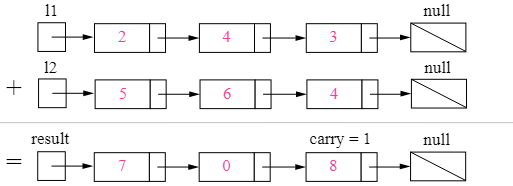

# Intergers
{: .no_toc }

<details open markdown="block">
  <summary>
    Table of contents
  </summary>
  {: .text-delta }
1. TOC
{:toc}
</details>


---

## Palindrome Number

An integer is a palindrome when it reads the same backward as forward.

For example, 121 is a palindrome while 123 is not.

###  Problem Statement

Given an integer x, return true if x is palindrome integer.

1. **Example 1**
 Input: x = 121
 Output: true

2. **Example 2**
 Input: x = -121
 Output: false

3. **Example 3**
 Input: x = 10
 Output: false

###  Solution 1
Lets understand the problem statement first. In this problem we are given an integer value as input, our task is to write an algorithm that tells us whether the given number is a palindrome or not. So, what are palindromic numbers? A number is a palindrome if it remains same when its digits are reversed. In other words a number is a palindrome if we get the same sequence of digits whether we read the number from left to right or right to left. For example 121, 99, 2332 etc. are palindromic numbers.

The idea is to do the steps mentioned here to reverse the given number only up to the middle digit in x and then compare x with the reversedNum. Basically what we do here is reverse only half of the given number x and compare x with reversed number.

This algorithm involves the following steps:

1. Reverse half of the digits of the given number x. (Reversing is done using same steps described in solution 1).
2. Once half of the digits in x are reversed, reversedNum will contain the reversed second half of the original input number and x (modified) will contain the first half of the original input number. For example if the given input is x = 123321, then after reversing half of the digits, reversedNum will be 123 and modified x will be 123.
3. Now compare the modified x with the reversedNum.
4. If both x and reversedNum are equal then return true as result, otherwise return false.


Let take one more example to understand this. Consider x = 1221 is the given number, our algorithm reverses the last two digits in x i.e. 21 (until middle digit). So, at the end of our loop x = 12 and reversedNum = 12. Now compare (x, reversedNum) and return the result.

**Note**: If x contains odd number of digits as in x = 12321, at the end of our loop reversedNum = 123 and x = 12. So we need to divide reversedNum by 10 if x contains odd number of digits before comparing x and reversedNum.

###  Implementation

```java
class PalindromeSolution {
 public boolean isPalindrome(int x) {
  // If x is a negative number it is not a palindrome
  // If x % 10 = 0, in order for it to be a palindrome the first digit should also be 0
  if (x < 0 || (x != 0 && x % 10 == 0))
    return false;
  int res = 0;
  while (x > res) {
     res = res * 10 + x % 10;
    x = x / 10;
  }
  // If x is equal to reversed number then it is a palindrome
  // If x has odd number of digits, dicard the middle digit before comparing with x
  // Example, if x = 23132, at the end of for loop x = 23 and reversedNum = 231
  // So, reversedNum/10 = 23, which is equal to x
  return (x == res || x == res / 10);
 }
}
```

###  Complexity Analysis

**Time Complexity**: O(d/2)
d here is the no. of digits in the given input number. Time complexity of this algorithm is O(d/2) because we only have to check half of the digits in the given number x (last to middle) to determine if the given number is a palindrome.

**Space Complexity**: O(1)
No extra space is used.

###  Solution 2

###  Implementation

###  Complexity Analysis


---

## Fizz Buzz

Given an integer n, return a string array answer (1-indexed) where:

- answer[i] == "FizzBuzz" if i is divisible by 3 and 5.
- answer[i] == "Fizz" if i is divisible by 3.
- answer[i] == "Buzz" if i is divisible by 5.
- answer[i] == i (as a string) if none of the above conditions are true.

**Example:**

Input: n = 15
Output: ["1","2","Fizz","4","Buzz","Fizz","7","8","Fizz","Buzz","11","Fizz","13","14","FizzBuzz"]


###  Solution 


###  Implementation
```java
class FizzBuzzSolution {
    public List<String> fizzBuzz(int n) {
        List<String> ls = new ArrayList<String>();
        for (int i = 1; i <= n; i++) {
            if (i%3 == 0 && i%5 == 0) ls.add("FizzBuzz");
            else if (i%3 == 0) ls.add("Fizz");
            else if (i%5 == 0) ls.add("Buzz");
            else ls.add(Integer.toString(i));
        }
        return ls;
    }
}
```

###  Complexity Analysis

**Time Complexity**: O(n) 1ms time taken.

**Space Complexity**: O(n)


---

## Prime Numbers

A prime number is a natural number greater than one that has no positive divisors other than one and itself.

For example, 7 is prime because 1 and 7 are its only positive integer factors, whereas 12 is not because it has the divisors 3 and 2 in addition to 1, 4 and 6.

###  Generating Prime Numbers

The method checks each numbers divisibility by the numbers in a range from 2 till number-1.

If at any point we encounter a number that is divisible, we return false. At the end when we find that number is not divisible by any of its prior number, we return true indicating its a prime number.

####  Implementation

```java
class Solution {
 public static List<Integer> primeNumbersBruteForce(int n) {
  List<Integer> primeNumbers = new LinkedList<>();
  for (int i = 2; i <= n; i++) {
   if (isPrimeBruteForce(i)) {
    primeNumbers.add(i);
   }
  }
  return primeNumbers;
 }
 public static boolean isPrimeBruteForce(int number) {
  for (int i = 2; i < number; i++) {
   if (number % i == 0) {
    return false;
   }
  }
  return true;
 }    
}

```


####  Complexity Analysis

**Time Complexity**:
O(n^2)
**Space Complexity**:
O(n)

###  Efficiency and Optimization

When a number is not a prime, this number can be factored into two factors namely a and b i.e. number = a * b. If both a and b were greater than the square root of n, a*b would be greater than n.

So at least one of those factors must be less than or equal the square root of a number and to check if a number is prime, we only need to test for factors lower than or equal to the square root of the number being checked.

Additionally, prime numbers can never be an even number as even numbers are all divisible by 2.

Keeping in mind above ideas, let's improve the algorithm:

####  Implementation

```java
 class Solution {
 public static List<Integer> primeNumbersBruteForce(int n) {
  List<Integer> primeNumbers = new LinkedList<>();
  if (n >= 2) {
   primeNumbers.add(2);
  }
  for (int i = 3; i <= n; i += 2) {
   if (isPrimeBruteForce(i)) {
    primeNumbers.add(i);
   }
  }
  return primeNumbers;
 }
 private static boolean isPrimeBruteForce(int number) {
  for (int i = 2; i*i <= number; i++) {
   if (number % i == 0) {
    return false;
   }
  }
  return true;
 }
 }
```


###  Using Java 8
```java
 class Solution {
 public static List<Integer> primeNumbersTill(int n) {
  return IntStream.rangeClosed(2, n)
          .filter(x -> isPrime(x)).boxed()
          .collect(Collectors.toList());
 }
 private static boolean isPrime(int number) {
  return IntStream.rangeClosed(2, (int) (Math.sqrt(number)))
          .allMatch(n -> x % n != 0);
 }
}
```


---

## Add Two Numbers

[Leetcode URL](https://leetcode.com/problems/add-two-numbers/)

You are given two non-empty linked lists representing two non-negative integers. The digits are stored in reverse order, and each of their nodes contains a single digit. Add the two numbers and return the sum as a linked list.

You may assume the two numbers do not contain any leading zero, except the number 0 itself.

**Example 1:**


```log
Input: l1 = [2,4,3], l2 = [5,6,4]
Output: [7,0,8]
Explanation: 342 + 465 = 807.
```

**Example 2:**

```log
Input: l1 = [0], l2 = [0]
Output: [0]
```

**Example 3:**

```log
Input: l1 = [9,9,9,9,9,9,9], l2 = [9,9,9,9]
Output: [8,9,9,9,0,0,0,1]
```

### Approach 1: Elementary Math

**Intuition**

Keep track of the carry using a variable and simulate digits-by-digits sum starting from the head of list, which contains the least-significant digit.



Figure 1. Visualization of the addition of two numbers: 342 + 465 = 807342+4=807.
Each node contains a single digit and the digits are stored in reverse order.


**Algorithm**

Just like how you would sum two numbers on a piece of paper, we begin by summing the least-significant digits, which is the head of l1l1 and l2l2. Since each digit is in the range of 0 \ldots 90…9, summing two digits may "overflow". For example 5 + 7 = 125+7=12. In this case, we set the current digit to 22 and bring over the carry = 1carry=1 to the next iteration. carrycarry must be either 00 or 11 because the largest possible sum of two digits (including the carry) is 9 + 9 + 1 = 199+9+1=19.

The pseudocode is as following:

Initialize current node to dummy head of the returning list.
Initialize carry to 00.
Initialize pp and qq to head of l1 and l2 respectively.
Loop through lists l1 and l2 until you reach both ends.
Set x to node p's value. If p has reached the end of l1, set to 0.
Set y to node q's value. If q has reached the end of l2, set to 0.
Set sum = x + y + carry.
Update carry = sum / 10.
Create a new node with the digit value of (sum mod10) and set it to current node's next, then advance current node to next.
Advance both pp and qq.
1.Check if carry = 1, if so append a new node with digit 11 to the returning list.
2.Return dummy head's next node.

Note that we use a dummy head to simplify the code. Without a dummy head, you would have to write extra conditional statements to initialize the head's value.

Take extra caution of the following cases:


| Test case | Explanation                             |
|-----------|-----------------------------------------|
| l1=[0,1]  | When one list is longer than the other. | 
| l2=[0,1,2] |  When one list is longer than the other.| 
| l1=[]     | When one list is null, which means an empty list.| 
| l2=[0,1]  |  When one list is null, which means an empty list.| 
|   l1=[9,9] | The sum could have an extra carry of one at the end, which is easy to forget.| 
|    l2=[1]|  The sum could have an extra carry of one at the end, which is easy to forget. |   


#### Implementation 

```java

/**
 * Definition for singly-linked list.
 * public class ListNode {
 *     int val;
 *     ListNode next;
 *     ListNode() {}
 *     ListNode(int val) { this.val = val; }
 *     ListNode(int val, ListNode next) { this.val = val; this.next = next; }
 * }
 */
class Solution {

 public ListNode addTwoNumbers(ListNode l1, ListNode l2) {
  ListNode dummyHead = new ListNode(0);
  ListNode p = l1, q = l2, curr = dummyHead;
  int carry = 0;
  while (p != null || q != null) {
   int x = (p != null) ? p.val : 0;
   int y = (q != null) ? q.val : 0;
   int sum = carry + x + y;
   carry = sum / 10;
   curr.next = new ListNode(sum % 10);
   curr = curr.next;
   if (p != null) p = p.next;
   if (q != null) q = q.next;
  }
  if (carry > 0) {
   curr.next = new ListNode(carry);
  }
  return dummyHead.next;
 }
}
```

#### Complexity Analysis

**Time complexity** : O(max(m,n)). Assume that mm and nn represents the length of l1 and l2 respectively, the algorithm above iterates at most  `max(m,n)` times.

**Space complexity** : O(max(m,n)). The length of the new list is at most  max(m,n)+1.

---

## Fibonacci Number

The Fibonacci numbers, commonly denoted F(n) form a sequence, called the Fibonacci sequence, such that each number is the sum of the two preceding ones, starting from 0 and 1. That is,
```log
F(0) = 0, F(1) = 1
F(n) = F(n - 1) + F(n - 2), for n > 1.
```

Given n, calculate F(n).

**Example 1:**
```log
Input: n = 2
Output: 1
Explanation: F(2) = F(1) + F(0) = 1 + 0 = 1.
```

**Example 2:**
```log
Input: n = 3
Output: 2
Explanation: F(3) = F(2) + F(1) = 1 + 1 = 2.
```

**Example 3:**
```log
Input: n = 4
Output: 3
Explanation: F(4) = F(3) + F(2) = 2 + 1 = 3.
```

**Constraints:**

```log
0 <= n <= 30
```


## More Details: 
1. [Palindrome Number - Leetcode #9 Short & Simple Solution](https://www.code-recipe.com/post/palindrome-number)
2. [Generating Prime Numbers in Java](https://www.baeldung.com/java-generate-prime-numbers)


