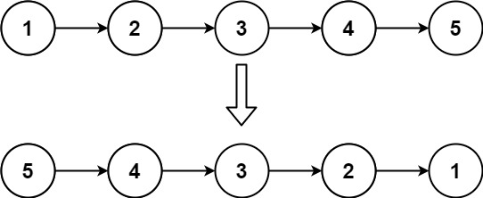

# Linked List
{: .no_toc }

<details open markdown="block">
  <summary>
    Table of contents
  </summary>
  {: .text-delta }
1. TOC
{:toc}
</details>


---

## Linked List Cycle

Given head, the head of a linked list, determine if the linked list has a cycle in it.

There is a cycle in a linked list if there is some node in the list that can be reached again by continuously following the next pointer. Internally, pos is used to denote the index of the node that tail's next pointer is connected to. Note that pos is not passed as a parameter.

Return true if there is a cycle in the linked list. Otherwise, return false.

### Floyd’s Cycle Detection Algorithm

This approach uses a two-pointer – a fast pointer and a slow pointer to determine if there exists a cycle in the loop. The slow pointer moves one node ahead at a time, while the fast pointer moves two nodes ahead at a time.
If a loop exists in the linked list, the fast and slow pointers are bound to meet at some point.

**Algorithm:**

- Initialise two pointers, fast and slow to the head of the linked list.
- Traverse through the linked list until the fast pointer doesn’t reach the end of the linked list.
- If the fast pointer reaches the end, it means that the linked list doesn’t contain any cycle. Hence, return False.
- Else, move the slow pointer by one node i.e. slow = slow -> next and fast pointer by two nodes i.e. fast = fast -> next -> next.
- At any point, if the fast and the slow pointers point to the same node, return True as a loop has been detected.


####  Implementation

```java
public class SinglyLinkedListHasCycle {
    //Definition for singly-linked list.
    class ListNode {
        int val;
        ListNode next;
        ListNode(int x) {
            val = x;
            next = null;
        }
    }

    public boolean hasCycle(ListNode head) {
        if (head == null) return false;
        ListNode walker = head;
        ListNode runner = head;
        while (runner.next != null && runner.next.next != null) {
            walker = walker.next;
            runner = runner.next.next;
            if (walker == runner) return true;
        }
        return false;
    }
}
```

####  Runtime
0 ms

####  Memory
43.4 MB

####  Complexity Analysis

**Time Complexity**:
O(N), where N is the number of nodes of the linked list.
**Space Complexity**:
O(1) 


###  HashSet Approach

The simplest approach to solve this problem is to check whether a node in the linked list has been visited before. To perform this operation, a hashmap can be used.

**Algorithm**

- Initialise a hashmap.
- Traverse the linked list till the head pointer isn’t NULL:
  - If the current node is already present in the hashset, it ensures that the linked list contains a loop. Hence, terminate and return True.
  - Else, continue traversing and continue inserting the node into the hashset.
- Return False if it doesn’t satisfy the above conditions.

####  Implementation

```java
public class SinglyLinkedListHasCycleHashSet {
    public boolean hasCycle(ListNode head) {
        Set<ListNode> mp = new HashSet<>();
        while (head != null) {
            if (mp.contains(head)) {
                return true;
            }
            mp.add(head);
            head = head.next;
        }
        return false;
    }
} 
```


####  Complexity Analysis

**Time Complexity**:
O(N) where N is the number of nodes of the linked list.

**Space Complexity**:
O(N), as HashSet is used


### Recursive Approach

####  Implementation

```java
public class SinglyLinkedListHasCycleRecursive {
    class HasCycleInLinkedList{
        public boolean hasCycle(ListNode head){
            if(head == null || head.next == null) return false;
            if(head.next == head) return true;
            ListNode nextNode = head.next;
            head.next = head;
            return hasCycle(nextNode);
        }
    }
} 
```


####  Complexity Analysis

**Time Complexity**:


**Space Complexity**:


---

## Reverse Linked List

Given the `head` of a singly linked list, reverse the list, and return *the reversed list*.

**Example 1 :**



```log
Input: head = [1,2,3,4,5]
Output: [5,4,3,2,1]
```

**Example 2 :**


```log
Input: head = [1,2]
Output: [2,1]
```

**Example 3 :**
```log
Input: head = []
Output: []
```

**Constraints:**

* The number of nodes in the list is the range `[0, 5000]`.

* `-5000 <= Node.val <= 5000`

### Solution 1 : Iterative

**Intuition**

Assume that we have linked list `1 → 2 → 3 → Ø`, we would like to change it to `Ø ← 1 ← 2 ← 3`.

While traversing the list, we can change the current node's next pointer to point to its previous element. Since a node does not have reference to its previous node, we must store its previous element beforehand. We also need another pointer to store the next node before changing the reference. Do not forget to return the new head reference at the end!

#### Implementation
```java
class Solution {
    public ListNode reverseList(ListNode head) {
        ListNode prev = null;
        ListNode curr = head;
        while (curr != null) {
            ListNode nextTemp = curr.next;
            curr.next = prev;
            prev = curr;
            curr = nextTemp;
        }
        return prev;
    }
}
```

#### Complexity analysis

**Time complexity :** O(n). Assume that nn is the list's length, the time complexity is O(n).

**Space complexity :** O(1).

### Solution 2 : Recursive

**Intuition**

The recursive version is slightly trickier and the key is to work backwards. Assume that the rest of the list had already been reversed, now how do we reverse the front part? Let's assume the list is:` n1 → … → nk-1 → nk → nk+1 → … → nm → Ø`

Assume from node `nk+1` to `nm` had been reversed and we are at node `nk`.

`n1 → … → nk-1 → nk → nk+1 ← … ← nm`

We want `nk+1`’s next node to point to `nk`.

So,

`nk.next.next = nk;`

Be very careful that `n1`'s next must point to `Ø`. If you forget about this, your linked list will have a cycle in it. This bug could be caught if you test your code with a linked list of size 2.

#### Implementation

```java
class Solution {
    public ListNode reverseList(ListNode head) {
        if (head == null || head.next == null) {
            return head;
        }
        ListNode p = reverseList(head.next);
        head.next.next = head;
        head.next = null;
        return p;
    }
}
```

#### Complexity Analysis

**Time complexity :** O(n). Assume that n is the list's length, the time complexity is O(n).

**Space complexity :** O(n). The extra space comes from implicit stack space due to recursion. The recursion could go up to nn levels deep.

---


## More Details: 
1. [Linked List Cycle](https://leetcode.com/problems/linked-list-cycle/)


