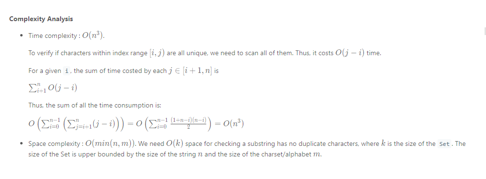
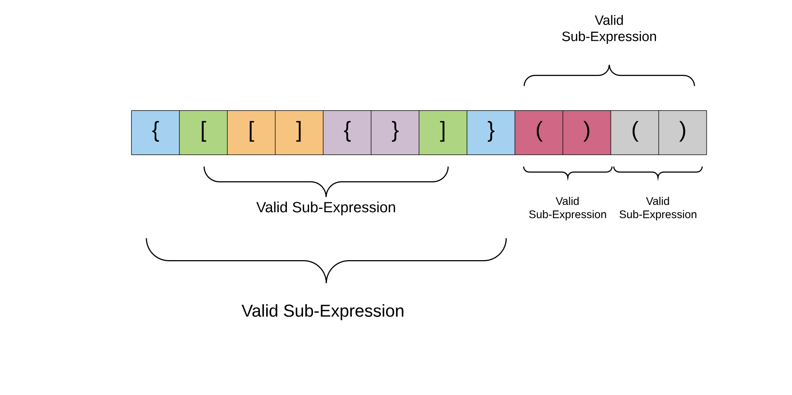
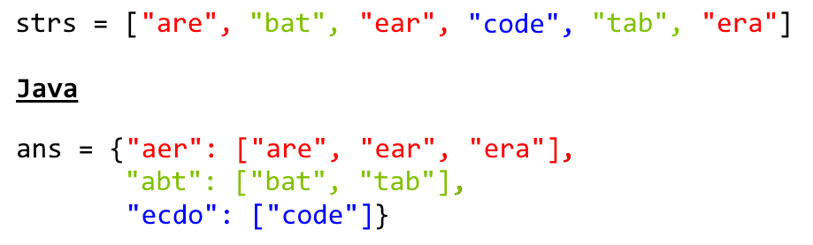
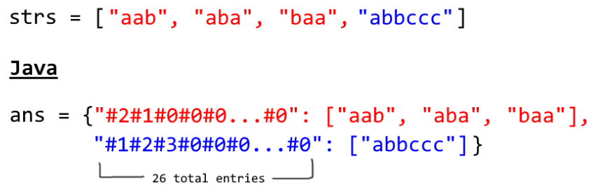
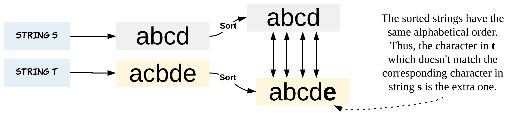
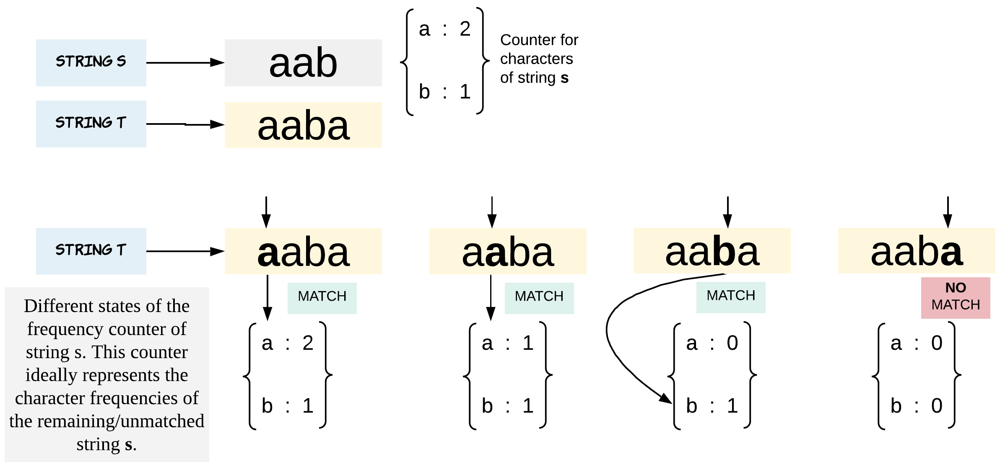
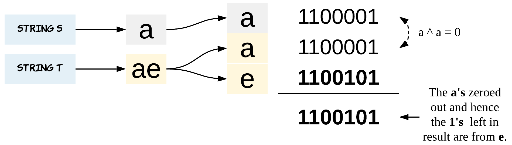

# String
{: .no_toc }

<details open markdown="block">
  <summary>
    Table of contents
  </summary>
  {: .text-delta }
1. TOC
{:toc}
</details>

---

---

## Reverse String

Write a function that reverses a string. The input string is given as an array of characters s.

You must do this by modifying the input array in-place with O(1) extra memory.

**Example:**

Input: s = ["h","e","l","l","o"]

Output: ["o","l","l","e","h"]

###  Solution1

Two pointers i and j, pointing to the beginning and end, respectively. While i < j, swap.
Using a helper swap function severely impacts runtime and memory, so we swap in the loop.

####  Implementation

```java
class Solution {
    public void reverseString(char[] s) {
        int len = s.length;
        int left = 0;
        int right = s.length - 1;
        while(left < right) {
            char tmp = s[left];
            s[left] = s[right];
            s[right] = tmp;
            left++;
            right--;
        }
    }
}
```

####  Runtime
3 ms

####  Memory
52.6 MB

####  Complexity Analysis


**Time Complexity**: 

We are iterating  half array hence it will take O(n/2) which will become O(n).

**Space Complexity**: 

O(1)

###  Solution2

Using for loop swap.

####  Implementation
```java
 class Solution {
    public void reverseString(char[] s) {
        for (int i = 0; i < s.length / 2; i++) {    //Do it half the number of String length
            char tmp = s[i];
            s[i] = s[s.length - 1 - i];     //Front swap with other End side 
            s[s.length - 1 - i] = tmp;      //End swap with other Front side
        }
    }
}
```

####  Runtime
1 ms

####  Memory
52.7 MB

####  Complexity Analysis


**Time Complexity**:

We are iterating  half array hence it will take O(n/2) which will become O(n).

**Space Complexity**:

O(1)


###  Solution3

Add to extra space from rear to front then  Set reversed 'str' into char array 's'

####  Implementation
```java
 class Solution {
    public void reverseString(char[] s) {
        String str = "";                   //Allocate extra space

        for (int i = s.length - 1; i >= 0; i--)   /*Add to extra space from rear to front */
            str += s[i];

        for (int i = 0; i < s.length; i++)      /*Set reversed 'str' into char array 's' */
            s[i] = str.charAt(i);
    }
}
```


###  Solution4

Using StringBuilder reverse method.

####  Implementation

```java
return new StringBuilder(s).reverse().toString();

```


---

## Longest Common Prefix

Write a function to find the longest common prefix string amongst an array of strings.

Iif there is no common prefix, return an empty string "".

**Example 1:**

- Input: strs = ["flower","flow","flight"]
- Output: "fl"


**Example 2:**

- Input: strs = ["dog","racecar","car"]
- Output: ""
- Explanation: There is no common prefix among the input strings.

###  Solution1

1. Take the first(index=0) string in the array as prefix.
2. Iterate from second(index=1) string till the end.
3. Use the indexOf() function to check if the prefix is there in the strs[i] or not. If the prefix is there the function returns 0 else -1.
4. Use the substring function to chop the last letter from prefix each time the function return -1.

```log
**Example :**
strs=["flower", "flow", "flight"]
prefix=flower

**index=1**
while(strs[index].indexOf(prefix) != 0) means while("flow".indexOf("flower")!=0)
Since flower as a whole is not in flow, it return -1 and  prefix=prefix.substring(0,prefix.length()-1) reduces prefix to "flowe"
Again while(strs[index].indexOf(prefix) != 0) means while("flow".indexOf("flowe")!=0)
Since flowe as a whole is not in flow, it return -1 and  prefix=prefix.substring(0,prefix.length()-1) reduces prefix to "flow"
Again while(strs[index].indexOf(prefix) != 0) means while("flow".indexOf("flow")!=0)
Since flow as a whole is in flow, it returns 0 so now prefix=flow

**index=2**
while(strs[index].indexOf(prefix) != 0) means while("flight".indexOf("flow")!=0)
Since flow as a whole is not in flight, it return -1 and  prefix=prefix.substring(0,prefix.length()-1) reduces prefix to "flo"
Again while(strs[index].indexOf(prefix) != 0) means while("flight".indexOf("flo")!=0)
Since flo as a whole is not in flight, it return -1 and  prefix=prefix.substring(0,prefix.length()-1) reduces prefix to "fl"
Again while(strs[index].indexOf(prefix) != 0) means while("flight".indexOf("fl")!=0)
Since fl as a whole is in flight, it returns 0 so now prefix=fl

**index=3** 
for loop terminates and we return prefix which is equal to fl
```

####  Implementation

```java
 class Solution {
    public String longestCommonPrefix(String[] strs) {
        if(strs.length == 0) return "";
        String prefix = strs[0];
        for(int i=1; i< strs.length; i++ ) {
            while(strs[i].indexOf(prefix) != 0) {
                prefix = prefix.substring(0, prefix.length()-1);
            }
        }

        return prefix;
    }
}
```

####  Runtime
1 ms

####  Memory
39.2 MB

####  Complexity Analysis

**Time Complexity**:
O(n)

**Space Complexity**:
O(1)


###  Solution2

####  Implementation

```java
 class Solution {
 public String longestCommonPrefix(String[] strs) {
        if (strs == null || strs.length == 0)
            return "";
        
        Arrays.sort(strs);
        String first = strs[0];
        String last = strs[strs.length - 1];
        int c = 0;
        while(c < first.length())
        {
            if (first.charAt(c) == last.charAt(c))
                c++;
            else
                break;
        }
        return c == 0 ? "" : first.substring(0, c);
    }
}
   
```


---

## Reverse Words in a String

Given an input string s, reverse the order of the words.

A word is defined as a sequence of non-space characters. The words in s will be separated by at least one space.

Return a string of the words in reverse order concatenated by a single space.

Note that s may contain leading or trailing spaces or multiple spaces between two words. The returned string should only have a single space separating the words. Do not include any extra spaces.


**Example 1:**

- Input: s = "the sky is blue"
- Output: "blue is sky the"

**Example 2:**

Input: s = "  hello world  "
Output: "world hello"
Explanation: Your reversed string should not contain leading or trailing spaces.

**Example 3:**

Input: s = "a good   example"
Output: "example good a"
Explanation: You need to reduce multiple spaces between two words to a single space in the reversed string.

###  Solution 1

Two-pointers solution no trim( ), no split( ), no StringBuilder


####  Implementation

```java
 public class Solution {

    public String reverseWords(String s) {
        if (s == null) return null;

        char[] a = s.toCharArray();
        int n = a.length;

        // step 1. reverse the whole string
        reverse(a, 0, n - 1);
        // step 2. reverse each word
        reverseWords(a, n);
        // step 3. clean up spaces
        return cleanSpaces(a, n);
    }

    void reverseWords(char[] a, int n) {
        int i = 0, j = 0;

        while (i < n) {
            while (i < j || i < n && a[i] == ' ') i++; // skip spaces
            while (j < i || j < n && a[j] != ' ') j++; // skip non spaces
            reverse(a, i, j - 1);                      // reverse the word
        }
    }

    // trim leading, trailing and multiple spaces
    String cleanSpaces(char[] a, int n) {
        int i = 0, j = 0;

        while (j < n) {
            while (j < n && a[j] == ' ') j++;             // skip spaces
            while (j < n && a[j] != ' ') a[i++] = a[j++]; // keep non spaces
            while (j < n && a[j] == ' ') j++;             // skip spaces
            if (j < n) a[i++] = ' ';                      // keep only one space
        }

        return new String(a).substring(0, i);
    }

    // reverse a[] from a[i] to a[j]
    private void reverse(char[] a, int i, int j) {
        while (i < j) {
            char t = a[i];
            a[i++] = a[j];
            a[j--] = t;
        }
    }

}
```

####  Runtime


####  Memory


####  Complexity Analysis

**Time Complexity**:

**Space Complexity**:


---

## First Unique or Non Repeated Character in a String

Find First Non Repeated Character in a String

Given a string s, find the first non-repeating character in it and return its index. If it does not exist, return -1.

**Example 1:**

Input: s = "leetcode"
Output: 0

**Example 2:**

Input: s = "loveleetcode"
Output: 2

**Example 3:**

Input: s = "aabb"
Output: -1

###  Solution 1

####  Implementation

```java
class Solution{
    public int firstUniqChar(String s) {
        for(char c : s.toCharArray()){
            int index = s.indexOf(c);
            int lastIndex = s.lastIndexOf(c);
            if(index == lastIndex)
                return index;
        }
        return -1;
    }
}

```

####  Runtime
20 ms

####  Memory
39.5 MB

####  Complexity Analysis

**Time Complexity**:
O(n^2)

**Space Complexity**:
O(1)


###  Solution 2

####  Implementation

```java
 class Solution {
    public int firstUniqChar(String s) {
        int ans = Integer.MAX_VALUE;
        for (char i = 'a'; i <= 'z';i++) {
            int ind = s.indexOf (i);
            if (ind != -1 && ind == s.lastIndexOf (i))
                ans = Math.min (ans,ind);
        }
        if (ans == Integer.MAX_VALUE)
            return -1;
        return ans;
    }
}
```


###  Solution 3

Using LinkedHashMap to find first non repeated character of String Algorithm :
**Step 1:** get character array and loop through it to build a hash table with char and their count.
**Step 2:** loop through LinkedHashMap to find an entry with value 1, that's your first non-repeated character, as LinkedHashMap maintains insertion order.

####  Implementation

```java
 class Solution {
    public static char getFirstNonRepeatedChar(String str) {
        Map<Character,Integer> counts = new LinkedHashMap<>(str.length());

        for (char c : str.toCharArray()) {
            counts.put(c, counts.containsKey(c) ? counts.get(c) + 1 : 1);
        }

        for (Entry<Character,Integer> entry : counts.entrySet()) {
            if (entry.getValue() == 1) {
                return entry.getKey();
            }
        }
        throw new RuntimeException("didn't find any non repeated Character");
    }
 }

```


---

## String indexOf() custom method

Get index of first occurrance of second string in the first String using recursion

###  Implementation

```java
 class Solution {
    public static int indexOf(String s1, String s2) {
        if (s1.length() < s2.length()) {
            return -1;
        } else if (s1.substring(0, s2.length()).equals(s2)) {
            return 0;
        } else {
            int i = indexOf(s1.substring(1, s1.length()), s2);
            if (i == -1) {
                return i;
            } else {
                return 1 + i;
            }
        }
    }
}        
```

Output: 
```
String s1 = "BarackObama";
String s2 = "rac";
indexOf(s1, s2);
```

###  Complexity Analysis

**Time Complexity**:

**Space Complexity**:


---

## Test


####  Implementation

```java
 
```

####  Runtime


####  Memory


####  Complexity Analysis

**Time Complexity**:

**Space Complexity**:

---

##  Longest Substring Without Repeating Characters

Given a string s, find the length of the longest substring without repeating characters.

**Example 1:**

```log
Input: s = "abcabcbb"
Output: 3
Explanation: The answer is "abc", with the length of 3.
```

**Example 2:**

```log
Input: s = "bbbbb"
Output: 1
Explanation: The answer is "b", with the length of 1.
```

**Example 3:**

```log
Input: s = "pwwkew"
Output: 3
Explanation: The answer is "wke", with the length of 3.
Notice that the answer must be a substring, "pwke" is a subsequence and not a substring.
```

### Solution 1: Brute Force

**Intuition**

Check all the substring one by one to see if it has no duplicate character.

**Algorithm**

Suppose we have a function boolean allUnique(String substring) which will return true if the characters in the substring are all unique, otherwise false. We can iterate through all the possible substrings of the given string s and call the function allUnique. If it turns out to be true, then we update our answer of the maximum length of substring without duplicate characters.

Now let's fill the missing parts:

To enumerate all substrings of a given string, we enumerate the start and end indices of them. Suppose the start and end indices are i and j, respectively. Then we have 0≤i<j≤n (here end index j is exclusive by convention). Thus, using two nested loops with i from 0 to n−1 and j from i+1 to n, we can enumerate all the substrings of s.

To check if one string has duplicate characters, we can use a set. We iterate through all the characters in the string and put them into the set one by one. Before putting one character, we check if the set already contains it. If so, we return false. After the loop, we return true.

####  Implementation

```java
 class Solution {
    public class Solution {
        public int lengthOfLongestSubstring(String s) {
            int n = s.length();

            int res = 0;
            for (int i = 0; i < n; i++) {
                for (int j = i; j < n; j++) {
                    if (checkRepetition(s, i, j)) {
                        res = Math.max(res, j - i + 1);
                    }
                }
            }

            return res;
        }
        private boolean checkRepetition(String s, int start, int end) {
            int[] chars = new int[128];

            for (int i = start; i <= end; i++) {
                char c = s.charAt(i);
                chars[c]++;
                if (chars[c] > 1) {
                    return false;
                }
            }

            return true;
        }
    }
 }
```

#### Complexity Analysis



### Solution 2: Sliding Window

**Algorithm**

The naive approach is very straightforward. But it is too slow. So how can we optimize it?

In the naive approaches, we repeatedly check a substring to see if it has duplicate character. But it is unnecessary. If a substring sij

from index i to j−1 is already checked to have no duplicate characters. We only need to check if s[j] is already in the substring sij .

To check if a character is already in the substring, we can scan the substring, which leads to an O(n^2) algorithm. But we can do better.

By using HashSet as a sliding window, checking if a character in the current can be done in O(1).

A sliding window is an abstract concept commonly used in array/string problems. A window is a range of elements in the array/string which usually defined by the start and end indices, i.e. [i,j) (left-closed, right-open). A sliding window is a window "slides" its two boundaries to the certain direction. For example, if we slide [i,j) to the right by 11 element, then it becomes [i+1,j+1) (left-closed, right-open).

Back to our problem. We use HashSet to store the characters in current window [i,j) (j=i initially). Then we slide the index j to the right. If it is not in the HashSet, we slide j further. Doing so until s[j] is already in the HashSet. At this point, we found the maximum size of substrings without duplicate characters start with index i. If we do this for all i, we get our answer.

####  Implementation

```java
 class Solution {
    public class Solution {
        public int lengthOfLongestSubstring(String s) {
            int[] chars = new int[128];

            int left = 0;
            int right = 0;

            int res = 0;
            while (right < s.length()) {
                char r = s.charAt(right);
                chars[r]++;

                while (chars[r] > 1) {
                    char l = s.charAt(left);
                    chars[l]--;
                    left++;
                }

                res = Math.max(res, right - left + 1);

                right++;
            }
            return res;
        }
    }
 }
```


### solution 3: Sliding Window Optimized

The above solution requires at most 2n steps. In fact, it could be optimized to require only n steps. Instead of using a set to tell if a character exists or not, we could define a mapping of the characters to its index. Then we can skip the characters immediately when we found a repeated character.

The reason is that if s[j] have a duplicate in the range [i, j) with index j',we don't need to increase i little by little. We can skip all the elements in the range [i, j'] and let i to be j' + 1 directly.

**Java (Using HashMap)**

####  Implementation

```java
 class Solution {
    public class Solution {
        public int lengthOfLongestSubstring(String s) {
            int n = s.length(), ans = 0;
            Map<Character, Integer> map = new HashMap<>(); // current index of character
            // try to extend the range [i, j]
            for (int j = 0, i = 0; j < n; j++) {
                if (map.containsKey(s.charAt(j))) {
                    i = Math.max(map.get(s.charAt(j)), i);
                }
                ans = Math.max(ans, j - i + 1);
                map.put(s.charAt(j), j + 1);
            }
            return ans;
        }
    }
 }
```
**Java (Assuming ASCII 128)**

The previous implements all have no assumption on the charset of the string s.

If we know that the charset is rather small, we can replace the Map with an integer array as direct access table.

Commonly used tables are:

int[26] for Letters 'a' - 'z' or 'A' - 'Z'
int[128] for ASCII
int[256] for Extended ASCII

####  Implementation

```java
 class Solution {
    public class Solution {
        public int lengthOfLongestSubstring(String s) {
            Integer[] chars = new Integer[128];

            int left = 0;
            int right = 0;

            int res = 0;
            while (right < s.length()) {
                char r = s.charAt(right);

                Integer index = chars[r];
                if (index != null && index >= left && index < right) {
                    left = index + 1;
                }

                res = Math.max(res, right - left + 1);

                chars[r] = right;
                right++;
            }

            return res;
        }
    }
 }
```

#### Complexity Analysis

Time complexity : O(n). Index jj will iterate nn times.

Space complexity (HashMap) : O(min(m,n)). Same as the previous approach.

Space complexity (Table): O(m). m is the size of the charset.

---

## Valid Parentheses

Given a string s containing just the characters `'(', ')', '{', '}', '[' and ']'`, determine if the input string is valid.

An input string is valid if:

1. Open brackets must be closed by the same type of brackets.
2. Open brackets must be closed in the correct order.
3. Every close bracket has a corresponding open bracket of the same type.

**Example 1:**

```log
Input: s = "()"
Output: true
```

**Example 2:**

```log
Input: s = "()[]{}"
Output: true
```

**Example 3:**

```log
Input: s = "(]"
Output: false
```

**Constraints:**

```log
1 <= s.length <= 104
s consists of parentheses only '()[]{}'.
```

### Solution 1 : Stacks

**Intuition**  

Imagine you are writing a small compiler for your college project and one of the tasks (or say sub-tasks) for the compiler would be to detect if the parenthesis are in place or not.

The algorithm we will look at in this article can be then used to process all the parenthesis in the program your compiler is compiling and checking if all the parenthesis are in place. This makes checking if a given string of parenthesis is valid or not, an important programming problem.

The expressions that we will deal with in this problem can consist of three different type of parenthesis:
```log
(),
{} and
[]
```
Before looking at how we can check if a given expression consisting of these parenthesis is valid or not, let us look at a simpler version of the problem that consists of just one type of parenthesis. So, the expressions we can encounter in this simplified version of the problem are e.g.
```log
(((((()))))) -- VALID

()()()()     -- VALID

(((((((()    -- INVALID

((()(())))   -- VALID
```
An interesting property about a valid parenthesis expression is that a sub-expression of a valid expression should also be a valid expression. (Not every sub-expression) e.g.



Also, if you look at the above structure carefully, the color coded cells mark the opening and closing pairs of parenthesis. The entire expression is valid, but sub portions of it are also valid in themselves. This lends a sort of a recursive structure to the problem. For e.g. Consider the expression enclosed within the two green parenthesis in the diagram above. The opening bracket at index `1` and the corresponding closing bracket at index `6`.

**Algorithm**

1. Initialize a stack S.
2. Process each bracket of the expression one at a time.
3. If we encounter an opening bracket, we simply push it onto the stack. This means we will process it later, let us simply move onto the sub-expression ahead.
4. If we encounter a closing bracket, then we check the element on top of the stack. If the element at the top of the stack is an opening bracket of the same type, then we pop it off the stack and continue processing. Else, this implies an invalid expression.
5. In the end, if we are left with a stack still having elements, then this implies an invalid expression.

```java
class Solution {

  // Hash table that takes care of the mappings.
  private HashMap<Character, Character> mappings;

  // Initialize hash map with mappings. This simply makes the code easier to read.
  public Solution() {
    this.mappings = new HashMap<Character, Character>();
    this.mappings.put(')', '(');
    this.mappings.put('}', '{');
    this.mappings.put(']', '[');
  }

  public boolean isValid(String s) {

    // Initialize a stack to be used in the algorithm.
    Stack<Character> stack = new Stack<Character>();

    for (int i = 0; i < s.length(); i++) {
      char c = s.charAt(i);

      // If the current character is a closing bracket.
      if (this.mappings.containsKey(c)) {

        // Get the top element of the stack. If the stack is empty, set a dummy value of '#'
        char topElement = stack.empty() ? '#' : stack.pop();

        // If the mapping for this bracket doesn't match the stack's top element, return false.
        if (topElement != this.mappings.get(c)) {
          return false;
        }
      } else {
        // If it was an opening bracket, push to the stack.
        stack.push(c);
      }
    }

    // If the stack still contains elements, then it is an invalid expression.
    return stack.isEmpty();
  }
}
```
#### Complexity analysis

**Time complexity :** O(n) because we simply traverse the given string one character at a time and push and pop operations on a stack take O(1) time.

**Space complexity :** O(n) as we push all opening brackets onto the stack and in the worst case, we will end up pushing all the brackets onto the stack. e.g. ((((((((((.

### Solution 2 : Hashmap

```java
class Solution {
    public boolean isValid(String s) {
        if(s.length()%2!=0)
            return false;
        
        HashMap<Character,Character> paren = new HashMap<>();
        paren.put('(',')');
        paren.put('[',']');
        paren.put('{','}');
      
       Stack<Character> stack = new Stack<>();
        for (char ch: s.toCharArray()) {
            if (paren.containsKey(ch))
            {
                stack.push(ch);
            }
            else if (stack.isEmpty() || paren.get(stack.pop()) != ch) {
                return false;
            }
        }
        return stack.isEmpty();

    }
}
```

---

## Add Strings

Given two non-negative integers, num1 and num2 represented as string, return the sum of num1 and num2 as a string.

You must solve the problem without using any built-in library for handling large integers (such as BigInteger). You must also not convert the inputs to integers directly.

**Example 1:**
```log 
Input: num1 = "11", num2 = "123"
Output: "134"
```

**Example 2:**
```log
Input: num1 = "456", num2 = "77"
Output: "533"
```

**Example 3:**
```log
Input: num1 = "0", num2 = "0"
Output: "0"
```

**Constraints:**
```log
* 1 <= num1.length, num2.length <= 104
* num1 and num2 consist of only digits.
* num1 and num2 don't have any leading zeros except for the zero itself.
```
### Solution 1 : StringBuilder

**Algorithm**

* Initialize an empty res structure. Once could use StringBuilder in Java.

* Start from carry = 0.

* Set a pointer at the end of each string: p1 = num1.length() - 1, p2 = num2.length() - 1.

* Loop over the strings from the end to the beginning using p1 and p2. Stop when both strings are used entirely.

     1. Set x1 to be equal to a digit from string nums1 at index p1. If p1 has reached the beginning of nums1, set x1 to 0.

     2. Do the same for x2. Set x2 to be equal to digit from string nums2 at index p2. If p2 has reached the beginning of nums2, set x2 to 0.

     3. Compute the current value: value = (x1 + x2 + carry) % 10, and update the carry: carry = (x1 + x2 + carry) / 10.

     4. Append the current value to the result: res.append(value).

* Now both strings are done. If the carry is still non-zero, update the result: res.append(carry).

* Reverse the result, convert it to a string, and return that string.

```java
class Solution {
    public String addStrings(String num1, String num2) {
        StringBuilder res = new StringBuilder();

        int carry = 0;
        int p1 = num1.length() - 1;
        int p2 = num2.length() - 1;
        while (p1 >= 0 || p2 >= 0) {
            int x1 = p1 >= 0 ? num1.charAt(p1) - '0' : 0;
            int x2 = p2 >= 0 ? num2.charAt(p2) - '0' : 0;
            int value = (x1 + x2 + carry) % 10;
            carry = (x1 + x2 + carry) / 10;
            res.append(value);
            p1--;
            p2--;    
        }
        
        if (carry != 0)
            res.append(carry);
        
        return res.reverse().toString();
    }
}
```

#### Complexity Analysis

**Time Complexity:** O(max(N_1,N_2)), where N_1 N_2 are length of nums1 and nums2. Here we do max(N_1, N_2) iterations at most.

**Space Complexity:** O(max(N_1,N_2)), because the length of the new string is at most max(N_1, N_2) + 1

### Solution 2 : Simple

**Algorithm**

* Start iterating the strings from the end
* take each digit of the both strings
* add them up and
* place the result of sum at desired position in the char array

```java
class Solution {
    public String addStrings(String num1, String num2) {
        
        int num1Len = num1.length() - 1;
        int num2Len = num2.length() - 1;
        int maxLen = Math.max(num1Len, num2Len) + 2;
        char[] res = new char[maxLen];
        int sum = 0;
        
        while(num1Len >= 0 || num2Len >= 0) {
            
            if(num1Len >= 0) {
                sum += num1.charAt(num1Len--) - '0';
            }
            
            if(num2Len >= 0) {
                sum += num2.charAt(num2Len--) - '0';
            }
            
            res[--maxLen] = (char)((sum % 10) + '0');
            sum /= 10;
        }
        
        if(sum != 0) {
            res[0] = '1';
            return String.valueOf(res);
        }
        
        return String.valueOf(res, 1, res.length - 1);
    }
}
```

#### Complexity Analysis

**Time:**  O(max(m, n)), where m and n are the lengths of given Strings a and b respectively.

**Space:** O(max(m, n)), as we need a char array(res) whose size is equal to max of length of 2 input strings

---

## Valid Anagram

Given two strings s and t, return true if t is an anagram of s, and false otherwise.

An Anagram is a word or phrase formed by rearranging the letters of a different word or phrase, typically using all the original letters exactly once.

**Example 1:**
```log 
Input: s = "anagram", t = "nagaram"
Output: true
```

**Example 2:**
```log
Input: s = "rat", t = "car"
Output: false
```

**Constraints:**
```log
* 1 <= s.length, t.length <= 5 * 104
* s and t consist of lowercase English letters.
```
### Solution 1 : Sorting

**Algorithm**

An anagram is produced by rearranging the letters of s into t. Therefore, if t is an anagram of s, sorting both strings will result in two identical strings. Furthermore, if ss and t have different lengths, t must not be an anagram of s and we can return early.

```java
public boolean isAnagram(String s, String t) {
    if (s.length() != t.length()) {
        return false;
    }
    char[] str1 = s.toCharArray();
    char[] str2 = t.toCharArray();
    Arrays.sort(str1);
    Arrays.sort(str2);
    return Arrays.equals(str1, str2);
}
```
#### Complexity Analysis

**Time complexity:** O(nlogn). Assume that n is the length of s, sorting costs O(nlogn) and comparing two strings costs O(n). Sorting time dominates and the overall time complexity is O(nlogn).

**Space complexity:** O(1). Space depends on the sorting implementation which, usually, costs O(1) auxiliary space if heapsort is used. Note that in Java, toCharArray() makes a copy of the string so it costs O(n) extra space, but we ignore this for complexity analysis because:

* It is a language dependent detail.

* It depends on how the function is designed. For example, the function parameter types can be changed to char[].

### Solution 2 : Frequency Counter

**Algorithm**

To examine if t is a rearrangement of s, we can count occurrences of each letter in the two strings and compare them. We could use a hash table to count the frequency of each letter, however, since both s and t only contain letters from a to z, a simple array of size 26 will suffice.

Do we need two counters for comparison? Actually no, because we can increment the count for each letter in s and decrement the count for each letter in t, and then check if the count for every character is zero.

```java
public boolean isAnagram(String s, String t) {
    if (s.length() != t.length()) {
        return false;
    }
    int[] counter = new int[26];
    for (int i = 0; i < s.length(); i++) {
        counter[s.charAt(i) - 'a']++;
        counter[t.charAt(i) - 'a']--;
    }
    for (int count : counter) {
        if (count != 0) {
            return false;
        }
    }
    return true;
}
```

Or we could first increment the counter for s, then decrement the counter for t. If at any point the counter drops below zero, we know that t contains an extra letter not in s and return false immediately.

```java
public boolean isAnagram(String s, String t) {
    if (s.length() != t.length()) {
        return false;
    }
    int[] table = new int[26];
    for (int i = 0; i < s.length(); i++) {
        table[s.charAt(i) - 'a']++;
    }
    for (int i = 0; i < t.length(); i++) {
        table[t.charAt(i) - 'a']--;
        if (table[t.charAt(i) - 'a'] < 0) {
            return false;
        }
    }
    return true;
}
```

#### Complexity Analysis

**Time complexity:** O(n). Time complexity is O(n) because accessing the counter table is a constant time operation.

**Space complexity:** O(1). Although we do use extra space, the space complexity is O(1) because the table's size stays constant no matter how large n is.

### Solution 3 : Simple 

```java
public boolean isAnagram(String s, String t) {
    
    int[] charsMap = new int['z'-'a'+1];
    
    for(char c: s.toCharArray()) {
        int pos = c - 'a';
        charsMap[pos]++;
    }
    
    for(char c: t.toCharArray()) {
        int pos = c - 'a';
        charsMap[pos]--;
    }
    
    for(int count: charsMap) {
        if(count != 0) {
            return false;
        }
    }
    
    return true;
}
```
---

## Group Anagrams

Given an array of strings `strs`, group the anagrams together. You can return the answer in any order.

An Anagram is a word or phrase formed by rearranging the letters of a different word or phrase, typically using all the original letters exactly once.

**Example 1:**

```log
Input: strs = ["eat","tea","tan","ate","nat","bat"]
Output: [["bat"],["nat","tan"],["ate","eat","tea"]]
```

**Example 2:**

```log
Input: strs = [""]
Output: [[""]]
```
**Example 3:**

```log
Input: strs = ["a"]
Output: [["a"]]
```

**Constraints:**

```log
1 <= strs.length <= 104
0 <= strs[i].length <= 100
strs[i] consists of lowercase English letters.
```

### Solution 1 : Categorize by Sorted String

**Intuition**

Two strings are anagrams if and only if their sorted strings are equal.

**Algorithm**

Maintain a map `ans : {String -> List}` where each key **K** is a sorted string, and each value is the list of strings from the initial input that when sorted, are equal to **K**.

In Java, we will store the key as a string, eg. code. In Python, we will store the key as a hashable tuple, eg. `('c', 'o', 'd', 'e')`.



#### Implementation

```java
class Solution {
    public List<List<String>> groupAnagrams(String[] strs) {
        if (strs.length == 0) return new ArrayList();
        Map<String, List> ans = new HashMap<String, List>();
        for (String s : strs) {
            char[] ca = s.toCharArray();
            Arrays.sort(ca);
            String key = String.valueOf(ca);
            if (!ans.containsKey(key)) ans.put(key, new ArrayList());
            ans.get(key).add(s);
        }
        return new ArrayList(ans.values());
    }
}
```
#### Complexity Analysis

**Time Complexity:** O(NKlogK), where N is the length of `strs`, and K is the maximum length of a string in `strs`. The outer loop has complexity O(N) as we iterate through each string. Then, we sort each string in O(KlogK) time.

**Space Complexity:** O(NK), the total information content stored in ans.

### Solution 2 : Categorize by Count

**Intuition**

Two strings are anagrams if and only if their character counts (respective number of occurrences of each character) are the same.

**Algorithm**

We can transform each string s into a character count, **count**, consisting of 26 non-negative integers representing the number of **a**'s, **b**'s, **c**'s, etc. We use these counts as the basis for our hash map.

In Java, the hashable representation of our count will be a string delimited with '#' characters. For example, `abbccc` will be `#1#2#3#0#0#0...#0` where there are 26 entries total. 



#### Implemention
```java
class Solution {
    public List<List<String>> groupAnagrams(String[] strs) {
        if (strs.length == 0) return new ArrayList();
        Map<String, List> ans = new HashMap<String, List>();
        int[] count = new int[26];
        for (String s : strs) {
            Arrays.fill(count, 0);
            for (char c : s.toCharArray()) count[c - 'a']++;

            StringBuilder sb = new StringBuilder("");
            for (int i = 0; i < 26; i++) {
                sb.append('#');
                sb.append(count[i]);
            }
            String key = sb.toString();
            if (!ans.containsKey(key)) ans.put(key, new ArrayList());
            ans.get(key).add(s);
        }
        return new ArrayList(ans.values());
    }
}
```

#### Complexity Analysis

**Time Complexity:** O(NK), where N is the length of `strs`, and K is the maximum length of a string in `strs`. Counting each string is linear in the size of the string, and we count every string.

**Space Complexity:** O(NK), the total information content stored in ans.

### Solution 3 : Simple Java Solution Beats 99.05% 5ms

#### Implementation

```java
class Solution {
    public List<List<String>> groupAnagrams(String[] strs) {
        HashMap<String,List<String>> map=new HashMap<>();
        
        for(int i=0;i<strs.length;i++){
            String s1=strs[i];
            char[] arr=s1.toCharArray();
            Arrays.sort(arr);
            String str=new String(arr);
            
            if(map.containsKey(str)){
                map.get(str).add(s1); 
            }else{
                map.put(str,new ArrayList<>());
                map.get(str).add(s1);
            }
        }
        return new ArrayList<>(map.values());
    }
}
```
#### Complexity Analysis

**Time Complexity:** O(n * klog(k)) since we are sorting k characters n times in the loop.

---

## Find the Difference

You are given two strings s and t.

String t is generated by random shuffling string s and then add one more letter at a random position.

Return the letter that was added to t.

**Example 1:**
```log
Input: s = "abcd", t = "abcde"
Output: "e"
Explanation: 'e' is the letter that was added.
```

**Example 2:**
```log
Input: s = "", t = "y"
Output: "y"
```

**Constraints:**
```log
0 <= s.length <= 1000
t.length == s.length + 1
s and t consist of lowercase English letters.
```

### Solution 1 : Sorting

**Intuition**

The obvious choice is sorting. Why obvious?

It's obvious because the first thing we might think of is, what if string t was not shuffled. If string t was not shuffled this problem would have been so easy.

And then next we might end up bringing the order between the two strings. What better than sorting both the strings.

`i.e. sort(String t) = sort(shuffled(String s + Any character)).`

That said, this could be one of the most brute ways of solving this problem. (There are other brute ways too. The intent is not to challenge your brute instincts :P)

 

Have you played Spot the Difference games, where you match an orange to orange and rule out the possibility? That's exactly what we are doing after sorting the strings.

**Algorithm**

* Sort the string s and string t.

* Iterate through the length of strings and do a character by character comparison. This just checks if the current character in string t is present in string s.

* Once we encounter a character which is in string t but not in string s, we have found the extra character string t was hiding all this while.

#### Implementation
```java
class Solution {
    public char findTheDifference(String s, String t) {

        // Sort both the strings
        char[] sortedS = s.toCharArray();
        char[] sortedT = t.toCharArray();
        Arrays.sort(sortedS);
        Arrays.sort(sortedT);

        // Character by character comparison
        int i = 0;
        while (i < s.length()) {
            if (sortedS[i] != sortedT[i]) {
                return sortedT[i];
            }
            i += 1;
        }

        return sortedT[i];
    }
}
```
#### Complexity Analysis

**Time Complexity:** O(Nlog(N)), where N is length of the strings. Sorting is the most expensive operation of this algorithm. Sorting would take O(Nlog(N)) time. Iterating both the strings for character by character comparison would take another O(N) time.

**Space Complexity:** O(N). The sorted character arrays would take O(N) each. An important thing to note here is that we are converting the String in java to an array first and then sorting it. That's what takes the additional space.

### Solution 2 : Using HashMap

This approach is also not very tricky. What is important is to analyze its complexity.

We might just think in worst case the string is of length `N` and each character has a frequency of 1. This would result in a hash map of O(N) space. This is when your attention to detail comes to test.

`The problem states, string s and t consists of only lowercase letters.`

The above statement implies we only have 26 characters i.e. [a, z]. Thus, we have a space complexity for just 26 characters.

It's always good to clarify this with the interviewer as now the space complexity would just be constant. Thus, this approach can also be implemented using array of length 26 as a hash table, where each index corresponds to a letter from [a, z].

**Algorithm**

* Store all the characters of string `s` in a hash map called `counterS`. The key would be the character and value would be number of times the character appeared in the string.

* Now, iterate through string `t` and for each character, check if it is present in the hash map `counterS`.

* If the character is present in `counterS` then we just decrement the corresponding value by `1`.

* If the character is not present in `counterS` or has a frequency of zero in counterS it means we have found the extra character of string `t`.



Note - We are dropping the frequency of a character by 1 every time there is a match. This helps us find out the extra character which is present in both s and t but the number of occurrences vary. Thus keeping frequency is equally important.

#### Implementation

```java
class Solution {
    public char findTheDifference(String s, String t) {

        char extraChar = '\0';

        // Prepare a counter for string s.
        // This hash map holds the characters as keys and respective frequency as value.
        HashMap <Character,Integer> counterS = new HashMap <>();
        for (int i = 0; i < s.length(); i++) {
            char ch = s.charAt(i);
            counterS.put(ch, counterS.getOrDefault(ch, 0) + 1);
        }

        // Iterate through string t and find the character which is not in s.
        for (int i = 0; i < t.length(); i += 1) {
            char ch = t.charAt(i);
            int countOfChar = counterS.getOrDefault(ch, 0);
            if (countOfChar == 0) {
                extraChar = ch;
                break;
            } else {

                // Once a match is found we reduce frequency left.
                // This eliminates the possibility of a false match later.
                counterS.put(ch, countOfChar - 1);
            }
        }
        return extraChar;
    }
}
```
#### Complexity Analysis

**Time Complexity:** O(N), where N is length of the strings. Since, we iterate through both the strings once.

**Space Complexity:** O(1). The problem states string `s` and string `t` have lowercase letters. Thus, the total number of unique characters and eventually buckets in the hash map possible are just 26.

### Solution 3 : Bit Manipulation

Don't be scared. This approach is as simple as scary it might sound.

The trick is simple. To use bitwise `XOR` operation on all the elements. `XOR` would help to eliminate the alike and only leave the odd duckling.

To understand how this works, let's brush up our `XOR` concepts first.

```log
    0 ^ 0 = 0
    0 ^ 1 = 1
    1 ^ 0 = 1
    1 ^ 1 = 0
```
Look at how the similar ones just even out. This is what we would use to our advantage. When all the other similar `pairs` just even out or reduce to a zero, the different one would remain.

Thus, the left over bits after `XOR`ing all the characters from string s and string `t` would be from the extra character of string `t`.



**Algorithm**

* Initialize a variable `ch` which would hold the `XOR`ed results.

* `XOR` all the characters with `ch` while iterating through string `s`.

* `XOR` all the characters with `ch` while iterating through string `t`. (Alternatively, we could have also combined steps 2 and 3).

* Return `ch` as the answer.

#### Implementation

```java
class Solution {
    public char findTheDifference(String s, String t) {

        // Initialize ch with 0, because 0 ^ X = X
        // 0 when XORed with any bit would not change the bits value.
        char ch = 0;

        // XOR all the characters of both s and t.
        for (int i = 0; i < s.length(); i += 1) {
            ch ^= s.charAt(i);
        }
        for (int i = 0; i < t.length(); i += 1) {
            ch ^= t.charAt(i);
        }

        // What is left after XORing everything is the difference.
        return ch;
    }
}
```
#### Complexity Analysis

**Time Complexity:** O(N), where N is length of the strings. Since, we iterate through both the strings once.

**Space Complexity:** O(1).

### Solution 4 : Using array as a map

#### Implementation

```java
var count = new short[26];
for (int i=0; i<s.length(); i++) {
	count[s.charAt(i) - 'a']++;
	count[t.charAt(i) - 'a']--;
}
count[t.charAt(t.length() - 1) - 'a']--;  // since t.length() = s.length() + 1
for (int i=0; i<count.length; i++) {
	if (count[i] < 0) {
		return (char)('a' + i);
	}
}
return (char)0;
```

---

## Valid Parenthesis String

Given a string s containing only three types of characters: `'(', ')'` and `'*'`, return true if s is valid.

The following rules define a valid string:

* Any left parenthesis `'('` must have a corresponding right parenthesis `')'`.

* Any right parenthesis `')'` must have a corresponding left parenthesis `'('`.

* Left parenthesis `'('` must go before the corresponding right parenthesis `')'`.

* `'*'` could be treated as a single right parenthesis `')'` or a single left parenthesis `'('` or an empty string `""`.

**Example 1:**
```log
Input: s = "()"
Output: true
```

**Example 2:**
```log
Input: s = "(*)"
Output: true
```

**Example 3:**
```log
Input: s = "(*))"
Output: true
```

**Constraints:**
```log
1 <= s.length <= 100
s[i] is '(', ')' or '*'.
```

### Solution 1 : Brute Force [Time Limit Exceeded]

**Intuition and Algorithm**

For each asterisk, let's try both possibilities.

```java
class Solution {
    boolean ans = false;

    public boolean checkValidString(String s) {
        solve(new StringBuilder(s), 0);
        return ans;
    }

    public void solve(StringBuilder sb, int i) {
        if (i == sb.length()) {
            ans |= valid(sb);
        } else if (sb.charAt(i) == '*') {
            for (char c: "() ".toCharArray()) {
                sb.setCharAt(i, c);
                solve(sb, i+1);
                if (ans) return;
            }
            sb.setCharAt(i, '*');
        } else
            solve(sb, i + 1);
    }

    public boolean valid(StringBuilder sb) {
        int bal = 0;
        for (int i = 0; i < sb.length(); i++) {
            char c = sb.charAt(i);
            if (c == '(') bal++;
            if (c == ')') bal--;
            if (bal < 0) break;
        }
        return bal == 0;
    }
}
```

#### Complexity Analysis

**Time Complexity:** O(N * 3^{N}), where N is the length of the string. For each asterisk we try 3 different values. Thus, we could be checking the validity of up to 3^N strings. Then, each check of validity is O(N).

**Space Complexity:** O(N), the space used by our character array.

### Solution 2 : Dynamic Programming [Accepted]

**Intuition and Algorithm**

Let `dp[i][j]` be true if and only if the interval `s[i], s[i+1], ..., s[j]` can be made valid. Then `dp[i][j]` is true only if:

`s[i]` is `'*'`, and the interval `s[i+1], s[i+2], ..., s[j]` can be made valid;

or, `s[i]` can be made to be `'('`, and there is some k in `[i+1, j]` such that `s[k]` can be made to be `')'`, plus the two intervals cut by `s[k]` `(s[i+1: k]` and `s[k+1: j+1])` can be made valid;

```java
class Solution {
    public boolean checkValidString(String s) {
        int n = s.length();
        if (n == 0) return true;
        boolean[][] dp = new boolean[n][n];

        for (int i = 0; i < n; i++) {
            if (s.charAt(i) == '*') dp[i][i] = true;
            if (i < n-1 &&
                    (s.charAt(i) == '(' || s.charAt(i) == '*') &&
                    (s.charAt(i+1) == ')' || s.charAt(i+1) == '*')) {
                dp[i][i+1] = true;
            }
        }

        for (int size = 2; size < n; size++) {
            for (int i = 0; i + size < n; i++) {
                if (s.charAt(i) == '*' && dp[i+1][i+size] == true) {
                    dp[i][i+size] = true;
                } else if (s.charAt(i) == '(' || s.charAt(i) == '*') {
                    for (int k = i+1; k <= i+size; k++) {
                        if ((s.charAt(k) == ')' || s.charAt(k) == '*') &&
                                (k == i+1 || dp[i+1][k-1]) &&
                                (k == i+size || dp[k+1][i+size])) {
                            dp[i][i+size] = true;
                        }
                    }
                }
            }
        }
        return dp[0][n-1];
    }
}
```

#### Complexity Analysis

**Time Complexity:** O(N^3), where N is the length of the string. There are O(N^2) states corresponding to entries of dp, and we do an average of O(N) work on each state.

**Space Complexity:** O(N^2), the space used to store intermediate results in dp.


### Solution 3 : Greedy [Accepted]

**Intuition**

When checking whether the string is valid, we only cared about the "balance": the number of extra, open left brackets as we parsed through the string. For example, when checking whether `'(()())'` is valid, we had a balance of `1, 2, 1, 2, 1, 0` as we parse through the string: `'('` has 1 left bracket, `'(('` has 2, `'(()'` has 1, and so on. This means that after parsing the first i symbols, (which may include asterisks,) we only need to keep track of what the balance could be.

For example, if we have string `'(***)'`, then as we parse each symbol, the set of possible values for the balance is `[1]` for `'('`; `[0, 1, 2]` for `'(*'`; `[0, 1, 2, 3]` for `'(**'`; `[0, 1, 2, 3, 4]` for `'(***'`, and `[0, 1, 2, 3]` for `'(***)'`.

Furthermore, we can prove these states always form a contiguous interval. Thus, we only need to know the left and right bounds of this interval. That is, we would keep those intermediate states described above as `[lo, hi] = [1, 1], [0, 2], [0, 3], [0, 4], [0, 3]`.

**Algorithm**

Let `lo, hi` respectively be the smallest and largest possible number of open left brackets after processing the current character in the string.

If we encounter a left bracket `(c == '(')`, then `lo++`, otherwise we could write a right bracket, so `lo--`. If we encounter what can be a left bracket `(c != ')')`, then `hi++`, otherwise we must write a right bracket, so `hi--`. If `hi < 0`, then the current prefix can't be made valid no matter what our choices are. Also, we can never have less than 0 open left brackets. At the end, we should check that we can have exactly 0 open left brackets.

```java
class Solution {
    public boolean checkValidString(String s) {
       int lo = 0, hi = 0;
       for (char c: s.toCharArray()) {
           lo += c == '(' ? 1 : -1;
           hi += c != ')' ? 1 : -1;
           if (hi < 0) break;
           lo = Math.max(lo, 0);
       }
       return lo == 0;
    }
}
```

#### Complexity Analysis

**Time Complexity:** O(N), where N is the length of the string. We iterate through the string once.

**Space Complexity:** O(1), the space used by our `lo` and `hi` pointers. However, creating a new character array will take O(N) space.

---

## Remove Invalid Parentheses

Given a string s that contains parentheses and letters, remove the minimum number of invalid parentheses to make the input string valid.

Return all the possible results. You may return the answer in any order.

**Example 1:**
```log
Input: s = "()())()"
Output: ["(())()","()()()"]
```

**Example 2:**
```log
Input: s = "(a)())()"
Output: ["(a())()","(a)()()"]
```

**Example 3:**
```log
Input: s = ")("
Output: [""]
```

**Constraints:**
```log
1 <= s.length <= 25
s consists of lowercase English letters and parentheses '(' and ')'.
There will be at most 20 parentheses in s.
```

### Solution 1 : Backtracking

**Algorithm**

* Initialize an array that will store all of our valid expressions finally.

* Start with the leftmost bracket in the given sequence and proceed right in the recursion.

* The state of recursion is defined by the index which we are currently processing in the original expression. Let this index be represented by the character i. Also, we have two different variables `left_count` and `right_count` that represent the number of left and right parentheses we have added to our expression till now. These are the parentheses that were considered.

* If the current character i.e. `S[i]` (considering S is the expression string) is neither a closing or an opening parenthesis, then we simply add this character to our final solution string for the current recursion.

* However, if the current character is either of the two brackets i.e. `S[i] == '(' or S[i] == ')'`, then we have two options. We can either discard this character by marking it an invalid character or we can consider this bracket to be a part of the final expression.

* When all of the parentheses in the original expression have been processed, we simply check if the expression represented by expr i.e. the expression formed till now is valid one or not. The way we check if the final expression is valid or not is by looking at the values in `left_count` and `right_count`. For an expression to be valid `left_count == right_count`. If it is indeed valid, then it could be one of our possible solutions.
 
   - Even though we have a valid expression, we also need to keep track of the number of removals we did to get this expression. This is done by another variable passed in recursion called `rem_count`.

   - Once recursion finishes we check if the current value of `rem_count` is < the least number of steps we took to form a valid expression till now i.e. the global minima. If this is not the case, we don't record the new expression, else we record it.


One small optimization that we can do from an implementation perspective is introducing some sort of pruning in our algorithm. Right now we simply go till the very end i.e. process all of the parentheses and when we are done processing all of them, we check if the expression we have can be considered or not.

We have to wait till the very end to decide if the expression formed in recursion is a valid expression or not. Is there a way for us to cutoff from some of the recursion paths early on because they wouldn't lead to a solution? The answer to this is Yes! The optimization is based on the following idea.

For a left bracket encountered during recursion, if we decide to consider it, then it may or may not lead to an invalid final expression. It may lead to an invalid expression eventually if there are no matching closing bracket available afterwards. But, we don't know for sure if this will happen or not.

     However, for a closing bracket, if we decide to keep it as a part of our final expression (remember for every bracket we have two options, either to keep it or to remove it and recurse further) and there is no corresponding opening bracket to match it in the expression till now, then it will definitely lead to an invalid expression no matter what we do afterwards.

e.g.

     ( (  ) ) )

In this case the third closing bracket will make the expression invalid. No matter what comes afterwards, this will give us an invalid expression and if such a thing happens, we shouldn't recurse further and simply prune the recursion tree.

That is why, in addition to having the index in the original string/expression which we are currently processing and the expression string formed till now, we also keep track of the number of left and right parentheses. Whenever we keep a left parenthesis in the expression, we increment its counter. For a right parenthesis, we check if `right_count < left_count`. If this is the case then only we consider that right parenthesis and recurse further. Otherwise we don't as we know it will make the expression invalid. This simple optimization saves a lot of runtime.

Now, let us look at the implementation for this algorithm.

```java
class Solution {

  private Set<String> validExpressions = new HashSet<String>();
  private int minimumRemoved;

  private void reset() {
    this.validExpressions.clear();
    this.minimumRemoved = Integer.MAX_VALUE;
  }

  private void recurse(
      String s,
      int index,
      int leftCount,
      int rightCount,
      StringBuilder expression,
      int removedCount) {

    // If we have reached the end of string.
    if (index == s.length()) {

      // If the current expression is valid.
      if (leftCount == rightCount) {

        // If the current count of removed parentheses is <= the current minimum count
        if (removedCount <= this.minimumRemoved) {

          // Convert StringBuilder to a String. This is an expensive operation.
          // So we only perform this when needed.
          String possibleAnswer = expression.toString();

          // If the current count beats the overall minimum we have till now
          if (removedCount < this.minimumRemoved) {
            this.validExpressions.clear();
            this.minimumRemoved = removedCount;
          }
          this.validExpressions.add(possibleAnswer);
        }
      }
    } else {

      char currentCharacter = s.charAt(index);
      int length = expression.length();

      // If the current character is neither an opening bracket nor a closing one,
      // simply recurse further by adding it to the expression StringBuilder
      if (currentCharacter != '(' && currentCharacter != ')') {
        expression.append(currentCharacter);
        this.recurse(s, index + 1, leftCount, rightCount, expression, removedCount);
        expression.deleteCharAt(length);
      } else {

        // Recursion where we delete the current character and move forward
        this.recurse(s, index + 1, leftCount, rightCount, expression, removedCount + 1);
        expression.append(currentCharacter);

        // If it's an opening parenthesis, consider it and recurse
        if (currentCharacter == '(') {
          this.recurse(s, index + 1, leftCount + 1, rightCount, expression, removedCount);
        } else if (rightCount < leftCount) {
          // For a closing parenthesis, only recurse if right < left
          this.recurse(s, index + 1, leftCount, rightCount + 1, expression, removedCount);
        }

        // Undoing the append operation for other recursions.
        expression.deleteCharAt(length);
      }
    }
  }

  public List<String> removeInvalidParentheses(String s) {

    this.reset();
    this.recurse(s, 0, 0, 0, new StringBuilder(), 0);
    return new ArrayList(this.validExpressions);
  }
}
```
#### Complexity analysis

**Time Complexity :** O(2^N) since in the worst case we will have only left parentheses in the expression and for every bracket we will have two options i.e. whether to remove it or consider it. Considering that the expression has N parentheses, the time complexity will be O(2^N).

**Space Complexity :** O(N) because we are resorting to a recursive solution and for a recursive solution there is always stack space used as internal function states are saved onto a stack during recursion. The maximum depth of recursion decides the stack space used. Since we process one character at a time and the base case for the recursion is when we have processed all of the characters of the expression string, the size of the stack would be O(N). Note that we are not considering the space required to store the valid expressions. We only count the intermediate space here.

### Solution 2 : Limited Backtracking!

**Algorithm**

The overall algorithm remains exactly the same as before. The changes that we will incorporate are listed below:

* The state of the recursion is now defined by five different variables:
  1. index which represents the current character that we have to process in the original string.
  
  2. `left_count` which represents the number of left parentheses that have been added to the expression we are building.
  
  3. `right_count` which represents the number of right parentheses that have been added to the expression we are building.

  4. `left_rem` is the number of left parentheses that remain to be removed.

  5. `right_rem` represents the number of right parentheses that remain to be removed. Overall, for the final expression to be valid, `left_rem == 0` and `right_rem == 0`.

* When we decide to not consider a parenthesis i.e. delete a parenthesis, be it a left or a right parentheses, we have to consider their corresponding remaining counts as well. This means that we can only discard a left parentheses if `left_rem > 0` and similarly for the right one we will check for `right_rem > 0`.

* There are no changes to checks for **considering** a parenthesis. Only the conditions change for **discarding** a parenthesis.

* Condition for an expression being valid in the base case would now become `left_rem == 0` and `right_rem == 0`. Note that we don't have to check if `left_count == right_count` anymore because in the case of a valid expression, we would have removed all the misplaced or invalid parenthesis by the time the recursion ends. So, the only check we need if `left_rem == 0` and `right_rem == 0`.


    The most important thing here is that we have completely gotten rid of checking if the number of parentheses removed is lesser than the current minimum or not. The reason for this is we always remove the same number of parentheses as defined by left_rem + right_rem at the start of recursion.

#### Implementation 

```java
class Solution {

  private Set<String> validExpressions = new HashSet<String>();

  private void recurse(
      String s,
      int index,
      int leftCount,
      int rightCount,
      int leftRem,
      int rightRem,
      StringBuilder expression) {

    // If we reached the end of the string, just check if the resulting expression is
    // valid or not and also if we have removed the total number of left and right
    // parentheses that we should have removed.
    if (index == s.length()) {
      if (leftRem == 0 && rightRem == 0) {
        this.validExpressions.add(expression.toString());
      }

    } else {
      char character = s.charAt(index);
      int length = expression.length();

      // The discard case. Note that here we have our pruning condition.
      // We don't recurse if the remaining count for that parenthesis is == 0.
      if ((character == '(' && leftRem > 0) || (character == ')' && rightRem > 0)) {
        this.recurse(
            s,
            index + 1,
            leftCount,
            rightCount,
            leftRem - (character == '(' ? 1 : 0),
            rightRem - (character == ')' ? 1 : 0),
            expression);
      }

      expression.append(character);

      // Simply recurse one step further if the current character is not a parenthesis.
      if (character != '(' && character != ')') {

        this.recurse(s, index + 1, leftCount, rightCount, leftRem, rightRem, expression);

      } else if (character == '(') {

        // Consider an opening bracket.
        this.recurse(s, index + 1, leftCount + 1, rightCount, leftRem, rightRem, expression);

      } else if (rightCount < leftCount) {

        // Consider a closing bracket.
        this.recurse(s, index + 1, leftCount, rightCount + 1, leftRem, rightRem, expression);
      }

      // Delete for backtracking.
      expression.deleteCharAt(length);
    }
  }

  public List<String> removeInvalidParentheses(String s) {

    int left = 0, right = 0;

    // First, we find out the number of misplaced left and right parentheses.
    for (int i = 0; i < s.length(); i++) {

      // Simply record the left one.
      if (s.charAt(i) == '(') {
        left++;
      } else if (s.charAt(i) == ')') {
        // If we don't have a matching left, then this is a misplaced right, record it.
        right = left == 0 ? right + 1 : right;

        // Decrement count of left parentheses because we have found a right
        // which CAN be a matching one for a left.
        left = left > 0 ? left - 1 : left;
      }
    }

    this.recurse(s, 0, 0, 0, left, right, new StringBuilder());
    return new ArrayList<String>(this.validExpressions);
  }
}
```

#### Complexity analysis

**Time Complexity :** The optimization that we have performed is simply a better form of pruning. Pruning here is something that will vary from one test case to another. In the worst case, we can have something like `(((((((((` and the `left_rem = len(S)` and in such a case we can discard all of the characters because all are misplaced. So, in the worst case we still have 2 options per parenthesis and that gives us a complexity of O(2^N).

**Space Complexity :** The space complexity remains the same i.e. O(N) as previous solution. We have to go to a maximum recursion depth of N before hitting the base case. Note that we are not considering the space required to store the valid expressions. We only count the intermediate space here.

### Solution 3 : Optimized Backtracking

#### Implementation

```java
class Solution {
    public List<String> removeInvalidParentheses(String s) {
        List<String> ans=new ArrayList<>();
        HashSet<String> set=new HashSet<String>();
        
        int minBracket=removeBracket(s);
        getAns(s, minBracket,set,ans);
        
        return ans;
    }
    
    public void getAns(String s, int minBracket, HashSet<String> set, List<String> ans){
        if(set.contains(s)) return;
        
        set.add(s);
        
        if(minBracket==0){
            int remove=removeBracket(s);   
            if(remove==0) ans.add(s);
            return;
        }
        
        for(int i=0;i<s.length();i++){
            if(s.charAt(i)!='(' && s.charAt(i)!=')') continue;
            String L=s.substring(0,i);
            String R=s.substring(i+1);
            
            if(!set.contains(L+R)) getAns(L+R,minBracket-1,set,ans);
        }
    }
    
    public int removeBracket(String s){
        Stack<Character> stack=new Stack<>();
        
        for(int i=0;i<s.length();i++){
            char x=s.charAt(i);
            
            if(x=='(') stack.push(x);
            else if(x==')'){
                if(!stack.isEmpty() && stack.peek()=='(') stack.pop();
                else stack.push(x);
            } 
        }
        return stack.size();
    }
}
```

---


## More Details: 
1. [Reverse-string Java, Simple Multiple solutions w/explanations!](https://leetcode.com/problems/reverse-string/discuss/275116/Java-Simple-Multiple-solutions-wexplanations!)
2. [3 ways to Find First Non Repeated Character in a String](https://javarevisited.blogspot.com/2014/03/3-ways-to-find-first-non-repeated-character-String-programming-problem.html)


