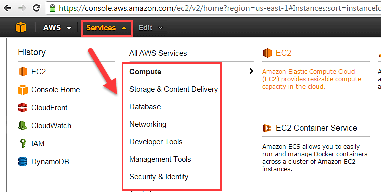
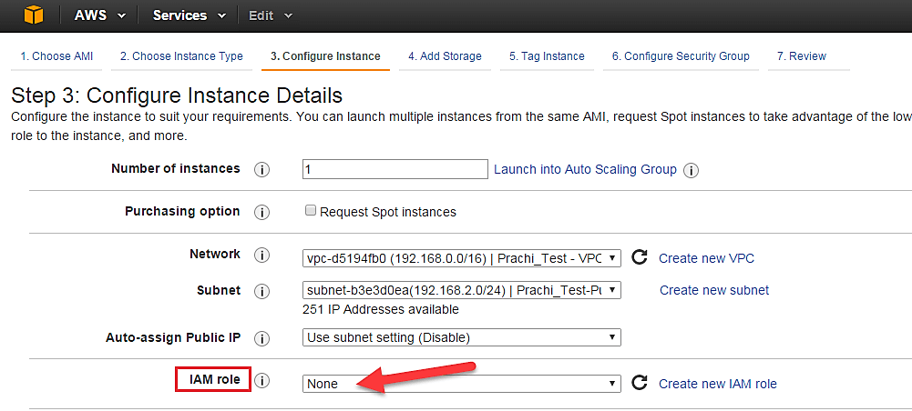
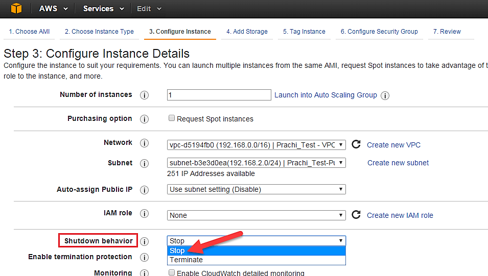
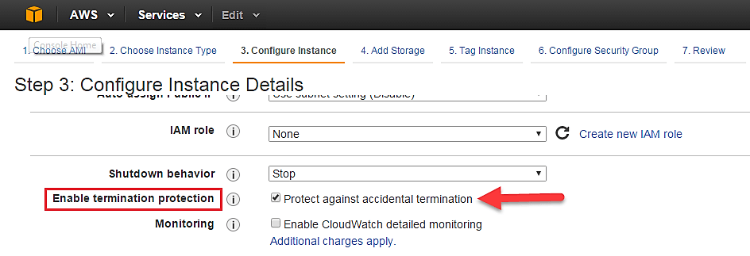
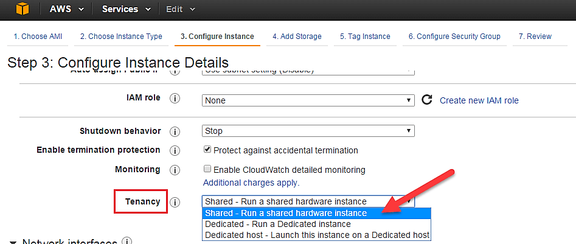
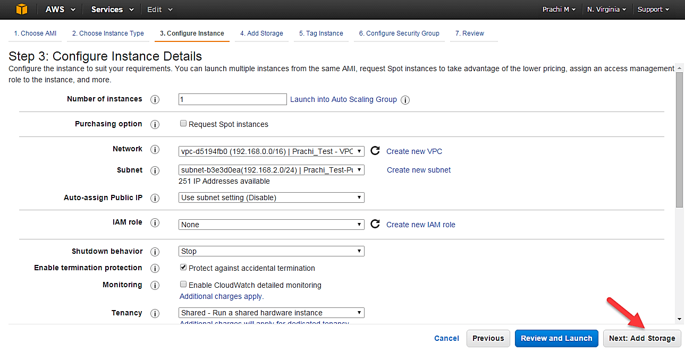
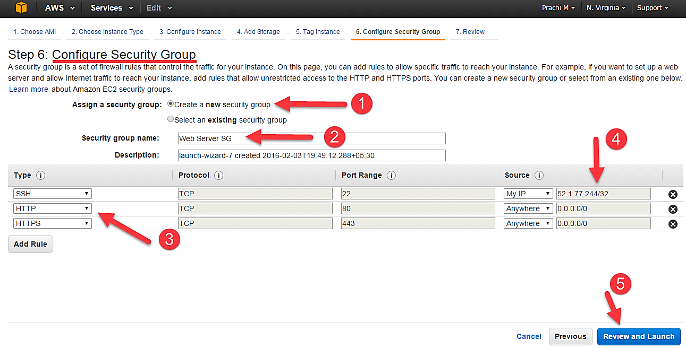
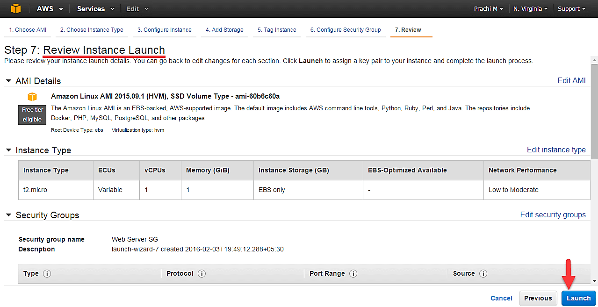
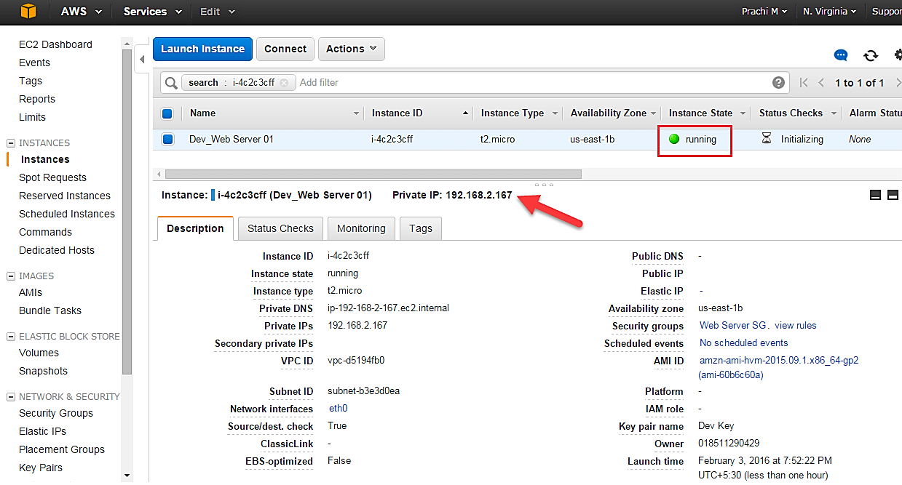

# AWS - Elastic Compute Cloud (EC2)
{: .no_toc }

  

    Table of contents
  

  {: .text-delta }
1. TOC
{:toc}

---

Amazon EC2 provides cloud hosted virtual machines, called `instances`, to run applications.

---

## EC2 instance

An EC2 instance is nothing but a virtual server in Amazon Web services terminology. It stands for Elastic Compute Cloud. It is a web service where an AWS subscriber can request and provision a compute server in AWS cloud.

An on-demand EC2 instance is an offering from AWS where the subscriber/user can rent the virtual server per hour and use it to deploy his/her own applications.

The instance will be charged per hour with different rates based on the type of the instance chosen. AWS provides multiple instance types for the respective business needs of the user.

Thus, you can rent an instance based on your own CPU and memory requirements and use it as long as you want. You can terminate the instance when it’s no more used and save on costs. This is the most striking advantage of an on-demand instance- you can drastically save on your CAPEX.

---

## Types of EC2 Computing Instances

| Instances Types   | Use Case | Example |
|-------------------|----------|---------|
| General Instances | For applications that require a balance of performance and cost.| email responding systems, where you need a prompt response as well as the it should be cost effective, since it doesn’t require much processing.|
| Compute Instances | For applications that require a lot of processing from the CPU.         |   analysis of data from a stream of data, like Twitter stream      |
| Memory Instances  | For applications that are heavy in nature, therefore, require a lot of RAM.         | when your system needs a lot of applications running in the background i.e multitasking.       |
| Storage Instances |  For applications that are huge in size or have a data set that occupies a lot of space.        |  When your application is of huge size.       |
| GPU Instances     |  For applications that require some heavy graphics rendering.        | 3D modelling etc.       |

Now, every instance type has a set of instances which are optimized for different workloads:

| General Instances | Compute Instances |  Memory Instances | Storage Instances | GPU Instances | 
|-------------------|----------|---------|-------------------|---------------|
| - t2              |  - c4    |  - r3   | - i2                | - g2            |
| - m4                |  - c3    |  - x1   | - d2                |               |  
| - m3                |          |         |                   |               |  

---

##  EC2 Pricing

Amazon EC2 instances are priced per second according to five different options:

- On-demand
- Spot instances (discounted short-term capacity if available)
- Savings Plans (commitment to a certain amount of usage)
- Reserved Instances (discounted reserved long-term capacity)
- Dedicated Hosts (on-demand hourly or by reserved instances)

---

##  Launch an on-demand EC2 instance in AWS Cloud

###  Step 1. Login and access to AWS services

Login to your AWS account and go to the AWS Services tab at the top left corner.
Here, you will see all of the AWS Services categorized as per their area viz. Compute, Storage, Database, etc. For creating an EC2 instance, we have to choose Computeà EC2 as in the next step.

Open all the services and click on EC2 under Compute services. This will launch the dashboard of EC2.

Here is the EC2 dashboard. Here you will get all the information in gist about the AWS EC2 resources running.

###  Step 2. Choose the AWS Region

On the top right corner of the EC2 dashboard, choose the AWS Region in which you want to provision the EC2 server.

Here we are selecting N. Virginia. AWS provides 10 Regions all over the globe.

###  Step 3. Launch Instance

Once your desired Region is selected, come back to the EC2 Dashboard.

Click on ‘Launch Instance’ button in the section of Create Instance (as shown below).

Instance creation wizard page will open as soon as you click ‘Launch Instance’.

###  Step 4. Choose AMI

- You will be asked to choose an AMI of your choice. (An AMI is an Amazon Machine Image. It is a template basically of an Operating System platform which you can use as a base to create your instance). Once you launch an EC2 instance from your preferred AMI, the instance will automatically be booted with the desired OS. (We will see more about AMIs in the coming part of the tutorial).
- Here we are choosing the default Amazon Linux (64 bit) AMI.

###  Step 5. Choose EC2 Instance Types

In the next step, you have to choose the type of instance you require based on your business needs.

- We will choose t2.micro instance type, which is a 1vCPU and 1GB memory server offered by AWS.
- Click on “Configure Instance Details” for further configurations

- In the next step of the wizard, enter details like no. of instances you want to launch at a time.
- Here we are launching one instance.

###  Step 6. Configure Instance

No. of instances- you can provision up to 20 instances at a time. Here we are launching one instance.

Under Purchasing Options, keep the option of ‘Request Spot Instances’ unchecked as of now. (This is done when we wish to launch Spot instances instead of on-demand ones. We will come back to Spot instances in the later part of the tutorial).

Next, we have to configure some basic networking details for our EC2 server.

- You have to decide here, in which VPC (Virtual Private Cloud) you want to launch your instance and under which subnets inside your VPC. It is better to determine and plan this prior to launching the instance. Your AWS architecture set-up should include IP ranges for your subnets etc. pre-planned for better management. (We will see how to create a new VPC in Networking section of the tutorial.
- Subnetting should also be pre-planned. E.g.: If it’s a web server you should place it in the public subnet and if it’s a DB server, you should place it in a private subnet all inside your VPC.

Below,
1. Network section will give a list of VPCs available in our platform.
2. Select an already existing VPC
3. You can also create a new VPC

Here I have selected an already existing VPC where I want to launch my instance.

A VPC consists of subnets, which are IP ranges that are separated for restricting access.  Below,

1. Under Subnets, you can choose the subnet where you want to place your instance.
2. I have chosen an already existing public subnet.
3. You can also create a new subnet in this step.

Once your instance is launched in a public subnet, AWS will assign a dynamic public IP to it from their pool of IPs.

- You can choose if you want AWS to assign it an IP automatically, or you want to do it manually later. You can enable/ disable ‘Auto assign Public IP’ feature here likewise.
- Here we are going to assign this instance a static IP called as EIP (Elastic IP) later. So we keep this feature disabled as of now.

In the following step, keep the option of IAM role ‘None’ as of now. We will visit the topic of IAM role in detail in IAM services.

you have to do following things

- **Shutdown Behavior** – when you accidently shut down your instance, you surely don’t want it to be deleted but stopped.
- Here we are defining my shutdown behavior as Stop.

- In case, you have accidently terminated your instance, AWS has a layer of security mechanism. It will not delete your instance if you have enabled accidental termination protection.
- Here we are checking the option for further protecting our instance from accidental termination.

- **Under Monitoring-** you can enable Detailed Monitoring if your instance is a business critical instance. Here we have kept the option unchecked. AWS will always provide Basic monitoring on your instance free of cost. We will visit the topic of monitoring in AWS Cloud Watch part of the tutorial.
- **Under Tenancy**- select the option if shared tenancy. If your application is a highly secure application, then you should go for dedicated capacity. AWS provides both options.

###  Step 7. Add Storage

Click on ‘Add Storage’ to add data volumes to your instance in next step.

- In the Add Storage step, you’ll see that the instance has been automatically provisioned a General Purpose SSD root volume of 8GB. ( Maximum volume size we can give to a General Purpose volume is 16GB)
- You can change your volume size, add new volumes, change the volume type, etc.
- AWS provides 3 type of **EBS volumes**- 
  1. Magnetic.
  2. General Purpose SSD.
  3. Provisioned IOPs. 
  
 You can choose a volume type based on your application’s IOPs needs.

###  Step 8. Tag Instance

- you can tag your instance with a key-value pair. This gives visibility to the AWS account administrator when there are lot number of instances.
- The instances should be tagged based on their department, environment like Dev/SIT/Prod. Etc. this gives a clear view of the costing on the instances under one common tag.
- Here we have tagged the instance as a Dev_Web server 01
- Go to configure Security Groups later

###  Step 9. Configure Security Groups

In this next step of configuring Security Groups, you can restrict traffic on your instance ports. This is an added firewall mechanism provided by AWS apart from your instance’s OS firewall.

You can define open ports and IPs.

Since our server is a webserver=, we will do following things

1. Creating a new Security Group
2. Naming our SG for easier reference
3. Defining protocols which we want enabled on my instance
4. Assigning IPs which are allowed to access our instance on the said protocols
5. Once, the firewall rules are set- Review and launch

###  Step 10. Review Instances

In this step, we will review all our choices and parameters and go ahead to launch our instance.

In the next step you will be asked to create a key pair to login to you an instance. A key pair is a set of public-private keys.

AWS stores the private key in the instance, and you are asked to download the private key. Make sure you download the key and keep it safe and secured; if it is lost you cannot download it again.

- Create a new key pair
- Give a name to your key
- Download and save it in your secured folder

When you download your key, you can open and have a look at your RSA private key.

Once you are done downloading and saving your key, launch your instance.

You can see the launch status meanwhile.

You can also see the launch log.

Click on the ‘Instances’ option on the left pane where you can see the status of the instance as ‘Pending’ for a brief while.

- Once your instance is up and running, you can see its status as ‘Running’ now.
- Note that the instance has received a Private IP from the pool of AWS.

###  Step 11. Create a EIP and connect to your instance

An EIP is a static public IP provided by AWS. It stands for Elastic IP. Normally when you create an instance, it will receive a public IP from the AWS’s pool automatically. If you stop/reboot your instance, this public IP will change- it’dynamic. In order for your application to have a static IP from where you can connect via public networks, you can use an EIP.

Step 1) On the left pane of EC2 Dashboard, you can go to ‘Elastic IPs’ as shown below.

https://www.guru99.com/creating-amazon-ec2-instance.html#3

---

## Links: 

1. [How to Create EC2 Instance in AWS: Step by Step Tutorial](https://www.guru99.com/creating-amazon-ec2-instance.html)
2. [AWS - Elastic Compute Cloud](https://www.tutorialspoint.com/amazon_web_services/amazon_web_services_elastic_compute_cloud.htm)
3. [EC2](https://www.javatpoint.com/aws-ec2)
